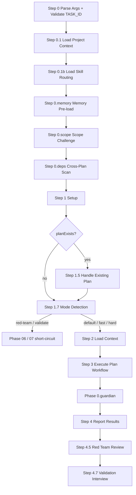

## ⛔ CRITICAL: Error Handling

**If ANY script returns an error, you MUST:**
1. **STOP immediately** — Do NOT attempt workarounds or auto-fixes.
2. **Report the error** — Show the exact error message to the user.
3. **Wait for user** — Ask user how to proceed before taking any action.

**DO NOT:**
- Try alternative approaches when scripts fail.
- Create branches manually when script validation fails.
- Guess or assume what the user wants after an error.
- Continue with partial results.

---

## User Input

```text
$ARGUMENTS
```

You **MUST** consider the user input before proceeding (if not empty).

## Core Principles

**YAGNI · KISS · DRY.** Implement only what is required. Prefer simple over clever. Single source of truth. Be honest, brutal, straight to the point, and concise.

## Boundary Declaration

**This command produces:**
- Implementation plan (`plan.md`)
- Research documentation (`research/yyMMdd-HHmmss-{slug}.md`)
- Data models (`data-model.md`)
- API contracts (`contracts/`)

**This command does NOT:**
- Write implementation code.
- Execute tests.
- Create PRs or commits.
- Write unit tests (delegates UT planning to `/tdk-ut-backfill-plan`; UT implementation is handled by `/tdk-implement` through `## Delegate Skills` in generated UT phase files).

## When to Use

- Plan a new feature implementation.
- Architect a system design.
- Evaluate technical approaches.
- Break down complex requirements into ordered phases.

## Process Flow (Authoritative)



**This diagram is the authoritative workflow.** Prose sections below provide detail per node.

## Workflow

### Step 0 — Parse Arguments & Validate Task ID
**Inline.** <!-- safety-critical: deterministic split before any script invocation -->
Split `$ARGUMENTS` into `TASK_ID`, `FLAGS`, and `USER_CONTENT`.

- `TASK_ID`: first argument token. It must be a valid task ID. Validate only this cleaned token with `tdk-validate-task-id` and host skill name `/tdk-plan`.
- `FLAGS`: known mode flags `--fast | --hard | --red-team | --validate`, allowed anywhere after `TASK_ID`.
- `USER_CONTENT`: remaining non-flag text after `TASK_ID`, preserving order. Empty string if no content was supplied.

Reject with STOP if the first argument token is missing or invalid, a known mode flag appears before `TASK_ID`, any token beginning with `--` is not an exact whitelisted mode flag, or multiple mode flags are present. Multiple flags or unknown flag → STOP with explicit error (see `references/modes.md`). If `tdk-validate-task-id` STOPs → halt. Store: `TASK_ID`, `TASK_ID_SOURCE`, `FLAGS`, `USER_CONTENT`.

### Script Command Contract
**Inline.** <!-- script invocation contract -->
Before any direct Bun script command in this skill or its references, resolve the project root at the agent layer using the active coding harness/session context. Ask the user for the project root if you cannot identify it confidently.

```bash
bash -lc '
PROJECT_DIR="$1"
if [ -z "$PROJECT_DIR" ] || [ ! -d "$PROJECT_DIR/.specify/scripts/ts" ]; then
  echo "Invalid project root: $PROJECT_DIR" >&2
  exit 1
fi
(cd "$PROJECT_DIR/.specify/scripts/ts" && bun src/commands/...)
' -- "<agent-resolved-project-root>"
```

Replace `<agent-resolved-project-root>` with the actual absolute project root; do not pass the placeholder literally. Invoke scripts from the resolved root with `(cd "$PROJECT_DIR/.specify/scripts/ts" && bun src/commands/...)`. If the Bun command exits non-zero, follow the critical error handling rule above.

### Step 0.1 — Load Project Context
**Inline.** <!-- script invocation -->
Invoke `tdk-load-project-context` with the validated `TASK_ID`. Store: `PROJECT_CONTEXT`, `FEATURE_DIR`.

### Step 0.1b — Load Skill Routing
Load: `references/skill-routing.md`
Resolve skill-routing file per reference. Parse sub-workspace sections. Store: `SKILL_ROUTING` map. Missing file → AskUserQuestion per reference (opt-in create or skip with empty map).

When `FLAGS` contains `--red-team` or `--validate`, do not run the interactive missing-file AskUserQuestion/create flow from this step. Those action flags still MUST always perform exact-path inline routing reads inside their own workflows.

### Step 0.memory — Memory Pre-load
Load: `references/gates.md`
Run only if `.specify/memory/memory-index.md` exists. Pre-load Context Block; carry it forward to Phase 0.guardian. Non-blocking — continue on failure.

### Step 0.scope — Scope Challenge
Load: `references/scope-challenge.md`
Skip if `--fast`, spec.md `$ARGUMENTS` <20 words, "just plan / quick / already decided" signals, or prior scope already recorded. Otherwise: 3-question batched AskUserQuestion → route EXPANSION / HOLD / REDUCTION → write `scope_mode:` + append `## Scope Challenge` session block.

### Step 0.deps — Cross-Plan Dependencies Scan
Load: `references/cross-plan-deps.md`
Skip if `--fast` in `FLAGS` (Step 1.7 hasn't resolved `MODE` yet at this point in the flow). Otherwise invoke `(cd "$PROJECT_DIR/.specify/scripts/ts" && bun src/commands/util/scan-cross-plan-deps.ts --current <TASK_ID> --json)`, parse findings, optionally auto-fix D1 bidirectional gaps via AskUserQuestion + dirty-tree gate (Validation S3 D12). Advisory only — never STOPs plan creation.

### Step 1 — Setup
**Inline.** <!-- safety-critical script invocation -->
Run `(cd "$PROJECT_DIR/.specify/scripts/ts" && bun src/commands/util/setup-plan.ts {task_id} --json)`. Parse JSON for `taskId`, `featureSpec`, `implPlan`, `featureDir`, `hasGit`, **`planExists`**.

### Step 1.5 — Handle Existing Plan
Load: `references/handle-existing-plan.md`
**Trigger:** only if `planExists == "true"`. Implements Rewrite / Append / Abort + F13 Soft Dirty Guard + F19 Lowercase Enforcement + Phase File Content Template.

### Step 1.7 — Mode Detection
Load: `references/modes.md`
Resolve `MODE` from `FLAGS`: `fast` | `hard` | `red-team` | `validate` | `default` (no flag). Conflict / unknown → already STOPped at Step 0. `--red-team` / `--validate` short-circuit to Phase 06 / 07 over the existing plan and skip Steps 2–4, using `USER_CONTENT` as focus text when non-empty. Other modes continue to Step 2 and use `USER_CONTENT` as planning instruction when non-empty.

### Step 2 — Load Context
Load: `references/gates.md`
Read `featureSpec` and `.specify/memory/constitution.md`. Apply Constitution Check + Skip Conditions. Choose UPDATE vs REGENERATE mode based on Step 1.5 outcome. Per-step skip rules under each mode are defined in `references/modes.md`.

**New spec format sections to read**: ## 1. Problem Statement, ## 2. Scope Boundary, ## 3. Impact Surface, ## 5. User Requirements & Testing (with `[sw/module]` tags), ## 6. Functional Requirements (with tags), ## 7. Success Criteria, ## 8. Risks & Mitigations.

### Step 3 — Execute Plan Workflow

#### 3a — Research
Load: `references/research-phase.md`

#### 3b — Design
Load: `references/design-phase.md`
Includes Solution Design, Embedded Brainstorming, Sequential Thinking for phase decomposition, and UT Phase Auto-inclusion.

#### 3c — Plan Layout & Output
Load: `references/plan-output-contract.md`
STOP before writing `plan.md`, `phases/*.md`, `research/*.md`, `data-model.md`, or `contracts/` unless `references/plan-output-contract.md` has been loaded successfully in this step. Use the loaded contract as the only source for output layout, frontmatter, phase file conventions, quality checklist, Decisions Made table, and sanitization rules; do not guess or reconstruct the layout from memory.

### Phase 0.guardian — Business Logic Validation
Load: `references/gates.md` <!-- semantics in same file as Step 0.memory -->
Spawn `memory-guardian` agent. Read Guardian Report; act per `BLOCK_IMPL` / `REVIEW` / `CLEAR` outcome.

### Step 4 — Report Results
**Inline.** <!-- terminal output, <10 lines -->
Command ends after Phase 1 design. Report: branch, `implPlan` path, generated artifacts, `## Decisions Made` summary. When `MODE != default`, print the one-line banner from `references/modes.md` (e.g. `Mode: fast — research / scope / deps / red-team / validate / UT skipped.`).

### Step 4.5 — Red Team Review
Load: `references/red-team-workflow.md`
Skip if `MODE in {default, fast}` AND `--red-team` not set. Otherwise spawn the 3 hostile personas (skeptic + security + reliability) in parallel, adjudicate via markdown-table + free-text reply, apply accepted findings as session-prefixed markers, append `## Red Team Review` to `plan.md`. Use `USER_CONTENT` as reviewer focus when non-empty. Bumps `red_team_session: N`.

### Step 4.7 — Validation Interview
Load: `references/validate-workflow.md`
Skip if `MODE == "fast"`. Otherwise: orphan-detect any prior `(in-progress)` session (Resume / Discard / Cancel via AskUserQuestion + trust-ask). On fresh run, prompt user `Run validation interview? [y/N]` (auto-yes on `--validate` action). Generate 3–8 questions via template framework, biasing toward `USER_CONTENT` as validation focus when non-empty, batch in groups of 4, write `## Validation Log` with `(in-progress) → (completed | partial)` marker + `validation_cursor` resume state. Bumps `validation_session: N`.

## Required Reference Load Contract

For every internal `Load: references/X.md` directive, resolve the target from `SKILL_BASE_DIR`, the directory containing this `SKILL.md`, to the expected absolute path `SKILL_BASE_DIR/references/X.md`. Before proceeding with the current step:

1. Verify the expected absolute path exists and is readable.
2. Read the first line and STOP if it begins with `<!-- DO NOT LOAD`.
3. Read the full file successfully before using any instruction from that reference.

On missing, unreadable, or stubbed internal references, STOP and report the expected absolute path and current step. Do not try alternate paths, fallback layouts, or partial reconstruction from memory.

This contract applies only to internal `references/*.md` loads. Project-specific files governed by `references/skill-routing.md` keep their documented AskUserQuestion / skip behavior.

## Subcommands

| Command | Reference | Purpose |
|---------|-----------|---------|
| `/tdk-plan <ID> --red-team` | `references/red-team-workflow.md` | Spawn 3 hostile personas (skeptic + security + reliability), adjudicate findings, apply session-prefixed markers. |
| `/tdk-plan <ID> --validate` | `references/validate-workflow.md` | Template-based 3–8 question interview across 8 categories (3 tdk-prioritized + 5 ck-plan). Resume-able via `validation_cursor`. |

<!-- Phase 01 intentionally created the table with header only (F13 + S2.F1); rows populate as features ship. -->

## Quality Standards

- Thorough and specific; long-term maintainability over cleverness.
- Address security and performance concerns up front.
- Detailed enough for a junior developer to execute.
- Validate against existing codebase patterns and constitution.

## Key Rules

- Use absolute paths in plan artifacts.
- ERROR on gate failures or unresolved clarifications — see `references/gates.md`.

**Remember:** plan quality determines implementation success.
