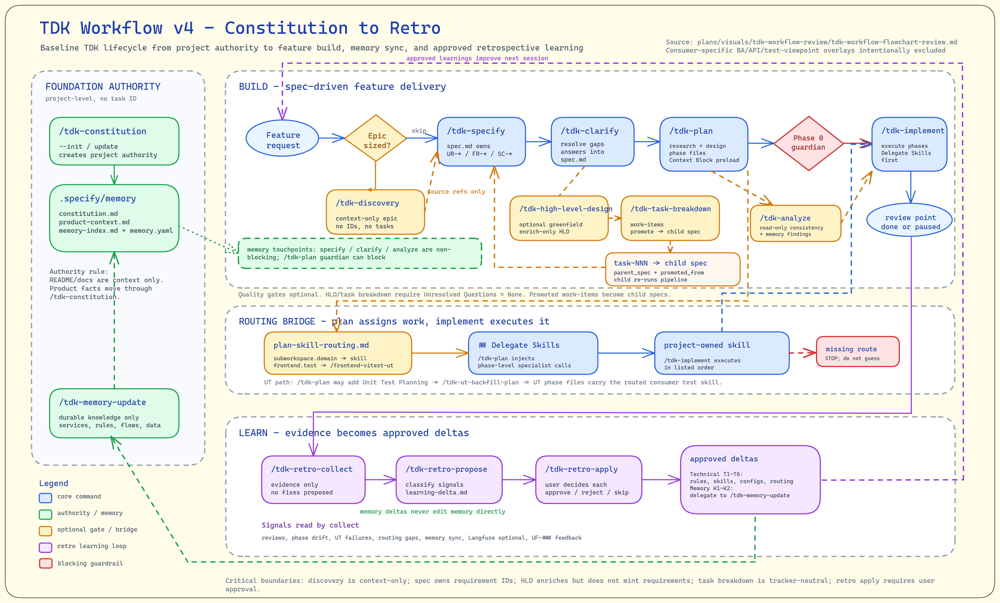
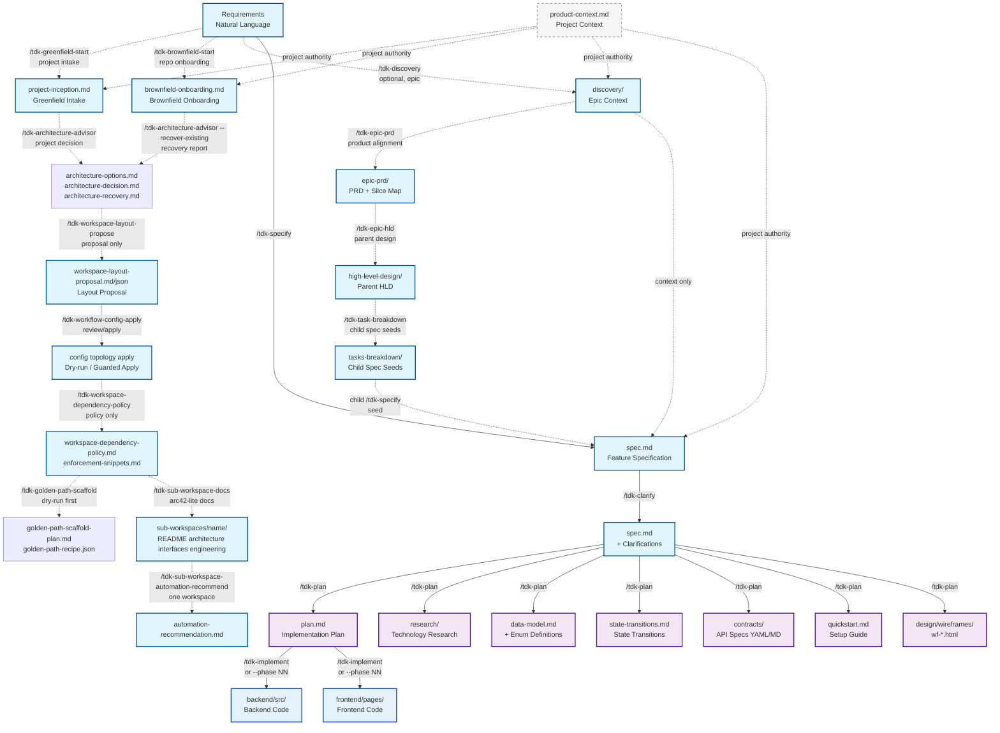
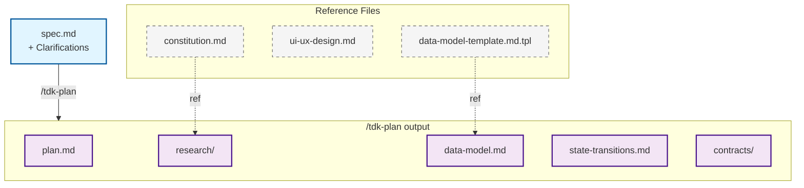
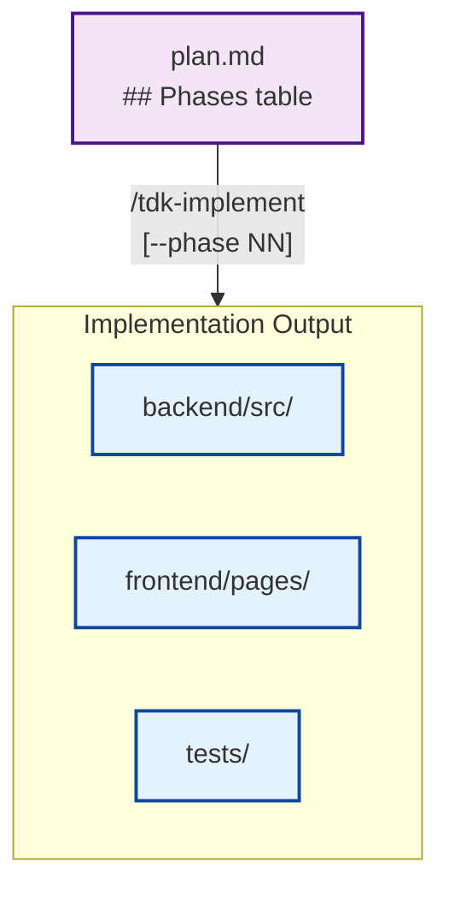
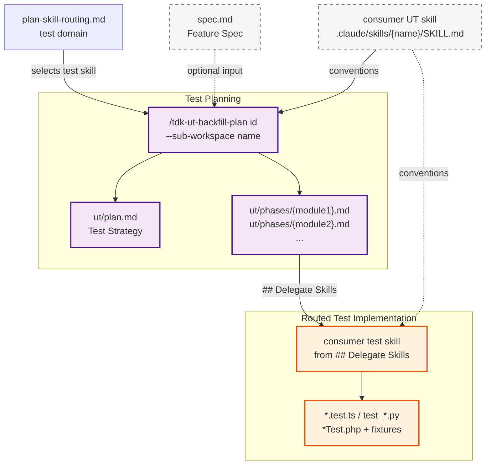
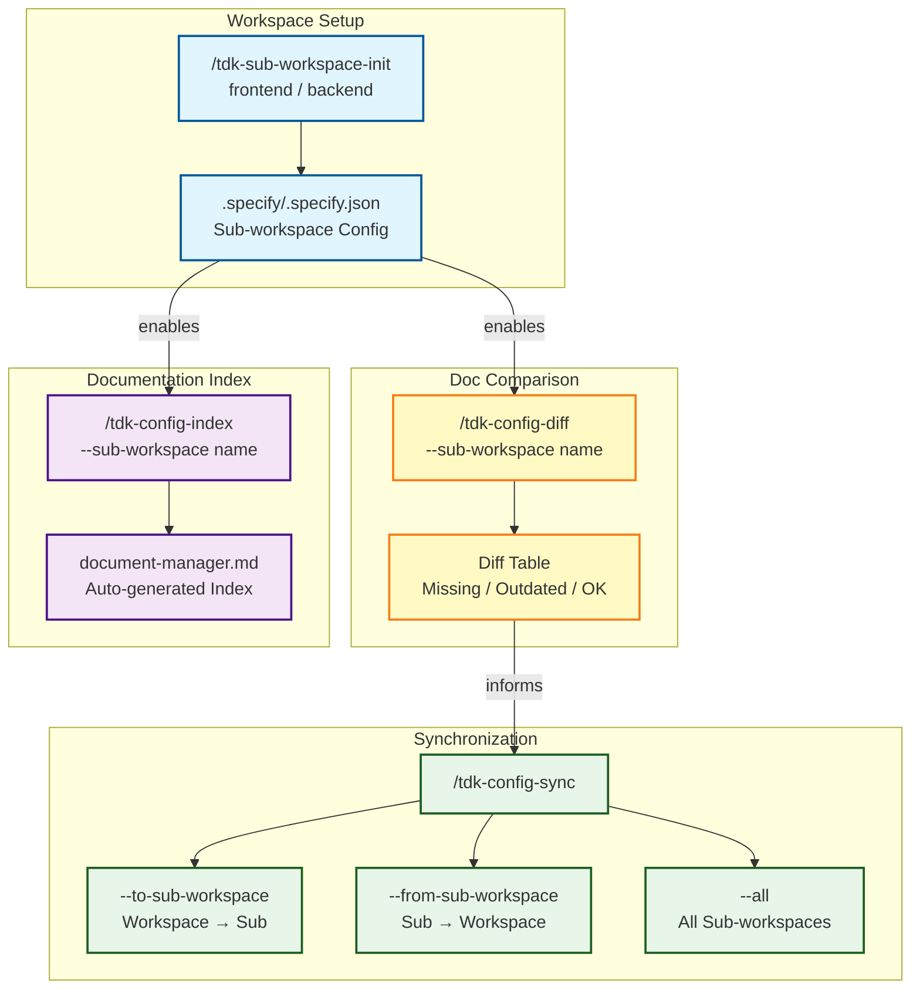
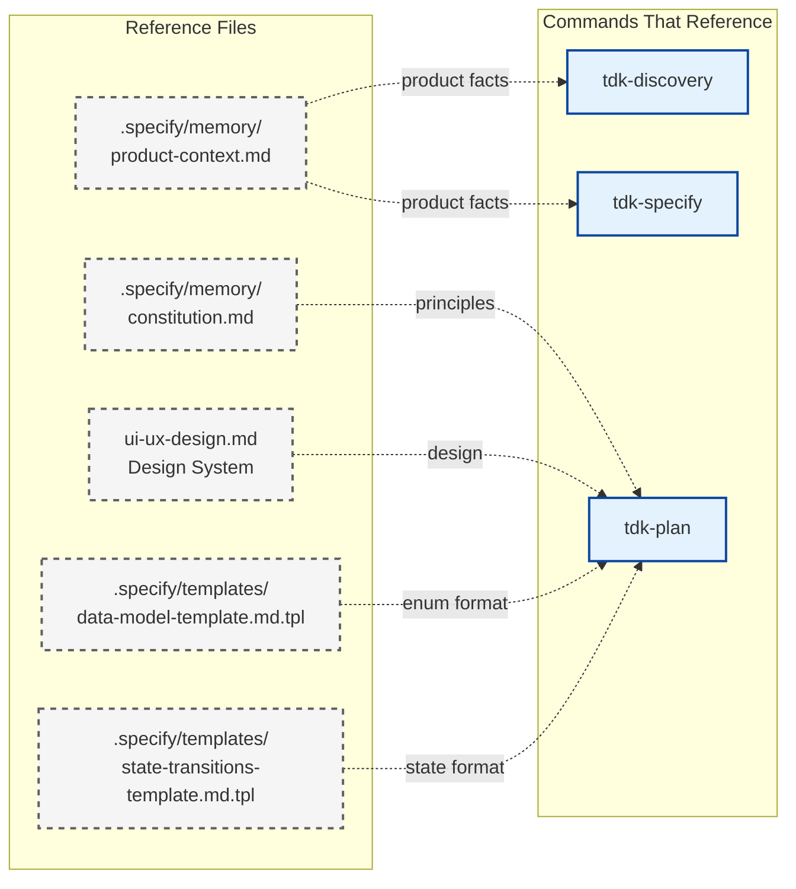
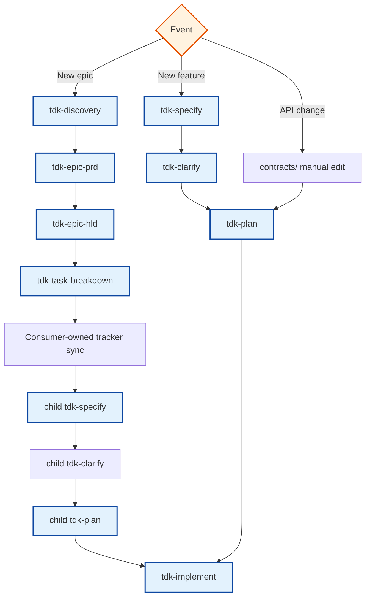

# TDK Document Flow

> Visual representation of all artifact inputs/outputs across the TDK command workflow.
> Migrated from speckit-tdk-jp DOCUMENT-FLOW.md and updated for Claude Code slash commands.

---



## Full Workflow Flow



---

## Phase-by-Phase Details

### Phase 0: Specification

```mermaid
flowchart LR
    REQ[Requirements]
    GREENFIELD_INCEPTION[project-inception.md]
    BROWNFIELD_ONBOARDING[brownfield-onboarding.md]
    ARCHITECTURE_REPORTS[architecture reports]
    TOPOLOGY[workspace-layout-proposal.md/json]
    CONFIG_PATCH[config dry-run/apply]
    POLICY[workspace-dependency-policy.md<br/>enforcement-snippets.md]
    GOLDEN_PATH[golden-path scaffold<br/>recipe/report]
    SUB_WORKSPACE_DOCS[sub-workspace docs<br/>arc42-lite]
    AUTOMATION_RECOMMEND[automation recommendation<br/>one workspace]
    DISCOVERY[discovery/<br/>Epic Context]
    EPIC_PRD[epic-prd/<br/>PRD + Slice Map]
    HLD[high-level-design/<br/>Parent HLD]
    TASKS[tasks-breakdown/<br/>Child Spec Seeds]
    SPEC[spec.md]
    SPEC_CLAR[spec.md<br/>+ Clarifications]

    REQ -.->|"/tdk-greenfield-start"| GREENFIELD_INCEPTION
    REQ -.->|"/tdk-brownfield-start"| BROWNFIELD_ONBOARDING
    GREENFIELD_INCEPTION -.->|"/tdk-architecture-advisor"| ARCHITECTURE_REPORTS
    BROWNFIELD_ONBOARDING -.->|"/tdk-architecture-advisor --recover-existing"| ARCHITECTURE_REPORTS
    ARCHITECTURE_REPORTS -.->|"/tdk-workspace-layout-propose"| TOPOLOGY
    TOPOLOGY -.->|"/tdk-workflow-config-apply<br/>review/apply"| CONFIG_PATCH
    CONFIG_PATCH -.->|"/tdk-workspace-dependency-policy<br/>policy only"| POLICY
    POLICY -.->|"/tdk-golden-path-scaffold<br/>dry-run first"| GOLDEN_PATH
    POLICY -.->|"/tdk-sub-workspace-docs"| SUB_WORKSPACE_DOCS
    SUB_WORKSPACE_DOCS -.->|"/tdk-sub-workspace-automation-recommend"| AUTOMATION_RECOMMEND
    REQ -.->|"/tdk-discovery<br/>epic-id brief"| DISCOVERY
    DISCOVERY -.->|"/tdk-epic-prd<br/>epic-id"| EPIC_PRD
    EPIC_PRD -.->|"/tdk-epic-hld<br/>epic-id"| HLD
    HLD -.->|"/tdk-task-breakdown<br/>epic-id"| TASKS
    TASKS -.->|"child /tdk-specify<br/>seed"| SPEC
    REQ -->|"/tdk-specify<br/>feature-id desc"| SPEC
    DISCOVERY -.->|"context only"| SPEC
    SPEC -->|"/tdk-clarify<br/>feature-id"| SPEC_CLAR

    SPEC_CLAR -.->|contains| CONTENT["- Functional requirements<br/>- User stories<br/>- Acceptance criteria<br/>- Clarifications"]

    classDef input fill:#e1f5ff,stroke:#01579b,stroke-width:2px
    classDef output fill:#b3e5fc,stroke:#01579b,stroke-width:2px
    classDef note fill:#f5f5f5,stroke:#616161,stroke-width:1px

    class REQ input
    class GREENFIELD_INCEPTION,BROWNFIELD_ONBOARDING,TOPOLOGY,CONFIG_PATCH,POLICY,SUB_WORKSPACE_DOCS,AUTOMATION_RECOMMEND,DISCOVERY,EPIC_PRD,SPEC,SPEC_CLAR,HLD,TASKS output
    class CONTENT note
```



**Create a child spec from a seed.** A `tasks-breakdown/task-NNN-{slice}.md`
seed that is independently specifiable can become a child spec at
`specs/<child-id>/`. Parent epic traceability stays in the seed refs; `parent_spec`
is only for explicit links to an existing parent `spec.md`. See
[Promote Convention](./promote-convention.md) for the manual seed flow,
optional `parent_spec` rule, and sizing rule.

### Phase 1: Design & Architecture



### Phase 2: Implementation Paths

#### Solo Path (Primary)


`/tdk-implement <id>` runs all runnable rows from `plan.md ## Phases`.
`/tdk-implement <id> --phase NN` runs one selected phase while still honoring dependencies and global stale `in_progress` recovery.

### Unit Testing Pipeline



Use `/tdk-ut-backfill-plan` to create the unit-test plan and phase files, then `/tdk-implement` runs phase delegates through the consumer test skill listed in `## Delegate Skills`. `--sub-workspace` targets a specific workspace (e.g., `backend`, `frontend`). `--standalone` on `/tdk-ut-backfill-plan` skips spec dependency for existing code.

### Config & Workspace Management



Always run `config:diff` before `config:sync` to preview changes. Use `--dry-run` with sync for safe previews. `config:index` generates `document-manager.md` for LLM discoverability.

---

## Artifact Matrix

| Artifact | Created By | Input From | Used By | Update Frequency |
|----------|-----------|------------|---------|-----------------|
| `product-context.md` | `/tdk-constitution --init/update` | constitution, memory, accepted project brief/update feedback | `/tdk-discovery`, `/tdk-specify`, `/tdk-plan` context | Project authority changes |
| `.specify/configurations/inception/project-inception.md` | `/tdk-greenfield-start` | Project brief or workspace-local file plus project-inception questions | Readiness-aware recommended greenfield route | New-project intake |
| `.specify/configurations/inception/brownfield-onboarding.md` | `/tdk-brownfield-start` | Existing repo evidence, optional scout output | Evidence/confidence-based brownfield onboarding route | Existing-repo intake |
| `.specify/configurations/architecture/architecture-options.md` | `/tdk-architecture-advisor` | Inception, onboarding, discovery, spec, scout, README, or bounded repo evidence | Architecture decision review | Project architecture options |
| `.specify/configurations/architecture/architecture-decision.md` | `/tdk-architecture-advisor` | `architecture-options.md` plus accepted assumptions | `/tdk-workspace-layout-propose` or future layout work | Project architecture decision |
| `.specify/configurations/architecture/architecture-recovery.md` | `/tdk-architecture-advisor --recover-existing` | Brownfield onboarding, scout, README, or bounded repo evidence | Brownfield-safe architecture recovery review | Existing-repo recovery |
| `.specify/configurations/workspace-layout/workspace-layout-proposal.md` | `/tdk-workspace-layout-propose` or human-authored layout proposal | Architecture decision/recovery plus inception/onboarding/scout evidence | Human review before dry-run preview | Project layout proposal |
| `.specify/configurations/workspace-layout/workspace-layout-proposal.json` | `/tdk-workspace-layout-propose` or human-authored layout proposal | Architecture decision/recovery plus inception/onboarding/scout evidence | `/tdk-workflow-config-apply` interactive review/apply, or explicit `--dry-run` for automation preview | Project layout changes |
| `.specify/configurations/workspace-topology/workspace-topology.md` | `/tdk-boundary-map` compatibility or human-authored legacy topology proposal | Legacy topology evidence | Human review before dry-run preview | Legacy project topology proposal |
| `.specify/configurations/workspace-topology/workspace-topology.json` | `/tdk-boundary-map` compatibility or human-authored legacy topology proposal | Legacy topology evidence | `/tdk-workflow-config-apply` legacy fallback | Legacy project topology changes |
| `config topology dry-run/apply` | `/tdk-workflow-config-apply` | `workspace-layout-proposal.json`, legacy `workspace-topology.json`, existing JSON `.specify/.specify.json` | Human review; parsed `planHash` passed internally for guarded write | Runtime config preview or guarded config write |
| `.specify/configurations/workspace-dependency-policy/workspace-dependency-policy.md` | `/tdk-workspace-dependency-policy` | layout artifacts, existing `.specify/.specify.json`, repo stack evidence | Human review of dependency guidance | Optional project dependency policy |
| `.specify/configurations/workspace-dependency-policy/enforcement-snippets.md` | `/tdk-workspace-dependency-policy --suggest` | policy report and detected stack evidence | Human-applied enforcement config candidates | Optional snippet guidance |
| `.specify/configurations/module-boundary-policy/module-boundary-policy.md` | `/tdk-module-boundary-policy` compatibility | legacy topology artifacts, existing `.specify/.specify.json`, repo stack evidence | Human review of legacy boundary guidance | Legacy optional project boundary policy |
| `.specify/configurations/golden-path/golden-path-scaffold-plan.md` | `/tdk-golden-path-scaffold --dry-run` | approved layout/config evidence, architecture decision/recovery, optional dependency policy | Human review before recipe approval | Optional skeleton plan |
| `.specify/configurations/golden-path/golden-path-recipe.json` | `/tdk-golden-path-scaffold --dry-run` | scaffold plan and approved layout/config evidence | Set `status: approved` before guarded apply | Optional skeleton recipe |
| `.specify/configurations/golden-path/generated-files-report.md` | `/tdk-golden-path-scaffold --dry-run` or `--yes` | recipe and safety gates | Review created/skipped/existing/refused paths | Scaffold report |
| `<docsPath>/sub-workspaces/<name>/{README,architecture,interfaces,engineering}.md` | `/tdk-sub-workspace-docs` | configured sub-workspace path, repomix pack, scout output, optional dependency policy | `/tdk-sub-workspace-automation-recommend` | Per sub-workspace docs refresh |
| `.specify/configurations/automation-recommendations/sub-workspaces/<name>/automation-recommendation.md` | `/tdk-sub-workspace-automation-recommend` | selected sub-workspace docs, dependency policy, official docs, local skill catalog, optional direct skill search | `/tdk-scaffold-from-recommendation` after approval | Per sub-workspace automation review |
| `discovery/` | `/tdk-discovery` | Epic brief or file, project context, memory, constitution; existing discovery files for ID-only `--interview` | Optional context for `/tdk-epic-prd` or `/tdk-specify` | Optional before epic PRD or specify |
| `epic-prd/` | `/tdk-epic-prd` | Existing `discovery/index.md`, `problem.md`, `personas.md`, and `mvp-scope.md`; existing PRD files for ID-only `--interview` | Feeds `/tdk-epic-hld`, then `/tdk-task-breakdown` child spec seeds | Optional after discovery |
| `spec.md` | `/tdk-specify` | User description, optional `discovery/index.md` or epic PRD slice seed; existing `spec.md` for ID-only `--interview` | `/tdk-clarify`, `/tdk-plan`, all downstream | Feature start |
| `spec.md` (+ Clarifications) | `/tdk-clarify` | `spec.md` | `/tdk-plan` | After specify |
| `{docs.path}/custom-workflow/high-level-design-skill-routing.md` | Human-authored from `.specify/templates/high-level-design/high-level-design-skill-routing-template.tpl` | Consumer HLD design skills | `/tdk-epic-hld` as advisory read-only routing | Optional project setup |
| `high-level-design/` | `/tdk-epic-hld` | `epic-prd/`; built-in lenses; optional HLD routing | `/tdk-task-breakdown` | Parent epic after PRD |
| `tasks-breakdown/` | `/tdk-task-breakdown` | `epic-prd/`; `high-level-design/` | Child `/tdk-specify` seeds | Parent epic after HLD |
| `plan.md` | `/tdk-plan` | `spec.md`, `constitution.md`, optional context | `plan.md ## Phases`, `/tdk-implement [--phase NN]` | Feature start |
| `plan.md ## Phases` | `/tdk-plan` | `spec.md`, design artifacts | `/tdk-implement [--phase NN]` | Feature start |
| `research/` | `/tdk-plan` | `spec.md` | Reference | Feature start |
| `data-model.md` | `/tdk-plan` | `spec.md` | Reference | Feature start |
| `backend/src/**` | `/tdk-implement` | `plan.md ## Phases` | Testing | Implementation |
| `frontend/pages/**` | `/tdk-implement` | `plan.md ## Phases`, `page-designs/` | Testing, review | Implementation |
| `ut/plan.md` | `/tdk-ut-backfill-plan` | `spec.md` (opt), consumer test skill routing | `/tdk-implement` | Feature UT |
| `ut/phases/{module}.md` | `/tdk-ut-backfill-plan` | `spec.md` (opt), `plan-skill-routing.md` | consumer test skill via `## Delegate Skills` | Feature UT |
| `*.test.ts` / `test_*.py` etc. | consumer test skill | `ut/phases/{module}.md` | Test runner | Feature UT |
| `.specify/.specify.json` | `/tdk-sub-workspace-init` | Project config | `config:*`, unit-test routing, sub-workspace docs | Project setup |
| `document-manager.md` | `/tdk-config-index` | All docs files | Manual reference, LLM tools | On demand |

---

## Reference Files (Templates)

These files are **read-only references** used by multiple commands but never modified:



---

## Event-Driven Update Triggers



---

## Artifact Directory Structure

```
.specify/specs/{task-id}/
├── discovery/                          # Optional epic discovery context
├── epic-prd/                           # Optional epic PRD, slice map, and open questions
├── spec.md                             # Phase 0: Feature specification
├── high-level-design/                  # Optional parent epic HLD after epic PRD
├── tasks-breakdown/                    # Optional child spec seed files after HLD
├── plan.md                             # Phase 1: Implementation plan
├── research/                           # Phase 1: Technology research
├── data-model.md                       # Phase 1: Entity definitions + enums
├── state-transitions.md                # Phase 1: State machine definitions
├── quickstart.md                       # Phase 1: Setup guide
├── contracts/                          # Phase 1: API specifications
│   └── *.yaml
├── design/wireframes/                  # Phase 1: UI wireframes
│   └── wf-*.html
├── page-designs/                       # Phase 1: Screen specifications
│   └── {category}/
│       └── {screen}.md
└── checklists/                         # Quality checklists
    └── requirements.md
```
