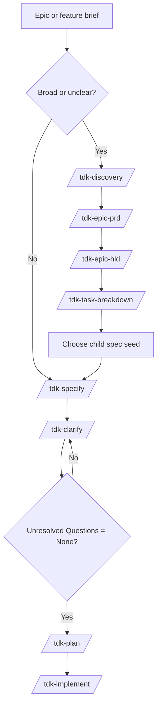

# Epic Start Guide

> Beginner-friendly guide for starting a broad epic with TDK before implementation.

Use this guide when you have a broad feature idea and need to turn it into clear artifacts that a junior or fresher developer can follow.

## One-Minute Model

TDK turns vague work into implementation-ready evidence:

```text
Epic brief
  -> optional /tdk-discovery
  -> /tdk-epic-prd
  -> /tdk-epic-hld
  -> /tdk-task-breakdown
  -> choose one seed from tasks-breakdown.md
  -> child /tdk-specify
  -> child /tdk-clarify
  -> child /tdk-plan
  -> child /tdk-implement
```

The most important rule:

```text
discovery is context
epic PRD is product alignment and slice map
epic HLD is parent design context for safe decomposition
task breakdown is child spec seeds from PRD + HLD
child spec.md is requirement authority
child specs are the implementation units
plan.md is implementation sequence for one spec
```

## Should I Start With Discovery?

| Situation | Start with | Why |
|---|---|---|
| The work is broad, vague, or has many possible MVP cuts | `/tdk-discovery` | You need epic-level problem, persona, and MVP context before a spec |
| The generated discovery could easily encode the wrong intent | `/tdk-discovery <epic-id/spec-id> <brief\|file> --interview` | Discovery interview mode asks artifact-grounded challenge questions before completion |
| Existing discovery or spec artifacts need another intent check | `/tdk-discovery <id> --interview` or `/tdk-specify <id> --interview` | ID-only interview mode rechecks current artifacts without regenerating them |
| Discovery is broad enough to become one bundled spec | `/tdk-epic-prd` | Epic PRD creates product alignment, blocking questions, and child spec seeds without minting requirements |
| The feature is already clear and small | `/tdk-specify` | Discovery would add ceremony without reducing risk |
| You are not sure who the users are | `/tdk-discovery` | Persona and jobs-to-be-done context should be captured first |
| You already know scope, actors, acceptance criteria, and edge cases | `/tdk-specify` | The spec can be written directly |

When in doubt, ask: "Can I write clear user requirements and success criteria now?" If no, run discovery first.

Interview mode quick syntax:

```text
/tdk-discovery <epic-id/spec-id> <brief|file> --interview
/tdk-discovery <epic-id/spec-id> --interview
/tdk-epic-prd <epic-id> [--force] [--interview]
/tdk-specify <epic-id/spec-id> <description> --interview
/tdk-specify <epic-id/spec-id> --interview
```

For creation-time interview, `<brief|file>` and `<description>` are required. For ID-only replay interview, the artifacts must already exist: discovery replay requires the four discovery files, and specify replay requires `spec.md`. Put `--interview` at the end of the command; positional `interview` is not a mode.

For discovery, this looks like:

```text
/tdk-discovery feat-001 "User avatar upload, cropping, validation, storage, and moderation" --interview
```

Use creation-time interview before `/tdk-specify` when wrong epic context would be expensive. It writes the normal four discovery files first, asks 3-5 questions about concrete claims in those files, then folds accepted corrections or open questions back into the same discovery artifacts. Use ID-only replay later when you want to recheck the current files without regenerating them. It is not a separate command and does not create `discovery/interview.md`.

## Flow Diagram



Feature-sized work should use the short path: `/tdk-specify -> /tdk-clarify -> /tdk-plan -> /tdk-implement`. In the epic workflow, `epic-prd.md` plus `epic-prd/` feeds parent HLD, HLD feeds task breakdown, and `tasks-breakdown.md` plus `tasks-breakdown/` feeds child /tdk-specify commands. Child specs do not run HLD by default.


## Canonical Epic Path

Use one parent ID for discovery and epic PRD. Use new child IDs for implementation slices from `epic-prd/slice-map.md`.

| Step | Command or action | Gate before next step |
|---|---|---|
| 1 | `/tdk-discovery <parent-id> <brief\|file> [--interview]` | `discovery.md` says the problem, personas, and MVP cut are ready enough for specify |
| 2 | `/tdk-epic-prd <parent-id> [--interview]` | `epic-prd.md` says Blocking Questions are empty, and `slice-map.md` has no catch-all slice |
| 3 | `/tdk-epic-hld <parent-id>` | Parent HLD captures slice boundaries, dependencies, risks, and design assumptions without minting requirement IDs |
| 4 | `/tdk-task-breakdown <parent-id>` | Seed files map PRD slices + HLD context into independently specifiable child specs |
| 5 | Choose one child spec seed | The seed describes one independently specifiable child, not the whole parent epic |
| 6 | `/tdk-specify <child-id> "<seed>"` | Child spec is scoped to one seed, and `UR-*` / `FR-*` / `SC-*` IDs start here |
| 7 | Child `/tdk-clarify` -> `/tdk-plan` -> `/tdk-implement` | Child spec is clarified before implementation planning |

## Output File Contents

Read generated files through the manifest first: `discovery.md`, `high-level-design.md`, or `tasks-breakdown.md`. Do not inspect a directory by globbing files and assuming every file is current.

### Discovery outputs

| File | What it contains | How a junior should use it |
|---|---|---|
| `discovery/problem.md` | Frontmatter, `## Problem`, `## Affected Users`, `## Current Alternatives`, `## Constraints`, `## Open Questions` | Understand what pain the epic solves, who feels it, and what constraints already exist |
| `discovery/personas.md` | `## Primary Personas`, `## Secondary Personas`, `## Jobs To Be Done`, `## Assumptions`, `## Open Questions` | Know the user roles and why different actors may need different behavior |
| `discovery/mvp-scope.md` | `## In Scope Candidates`, `## Out Of Scope Candidates`, `## MVP Cutline`, `## Risks`, `## Open Questions` | See the first safe MVP boundary before turning the epic into requirements |
| `discovery.md` | `## Artifact Manifest`, `## Summary`, `## Product-level signals`, `## Ready For Specify` | Start here; it tells you which discovery files matter and whether the epic is ready for `/tdk-specify` |

Discovery output is not requirement authority. Treat it as context for writing the first `spec.md`.

### Epic PRD outputs

| File | What it contains | How a junior should use it |
|---|---|---|
| `epic-prd.md` | Source discovery links, artifact map, readiness gate, next commands | Start here; if Blocking Questions exist, do not treat the epic as ready for downstream design or breakdown |
| `epic-prd/prd.md` | Product intent, problem/current state, personas, objectives, scope, MVP appetite, assumptions, risks, no-gos, source trace | Align on product direction without treating it as a requirement spec |
| `epic-prd/slice-map.md` | Slug slice keys, capabilities, actors, outcomes, dependencies, suggested child spec titles, priority | Source for HLD/task-breakdown; child `/tdk-specify` starts from the seed file |
| `epic-prd/open-questions.md` | Blocking Questions, Non-Blocking Questions, assumptions needing evidence, source trace | Resolve blockers before downstream epic design, breakdown, or child specs |

Epic PRD output is not `spec.md`, does not create tracker issues, and does not mint `UR-*`, `FR-*`, `SC-*`, or `FS-*`.

### Specify outputs

| File | What it contains | How a junior should use it |
|---|---|---|
| `spec.md` | Frontmatter, `# Feature Specification`, sections `## 1` through `## 9`, and reserved `## Clarifications` | Treat as the source of truth for scope, requirements, success criteria, and open questions |
| `checklists/requirements.md` | Structure completeness checks, tagging checks, content quality checks, requirement completeness checks, and notes | Review before moving on; incomplete items usually mean the spec needs more work |

The important `spec.md` sections are:

| Section | Purpose |
|---|---|
| `## 1. Problem Statement` | Concrete problem, affected users, and why it matters now |
| `## 2. Scope Boundary` | What is in scope, what is out of scope, and why |
| `## 3. Impact Surface` | Sub-workspaces or modules touched by the feature |
| `## 4. Evaluated Approaches` | Scope-level options and the recommended cut |
| `## 5. User Requirements & Testing` | `UR-*`, priorities, independent tests, Given/When/Then acceptance scenarios, edge cases |
| `## 6. Functional Requirements` | `FR-*`, functional behavior, and key entities |
| `## 7. Success Criteria` | `SC-*`, measurable and technology-agnostic outcomes |
| `## 8. Risks & Mitigations` | Main risks and mitigation ideas |
| `## 9. Unresolved Questions` | `None` or a numbered list of questions to resolve |
| `## Clarifications` | Decision history written by `/tdk-clarify` |

If the spec is created from a promoted task or sub-issue, its frontmatter may also include `parent_spec` and `promoted_from`.

### Clarify output

`/tdk-clarify` does not create a new artifact. It updates `spec.md`.

| Updated area | What changes | How a junior should use it |
|---|---|---|
| `## Clarifications` | Adds a dated session with one `Q -> A` bullet per accepted answer and rationale | Read this to understand why a decision was made |
| Existing requirement sections | Updates scope, user requirements, functional requirements, key entities, success criteria, edge cases, risks, or terminology | Read the updated section as the current truth; do not rely only on the Q/A log |
| `## 9. Unresolved Questions` | Should become exactly `None` before child planning | Use this as the child-spec gate before moving forward |

Clarify is useful because it keeps decisions inside the spec instead of leaving them only in chat history.

### HLD outputs

| File | What it contains | How a junior should use it |
|---|---|---|
| `high-level-design.md` | Frontmatter, `## Source`, `## Artifact Map`, `## Breakdown Readiness Map`, `## Readiness Gate` | Start here; it lists the HLD files that are current and validates the parent epic gate |
| `high-level-design/requirement-overview.md` | Product objective, scope, personas/jobs, slice source map, breakdown readiness | See how epic PRD slices translate into child spec seed implications |
| `high-level-design/project-and-technical-overview.md` | System context, slice boundary map, dependency map, interface assumptions, security posture, operability | Understand system-level decomposition impact; treat originated details marked `assumed` as assumptions to validate |
| `high-level-design/data-flow.md` | Key entities, cross-slice flows, external dependencies, state lifecycle, optional diagram | Understand data movement and state behavior before creating child spec seeds |
| `high-level-design/screen-flow.md` | Epic journeys, slice touchpoints, steps, branch conditions, related interfaces, optional diagram | Understand user journeys and UI/API touchpoints across slices |
| `high-level-design/decisions-and-risks.md` | Slice boundary decisions, rejected alternatives, risks, assumptions to validate, non-blocking follow-ups | See what was split/merged, what was rejected, and what may need child clarification |

HLD guides parent decomposition. It does not create `UR-*`, `FR-*`, `SC-*`, child specs, tasks, plans, tracker issues, or code.

### Task breakdown outputs

| File | What it contains | How a junior should use it |
|---|---|---|
| `tasks-breakdown.md` | Frontmatter, epic PRD/HLD links, `## Child Spec Seeds` table, tracker boundary, sync boundary | Treat as the authoritative manifest for child spec seed files |
| `tasks-breakdown/task-NNN-{slice}.md` | Frontmatter, source slice, suggested child `/tdk-specify` command, boundary, dependencies, assumptions/risks, child clarify questions | Use one seed file to start one child spec |

The `tasks-breakdown.md` task table has:

| Column | Meaning |
|---|---|
| `#` | Stable seed number such as `001` |
| `Slice key` | Source slice from `epic-prd/slice-map.md` |
| `Child spec title` | Suggested child spec name |
| `Depends on` | Slice keys or external dependencies |
| `Seed file` | Link to the child spec seed file |
| `Status` | Empty until a child spec/tracker workflow records progress |

Task breakdown is not an implementation plan and does not create child specs by itself. It creates portable child spec seeds that can be copied into `/tdk-specify <child-id> "<seed>"` or synced to a tracker by consumer-owned tooling.

### Tracker sub-issue and child spec outputs

TDK core does not create external issues. After consumer-owned tracker sync, each external sub-issue should carry the seed's source slice, boundary, dependencies, assumptions/risks, and clarify questions.

Then create a child spec from each sub-issue/task using a new child ID. The child spec output is the same shape as `spec.md`, but scoped to that one sub-issue. Only after the child spec is clarified should it move to `/tdk-plan` and `/tdk-implement`.

## Skill Playbook

### 1. `/tdk-discovery <epic-id/spec-id> [<brief|file>] [--force] [--interview]`

Use this only for epic-sized context before a feature spec.

Example:

```text
/tdk-discovery feat-001 "User avatar upload, cropping, validation, storage, and moderation"
```

Interview example:

```text
/tdk-discovery <epic-id/spec-id> <brief|file> --interview
/tdk-discovery feat-001 "User avatar upload, cropping, validation, storage, and moderation" --interview
/tdk-discovery feat-001 --interview
```

| Item | Detail |
|---|---|
| Input | Epic ID plus a short brief or a workspace-local Markdown file; ID only when replaying existing discovery with `--interview` |
| Reads | Project context, constitution, and memory when available |
| Creates | `discovery/problem.md`, `discovery/personas.md`, `discovery/mvp-scope.md`, `discovery.md` |
| Main value | Frames the problem, users, MVP cutline, risks, and open questions |
| Next command | `/tdk-specify <id> <description>` |

Add `--interview` with a brief when the epic is broad, politically sensitive, or likely to hide intent mismatches. It asks targeted questions about the generated discovery artifacts, then folds accepted changes into the same four files. Use `/tdk-discovery <id> --interview` only after the four discovery files already exist; replay reads and updates current artifacts without regenerating them. Neither form creates `discovery/interview.md` or tracker records.

What it does not do:

- Does not create `spec.md`.
- Does not create `UR-*`, `FR-*`, or `SC-*` IDs.
- Does not create plans, tasks, code, or tracker issues.

Ready check:

- Open `discovery.md`.
- Check that problem, personas, and MVP scope are understandable.
- If you used `--interview`, confirm accepted corrections appear in `problem.md`, `personas.md`, `mvp-scope.md`, or `discovery.md`, and unresolved points are in the relevant `## Open Questions`.
- If the MVP boundary still feels vague, clarify the brief before moving on.

### 2. `/tdk-epic-prd <epic-id> [--force] [--interview]`

Use this after discovery when the epic is too broad to become one bundled spec.

Example:

```text
/tdk-epic-prd feat-001 --interview
```

| Item | Detail |
|---|---|
| Input | Epic ID with existing discovery artifacts |
| Reads | `discovery.md`, `discovery/problem.md`, `discovery/personas.md`, `discovery/mvp-scope.md` |
| Creates | `epic-prd.md`, `epic-prd/prd.md`, `epic-prd/slice-map.md`, `epic-prd/open-questions.md` |
| Main value | Aligns product intent, rejects catch-all slices, and produces child spec seeds |
| Next command | child `/tdk-specify <child-id> "<slice seed>"` |

Add `--interview` when product direction or slice boundaries should be challenged before child specs are created. Use `/tdk-epic-prd <id> --interview` after the four PRD files exist to replay alignment without regenerating them.

What it does not do:

- Does not create `spec.md`.
- Does not create `UR-*`, `FR-*`, `SC-*`, or `FS-*` IDs.
- Does not create HLD, task breakdown, plans, code, tracker issues, or product-memory updates.

Ready check:

- Open `epic-prd.md`.
- Confirm Blocking Questions are empty.
- Confirm `slice-map.md` has no catch-all "all features" or "entire MVP" row.
- Pick exactly one slice seed before running child `/tdk-specify`.

### 3. `/tdk-specify <epic-id/spec-id> [<desc>] [--fast] [--interview]`

Use this to create the feature specification. This is the source of truth for requirements.

Example:

```text
/tdk-specify feat-001 Add user avatar upload with image cropping and validation
```

Interview example:

```text
/tdk-specify <epic-id/spec-id> <description> --interview
/tdk-specify feat-001 Add user avatar upload with image cropping and validation --interview
/tdk-specify feat-001 --interview
```

| Item | Detail |
|---|---|
| Input | Feature ID plus natural-language description; ID only when replaying existing `spec.md` with `--interview` |
| Reads | Optional `discovery.md` if discovery exists; existing `spec.md` for ID-only replay |
| Creates | `spec.md`, `checklists/requirements.md` |
| Main value | Defines problem, scope, impact surface, user requirements, functional requirements, success criteria, risks, and unresolved questions |
| Next command | `/tdk-clarify <id>` |

Add `--interview` with a description when you want to challenge the draft spec against your intent before unresolved-question handling. After `spec.md` exists, use `/tdk-specify <id> --interview` to replay the alignment gate without creating a new spec. `--fast --interview` is valid only with a description: `--fast` controls draft depth and `--interview` controls the alignment check.

Requirement IDs start here:

- `UR-*`: user requirements and acceptance scenarios
- `FR-*`: functional requirements
- `SC-*`: success criteria

What it does not do:

- Does not write code.
- Does not create implementation plans.
- Does not create child spec seed files.
- Should not describe implementation details like file paths, APIs, frameworks, or database tables unless they are part of the accepted requirement context.

Ready check:

- Open `spec.md`.
- Confirm `## 1. Problem Statement` is concrete.
- Confirm `## 2. Scope Boundary` has both in-scope and out-of-scope items.
- Confirm `## 5. User Requirements & Testing` has acceptance scenarios.
- Confirm `## 6. Functional Requirements` has stable `FR-*` IDs.
- Review `checklists/requirements.md`.

### 3. `/tdk-clarify <id>`

Use this to remove ambiguity before child planning.

Example:

```text
/tdk-clarify feat-001
```

| Item | Detail |
|---|---|
| Input | Existing `spec.md` |
| Updates | `spec.md` |
| Main value | Asks targeted questions and writes answers back into the spec |
| Next command | `/tdk-plan <child-id>` |

Clarify usually targets:

- unclear scope boundaries
- missing actor or role behavior
- missing data/entity details
- vague success criteria
- security, privacy, or compliance ambiguity
- edge cases and failure behavior

What it does not do:

- Does not create a new spec.
- Does not create tasks.
- Does not write code.

Ready check:

- Confirm answers appear under `## Clarifications`.
- Confirm affected requirement sections were updated, not only appended.
- Confirm `## 9. Unresolved Questions` is exactly `None` before child planning.

### 4. `/tdk-epic-hld <epic-id> [--force]`

Use this on the parent epic after `/tdk-epic-prd` and before `/tdk-task-breakdown`.

Example:

```text
/tdk-epic-hld feat-001
```

| Item | Detail |
|---|---|
| Input | `epic-prd.md`, `prd.md`, `slice-map.md`, `open-questions.md` |
| Creates | `high-level-design.md` plus 5 design artifacts |
| Main value | Turns epic PRD slices into parent product/system design context for safe breakdown |
| Next command | `/tdk-task-breakdown <epic-id>` |

Created files:

```text
high-level-design.md
high-level-design/requirement-overview.md
high-level-design/project-and-technical-overview.md
high-level-design/data-flow.md
high-level-design/screen-flow.md
high-level-design/decisions-and-risks.md
```

What it does not do:

- Does not create implementation plans.
- Does not create child spec seeds.
- Does not create code.
- Does not create tracker issues.
- Does not create new requirement IDs.

Ready check:

- Start with `high-level-design.md`.
- Read only artifacts listed in the stage manifest.
- Check that design statements trace to epic PRD sections or slice keys.
- If HLD exposes a new slice or product decision, return to `/tdk-epic-prd --interview` or update the epic PRD instead of hiding it in design.

### 5. `/tdk-task-breakdown <epic-id>`

Use this when you need child spec seed Markdown from the parent epic.

Example:

```text
/tdk-task-breakdown feat-001
```

| Item | Detail |
|---|---|
| Input | `epic-prd.md` + `epic-prd/`; `high-level-design.md` + `high-level-design/` |
| Creates | `tasks-breakdown.md`, `tasks-breakdown/task-NNN-{slice}.md` |
| Main value | Converts parent PRD slices and HLD context into child spec seeds |
| Next command | Child `/tdk-specify <child-id> "<seed>"` |

What it does not do:

- Does not create GitHub, GitLab, Backlog, Jira, or other tracker issues.
- Does not create child specs.
- Does not create an implementation plan.
- Does not write code.
- Does not mint `UR-*`, `FR-*`, `SC-*`, or `FS-*`.

Ready check:

- Open `tasks-breakdown.md`.
- Treat it as the authoritative manifest.
- Open each listed seed file.
- Confirm each seed cites a source slice key and PRD/HLD refs.
- Start one child spec from each selected seed.
- Run child clarify, plan, and implement. Do not run HLD in the child flow by default.

## Parent Epic vs Child Spec

For an epic, the parent discovery/PRD/HLD/task-breakdown artifacts are decomposition context. Child specs are the implementation authority. Do not plan and implement the parent epic as one large unit after task breakdown.

Instead:

```text
parent epic artifacts
  -> /tdk-epic-prd
  -> /tdk-epic-hld
  -> /tdk-task-breakdown
  -> tasks-breakdown.md
  -> child spec seed files
  -> consumer-owned tracker sync
  -> GitHub/GitLab/Backlog sub-issues
  -> child spec per synced sub-issue
  -> child clarify -> child plan -> child implement
```

Use the parent epic artifacts for:

- product intent and MVP boundary
- slice map and source traceability
- parent design context
- child spec seed manifest

Use each child spec for:

- detailed requirements for one sub-issue
- clarification of that sub-scope
- implementation planning
- implementation and verification

TDK core creates portable Markdown child spec seed files. The consumer project
owns tracker sync that turns those seeds into GitHub, GitLab, Backlog, Jira, or
other tracker sub-issues. After sync, this epic workflow treats each sub-issue as
a child spec seed.

## Readiness Gates

| Move | Gate |
|---|---|
| Discovery -> Epic PRD | Problem, persona, and MVP context are clear enough for product alignment |
| Epic PRD -> HLD | `epic-prd/open-questions.md` has no blocking questions and `slice-map.md` has no catch-all slice |
| HLD -> Task Breakdown | HLD index exists and marks the parent design ready for breakdown |
| Task Breakdown -> Child Spec | `tasks-breakdown.md` lists seed files; every seed cites a source slice key and PRD/HLD refs |
| Child Specify -> Child Clarify | Child `spec.md` exists and the requirements checklist was reviewed |
| Child Spec -> Child Plan | Child `spec.md` is clarified and unresolved questions are `None` |
| Child Plan -> Child Implement | Child `plan.md` has a usable `## Phases` table |

## Worked Example

Start with an epic:

```text
User avatar upload: users can upload an avatar, crop it, validate image size/type, store it, and remove it later.
```

If the problem and MVP are not fully clear:

```text
/tdk-discovery feat-001 "User avatar upload, cropping, validation, storage, and removal"
```

If the generated discovery needs an alignment check before it influences requirements:

```text
/tdk-discovery feat-001 "User avatar upload, cropping, validation, storage, and removal" --interview
```

Then create the epic PRD:

```text
/tdk-epic-prd feat-001 --interview
```

Create parent design context:

```text
/tdk-epic-hld feat-001
```

Break the parent epic into child spec seeds:

```text
/tdk-task-breakdown feat-001
```

Create and clarify one child spec from a seed:

```text
/tdk-specify feat-002 "Seed from tasks-breakdown/task-001-avatar-upload-validation.md"
/tdk-clarify feat-002
```

Then plan and implement the child:

```text
/tdk-plan feat-002
/tdk-implement feat-002
```

Repeat the child loop for each selected seed. Do not plan and implement the parent epic as one large unit.

## Common Mistakes

| Mistake | Correction |
|---|---|
| Running discovery for every small feature | Skip discovery when the feature is already clear |
| Skipping discovery interview mode for high-risk epic context | Use `/tdk-discovery <epic-id/spec-id> <brief\|file> --interview` before `/tdk-specify` |
| Regenerating artifacts just to recheck intent | Use `/tdk-discovery <id> --interview` or `/tdk-specify <id> --interview` after the artifacts already exist |
| Typing positional `interview` as a mode | Use the `--interview` flag |
| Looking for `discovery/interview.md` after `--interview` | Interview decisions are folded into the four existing discovery files |
| Treating discovery as requirements | Only `spec.md` owns `UR-*`, `FR-*`, and `SC-*` |
| Putting implementation details into spec | Keep spec focused on user value, behavior, scope, and success criteria |
| Running HLD before epic PRD is ready | Resolve PRD blocking questions and catch-all slices first |
| Treating HLD as a second PRD | HLD guides decomposition; update epic PRD when product direction changes |
| Planning the parent epic immediately after task breakdown | Create child specs from seeds, then plan each child |
| Treating task breakdown as implementation plan | Child `/tdk-plan` owns implementation phases for each child spec |
| Expecting TDK core to create tracker issues | Task breakdown is tracker-neutral; tracker sync is consumer-owned |

## Troubleshooting

| Symptom | Likely Cause | Fix |
|---|---|---|
| HLD stops before writing files | Epic PRD has blocking questions or catch-all slices | Update or interview the epic PRD |
| Task breakdown stops before writing files | Epic HLD is missing or parent readiness gates fail | Run `/tdk-epic-hld <id>` and resolve parent readiness issues |
| Sub-issue has no implementation path | It was synced from task breakdown but not seeded into a child spec | Create a child spec from the seed content |
| User cannot tell what to inspect next | They are reading by globbing directories | Start from `discovery.md`, `high-level-design.md`, or `tasks-breakdown.md` |
| Requirements conflict with HLD | Product/slice decision discovered too late | Update epic PRD or child spec in the owning lane, then regenerate downstream artifacts |

## Related Docs

- [Hướng Dẫn Bắt Đầu Epic](../../vi/guides/epic-start-guide.md)
- [TDK Skills Guide](skills-guide.md)
- [Document Flow](document-flow.md)
- [Full Feature Development Scenario](scenarios/01-full-feature-development.md)
- [Promote Convention](promote-convention.md)
