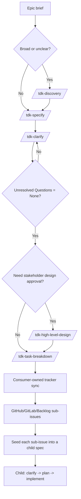

# Epic Start Guide

> Beginner-friendly guide for starting a broad epic with TDK before implementation.

Use this guide when you have a broad feature idea and need to turn it into clear artifacts that a junior or fresher developer can follow.

## One-Minute Model

TDK turns vague work into implementation-ready evidence:

```text
Epic brief
  -> optional /tdk-discovery
  -> /tdk-specify
  -> /tdk-clarify
  -> optional /tdk-high-level-design
  -> /tdk-task-breakdown
  -> consumer-owned tracker sync creates sub-issues
  -> each sub-issue becomes a child spec
  -> child spec runs clarify -> plan -> implement
```

The most important rule:

```text
discovery is context
spec.md is requirement authority
HLD is design enrichment
task breakdown is portable work items for sub-issues
child specs are the implementation units
plan.md is implementation sequence for one spec
```

## Should I Start With Discovery?

| Situation | Start with | Why |
|---|---|---|
| The work is broad, vague, or has many possible MVP cuts | `/tdk-discovery` | You need epic-level problem, persona, and MVP context before a spec |
| The generated discovery/spec could easily encode the wrong intent | Add `--interview` | The command asks artifact-grounded challenge questions before completion |
| The feature is already clear and small | `/tdk-specify` | Discovery would add ceremony without reducing risk |
| You are not sure who the users are | `/tdk-discovery` | Persona and jobs-to-be-done context should be captured first |
| You already know scope, actors, acceptance criteria, and edge cases | `/tdk-specify` | The spec can be written directly |

When in doubt, ask: "Can I write clear user requirements and success criteria now?" If no, run discovery first.

## Flow Diagram



Feature-sized work can skip task breakdown and run `/tdk-plan` on the current spec directly. In this epic workflow, task breakdown feeds tracker sub-issues, and each sub-issue gets its own child spec loop.

## Output File Contents

Read generated files through the manifest first: `discovery/index.md`, `high-level-design/index.md`, or `tasks-breakdown/index.md`. Do not inspect a directory by globbing files and assuming every file is current.

### Discovery outputs

| File | What it contains | How a junior should use it |
|---|---|---|
| `discovery/problem.md` | Frontmatter, `## Problem`, `## Affected Users`, `## Current Alternatives`, `## Constraints`, `## Open Questions` | Understand what pain the epic solves, who feels it, and what constraints already exist |
| `discovery/personas.md` | `## Primary Personas`, `## Secondary Personas`, `## Jobs To Be Done`, `## Assumptions`, `## Open Questions` | Know the user roles and why different actors may need different behavior |
| `discovery/mvp-scope.md` | `## In Scope Candidates`, `## Out Of Scope Candidates`, `## MVP Cutline`, `## Risks`, `## Open Questions` | See the first safe MVP boundary before turning the epic into requirements |
| `discovery/index.md` | `## Artifact Manifest`, `## Summary`, `## Product-level signals`, `## Ready For Specify` | Start here; it tells you which discovery files matter and whether the epic is ready for `/tdk-specify` |

Discovery output is not requirement authority. Treat it as context for writing the first `spec.md`.

### Specify outputs

| File | What it contains | How a junior should use it |
|---|---|---|
| `spec.md` | Frontmatter, `# Feature Specification`, sections `## 1` through `## 9`, and reserved `## Clarifications` | Treat as the source of truth for scope, requirements, success criteria, and open questions |
| `checklists/requirements.md` | Structure completeness checks, tagging checks, content quality checks, requirement completeness checks, and notes | Review before moving on; incomplete items usually mean the spec needs more work |

The important `spec.md` sections are:

| Section | Purpose |
|---|---|
| `## 1. Problem Statement` | Concrete problem, affected users, and why it matters now |
| `## 2. Scope Boundary` | What is in scope, what is out of scope, and why |
| `## 3. Impact Surface` | Sub-workspaces or modules touched by the feature |
| `## 4. Evaluated Approaches` | Scope-level options and the recommended cut |
| `## 5. User Requirements & Testing` | `UR-*`, priorities, independent tests, Given/When/Then acceptance scenarios, edge cases |
| `## 6. Functional Requirements` | `FR-*`, functional behavior, and key entities |
| `## 7. Success Criteria` | `SC-*`, measurable and technology-agnostic outcomes |
| `## 8. Risks & Mitigations` | Main risks and mitigation ideas |
| `## 9. Unresolved Questions` | `None` or a numbered list of questions to resolve |
| `## Clarifications` | Decision history written by `/tdk-clarify` |

If the spec is created from a promoted task or sub-issue, its frontmatter may also include `parent_spec` and `promoted_from`.

### Clarify output

`/tdk-clarify` does not create a new artifact. It updates `spec.md`.

| Updated area | What changes | How a junior should use it |
|---|---|---|
| `## Clarifications` | Adds a dated session with one `Q -> A` bullet per accepted answer and rationale | Read this to understand why a decision was made |
| Existing requirement sections | Updates scope, user requirements, functional requirements, key entities, success criteria, edge cases, risks, or terminology | Read the updated section as the current truth; do not rely only on the Q/A log |
| `## 9. Unresolved Questions` | Should become exactly `None` before HLD, task breakdown, or child planning | Use this as the gate before moving forward |

Clarify is useful because it keeps decisions inside the spec instead of leaving them only in chat history.

### HLD outputs

| File | What it contains | How a junior should use it |
|---|---|---|
| `high-level-design/index.md` | Frontmatter, `## Source`, `## Artifact Map`, `## Readiness Gate` | Start here; it lists the HLD files that are current and validates the spec gate |
| `high-level-design/requirement-overview.md` | Problem and outcome, scope, actors, requirement map, non-functional goals | See how `UR-*`, `FR-*`, and `SC-*` translate into design implications |
| `high-level-design/project-and-technical-overview.md` | System context, module impact, technical assumptions, integration map, security posture, operability | Understand system-level impact; treat originated details marked `assumed` as assumptions to validate |
| `high-level-design/data-flow.md` | Key entities, read/write flows, external dependencies, state lifecycle, optional diagram | Understand data movement and state behavior before splitting work |
| `high-level-design/screen-flow.md` | Primary journeys, screen list, steps, branch conditions, related APIs, optional diagram | Understand user journeys and UI/API touchpoints |
| `high-level-design/decisions-and-risks.md` | Decisions, rejected alternatives, risks, assumptions to validate, non-blocking follow-ups | See what was chosen, what was rejected, and what may need to go back to spec |

HLD enriches existing requirements. It does not create `UR-*`, `FR-*`, `SC-*`, tasks, plans, tracker issues, or code.

### Task breakdown outputs

| File | What it contains | How a junior should use it |
|---|---|---|
| `tasks-breakdown/index.md` | Frontmatter, source spec link, `## Tasks` table, tracker boundary, sync boundary | Treat as the authoritative manifest for task files to sync |
| `tasks-breakdown/task-NNN-{slug}.md` | Frontmatter, title, `## Objective`, `## Source Requirements`, `## Scope` with In/Out, `## Acceptance Criteria`, `## Notes` | Use one task file as the body/source for one tracker sub-issue |

The `tasks-breakdown/index.md` task table has:

| Column | Meaning |
|---|---|
| `#` | Stable work-item number such as `001` |
| `Task` | Short issue-sized title |
| `Source Requirements` | `UR-*`, `FR-*`, and `SC-*` references from `spec.md` |
| `File` | Link to the task file |
| `Status` | Empty for active work item, or `promoted -> <child-id>` when the work item became a child spec |

Task breakdown is not an implementation plan. It creates portable work items that the consumer project can sync to GitHub, GitLab, Backlog, Jira, or another tracker.

### Tracker sub-issue and child spec outputs

TDK core does not create external issues. After consumer-owned tracker sync, each external sub-issue should carry the task's objective, source requirements, scope, acceptance criteria, and notes.

Then create a child spec from each sub-issue/task. The child spec output is the same shape as `spec.md`, but scoped to that one sub-issue. Only after the child spec is clarified should it move to `/tdk-plan` and `/tdk-implement`.

## Skill Playbook

### 1. `/tdk-discovery <epic-id> <brief|file> [--force] [--interview]`

Use this only for epic-sized context before a feature spec.

Example:

```text
/tdk-discovery feat-001 "User avatar upload, cropping, validation, storage, and moderation"
```

| Item | Detail |
|---|---|
| Input | Epic ID plus a short brief or a workspace-local Markdown file |
| Reads | Project context, constitution, and memory when available |
| Creates | `discovery/problem.md`, `discovery/personas.md`, `discovery/mvp-scope.md`, `discovery/index.md` |
| Main value | Frames the problem, users, MVP cutline, risks, and open questions |
| Next command | `/tdk-specify <id> <description>` |

Add `--interview` when the epic is broad, politically sensitive, or likely to hide intent mismatches. It asks targeted questions about the generated discovery artifacts, then folds accepted changes into the same four files. It does not create `discovery/interview.md` or tracker records.

What it does not do:

- Does not create `spec.md`.
- Does not create `UR-*`, `FR-*`, or `SC-*` IDs.
- Does not create plans, tasks, code, or tracker issues.

Ready check:

- Open `discovery/index.md`.
- Check that problem, personas, and MVP scope are understandable.
- If the MVP boundary still feels vague, clarify the brief before moving on.

### 2. `/tdk-specify <id> <desc> [--fast] [--interview]`

Use this to create the feature specification. This is the source of truth for requirements.

Example:

```text
/tdk-specify feat-001 Add user avatar upload with image cropping and validation
```

| Item | Detail |
|---|---|
| Input | Feature ID plus natural-language description |
| Reads | Optional `discovery/index.md` if discovery exists |
| Creates | `spec.md`, `checklists/requirements.md` |
| Main value | Defines problem, scope, impact surface, user requirements, functional requirements, success criteria, risks, and unresolved questions |
| Next command | `/tdk-clarify <id>` |

Add `--interview` when you want to challenge the draft spec against your intent before unresolved-question handling. `--fast --interview` is valid: `--fast` controls draft depth and `--interview` controls the alignment check.

Requirement IDs start here:

- `UR-*`: user requirements and acceptance scenarios
- `FR-*`: functional requirements
- `SC-*`: success criteria

What it does not do:

- Does not write code.
- Does not create implementation plans.
- Does not create portable task files.
- Should not describe implementation details like file paths, APIs, frameworks, or database tables unless they are part of the accepted requirement context.

Ready check:

- Open `spec.md`.
- Confirm `## 1. Problem Statement` is concrete.
- Confirm `## 2. Scope Boundary` has both in-scope and out-of-scope items.
- Confirm `## 5. User Requirements & Testing` has acceptance scenarios.
- Confirm `## 6. Functional Requirements` has stable `FR-*` IDs.
- Review `checklists/requirements.md`.

### 3. `/tdk-clarify <id>`

Use this to remove ambiguity before design, task breakdown, or planning.

Example:

```text
/tdk-clarify feat-001
```

| Item | Detail |
|---|---|
| Input | Existing `spec.md` |
| Updates | `spec.md` |
| Main value | Asks targeted questions and writes answers back into the spec |
| Next command | `/tdk-high-level-design`, `/tdk-task-breakdown`, or `/tdk-plan` for feature-sized work |

Clarify usually targets:

- unclear scope boundaries
- missing actor or role behavior
- missing data/entity details
- vague success criteria
- security, privacy, or compliance ambiguity
- edge cases and failure behavior

What it does not do:

- Does not create a new spec.
- Does not create tasks.
- Does not write code.

Ready check:

- Confirm answers appear under `## Clarifications`.
- Confirm affected requirement sections were updated, not only appended.
- Confirm `## 9. Unresolved Questions` is exactly `None` before running HLD or task breakdown.

### 4. `/tdk-high-level-design <id> [--greenfield] [--force]`

Use this when stakeholders need approval-level design before breakdown or planning.

Example:

```text
/tdk-high-level-design feat-001
```

| Item | Detail |
|---|---|
| Input | Clarified `spec.md` with unresolved questions set to `None` |
| Creates | `high-level-design/index.md` plus 5 design artifacts |
| Main value | Turns stable requirements into product/system design context |
| Next command | `/tdk-task-breakdown <id>` for epic work, or `/tdk-plan <id>` for feature-sized work |

Created files:

```text
high-level-design/index.md
high-level-design/requirement-overview.md
high-level-design/project-and-technical-overview.md
high-level-design/data-flow.md
high-level-design/screen-flow.md
high-level-design/decisions-and-risks.md
```

What it does not do:

- Does not create implementation plans.
- Does not create tasks.
- Does not create code.
- Does not create tracker issues.
- Does not create new requirement IDs.

Ready check:

- Start with `high-level-design/index.md`.
- Read only artifacts listed in the index.
- Check that requirement-derived design statements cite `UR-*`, `FR-*`, or `SC-*`.
- If HLD exposes a new requirement, return to `specify` or `clarify` instead of forcing it into design.

### 5. `/tdk-task-breakdown <id>`

Use this when you need portable, issue-sized Markdown work items.

Example:

```text
/tdk-task-breakdown feat-001
```

| Item | Detail |
|---|---|
| Input | Clarified `spec.md`; optional HLD context |
| Creates | `tasks-breakdown/index.md`, `tasks-breakdown/task-NNN-{slug}.md` |
| Main value | Converts parent requirements into portable work items for consumer-owned tracker sub-issues |
| Next command | Consumer-owned tracker sync, then child spec creation per sub-issue |

What it does not do:

- Does not create GitHub, GitLab, Backlog, Jira, or other tracker issues.
- Does not create an implementation plan.
- Does not write code.
- Does not use HLD as a citation source.

Ready check:

- Open `tasks-breakdown/index.md`.
- Treat it as the authoritative manifest.
- Open each listed task file.
- Confirm each task cites at least one `UR-*`, `FR-*`, or `SC-*`.
- Sync each listed task to a tracker sub-issue using consumer-owned tooling.
- Seed each synced sub-issue into a child spec so it can run its own clarify, plan, and implement loop.

## Parent Epic vs Child Spec

For an epic, the parent spec is the decomposition authority. It usually should not be planned and implemented as one large unit after task breakdown.

Instead:

```text
parent spec
  -> /tdk-task-breakdown
  -> tasks-breakdown/index.md
  -> consumer-owned tracker sync
  -> GitHub/GitLab/Backlog sub-issues
  -> child spec per synced sub-issue
  -> child clarify -> child plan -> child implement
```

Keep the parent spec for:

- problem and scope authority
- requirement traceability
- breakdown manifest
- parent-child relationship tracking

Use each child spec for:

- detailed requirements for one sub-issue
- clarification of that sub-scope
- implementation planning
- implementation and verification

TDK core creates portable Markdown task files. The consumer project owns the tracker sync that turns those task files into GitHub, GitLab, Backlog, Jira, or other tracker sub-issues. After sync, this epic workflow treats each sub-issue as a child spec seed.

## Readiness Gates

| Move | Gate |
|---|---|
| Discovery -> Specify | Problem, persona, and MVP context are clear enough to write a feature spec |
| Specify -> Clarify | `spec.md` exists and the requirements checklist was reviewed |
| Clarify -> HLD | `## 9. Unresolved Questions` is exactly `None` |
| Clarify -> Task Breakdown | `## 9. Unresolved Questions` is exactly `None` |
| HLD -> Task Breakdown | HLD index exists and no new requirement needs a spec update |
| Task Breakdown -> Tracker Sync | `tasks-breakdown/index.md` lists task files; every task cites `UR-*`, `FR-*`, or `SC-*` |
| Tracker Sync -> Child Spec | Each external sub-issue has enough task content to seed a child spec |
| Child Spec -> Child Plan | Child `spec.md` is clarified and unresolved questions are `None` |
| Child Plan -> Child Implement | Child `plan.md` has a usable `## Phases` table |

## Worked Example

Start with an epic:

```text
User avatar upload: users can upload an avatar, crop it, validate image size/type, store it, and remove it later.
```

If the problem and MVP are not fully clear:

```text
/tdk-discovery feat-001 "User avatar upload, cropping, validation, storage, and removal"
```

Then create the requirement source of truth:

```text
/tdk-specify feat-001 Add user avatar upload with cropping, validation, storage, and removal
```

Resolve gaps:

```text
/tdk-clarify feat-001
```

If `spec.md` still has unresolved questions, answer them before moving on. If stakeholders need a design review:

```text
/tdk-high-level-design feat-001
```

Break the parent epic into issue-sized work items:

```text
/tdk-task-breakdown feat-001
```

Sync the listed task files to your tracker as sub-issues using consumer-owned tooling. Then seed each sub-issue into a child spec. Example:

```text
/tdk-specify feat-002 "Seed from task-001-avatar-upload-validation.md"
/tdk-clarify feat-002
/tdk-plan feat-002
/tdk-implement feat-002
```

Repeat the child loop for each sub-issue. Do not plan and implement the parent epic as one large unit unless you intentionally decide the current spec is small enough to implement directly.

## Common Mistakes

| Mistake | Correction |
|---|---|
| Running discovery for every small feature | Skip discovery when the feature is already clear |
| Treating discovery as requirements | Only `spec.md` owns `UR-*`, `FR-*`, and `SC-*` |
| Putting implementation details into spec | Keep spec focused on user value, behavior, scope, and success criteria |
| Running HLD while unresolved questions remain | Run `/tdk-clarify` until unresolved questions are `None` |
| Treating HLD as a second PRD | HLD enriches existing spec requirements; it does not mint new requirements |
| Planning the parent epic immediately after task breakdown | Sync tasks to sub-issues, then create child specs for implementation |
| Treating task breakdown as implementation plan | Child `/tdk-plan` owns implementation phases for each child spec |
| Expecting TDK core to create tracker issues | Task breakdown is tracker-neutral; tracker sync is consumer-owned |

## Troubleshooting

| Symptom | Likely Cause | Fix |
|---|---|---|
| HLD stops before writing files | `## 9. Unresolved Questions` is not exactly `None` | Run `/tdk-clarify <id>` |
| Task breakdown stops before writing files | Spec still has unresolved questions or missing stable IDs | Resolve questions and ensure `UR-*`, `FR-*`, `SC-*` exist |
| Sub-issue has no implementation path | It was synced from task breakdown but not seeded into a child spec | Create a child spec from the sub-issue/task content |
| User cannot tell what to inspect next | They are reading by globbing directories | Start from `discovery/index.md`, `high-level-design/index.md`, or `tasks-breakdown/index.md` |
| Requirements conflict with HLD | New requirement discovered too late | Update `spec.md` through `specify` or `clarify`, then regenerate downstream artifacts |

## Related Docs

- [Hướng Dẫn Bắt Đầu Epic](../../vi/guides/epic-start-guide.md)
- [Command Reference](command-reference.md)
- [Document Flow](document-flow.md)
- [Full Feature Development Scenario](scenarios/01-full-feature-development.md)
- [Promote Convention](promote-convention.md)
