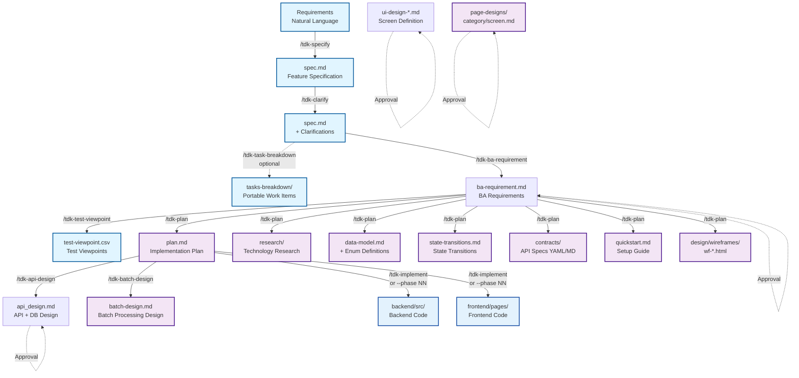
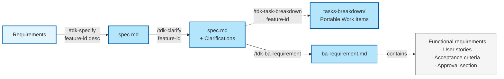
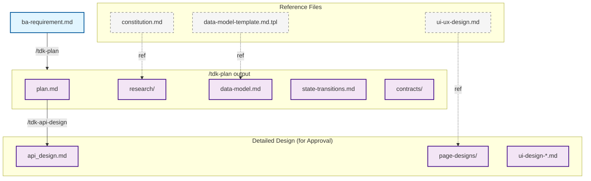
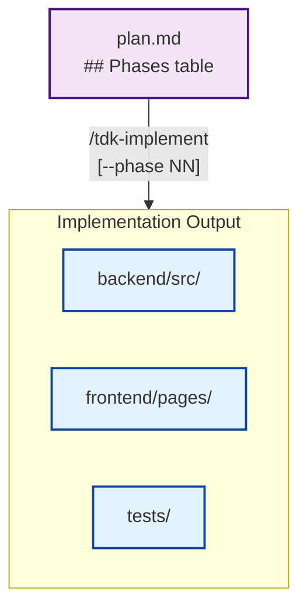
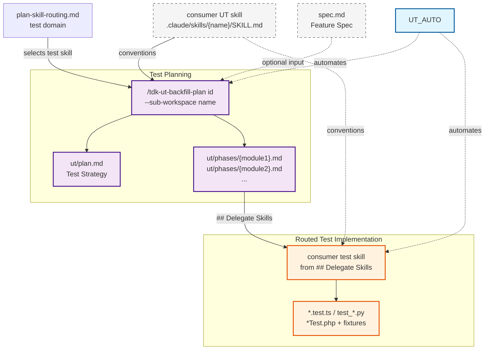
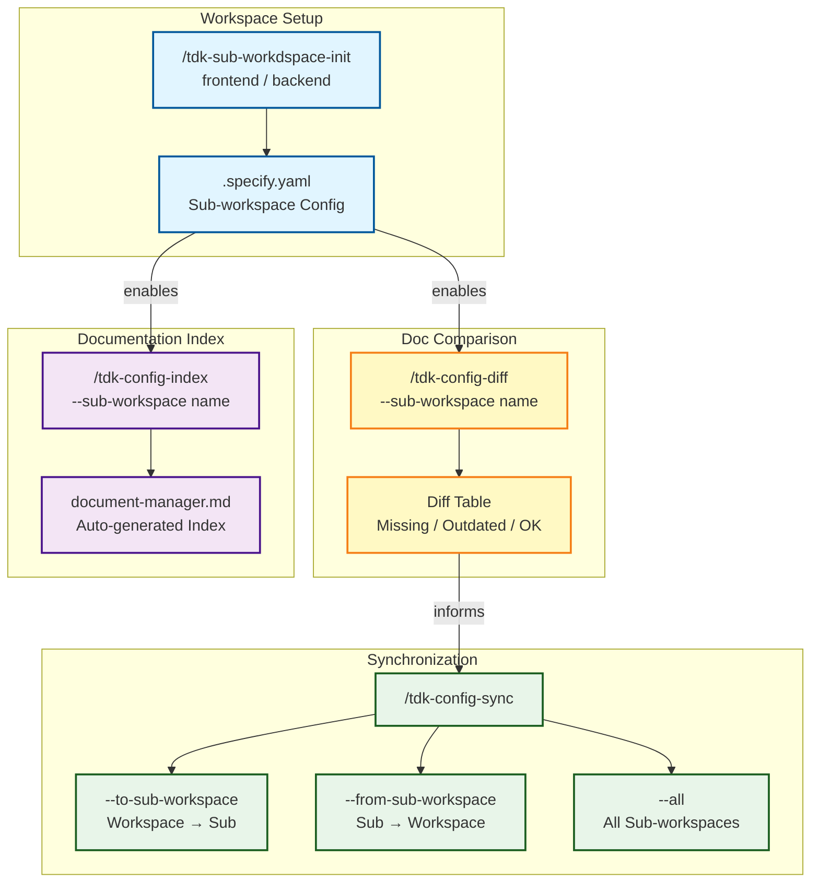
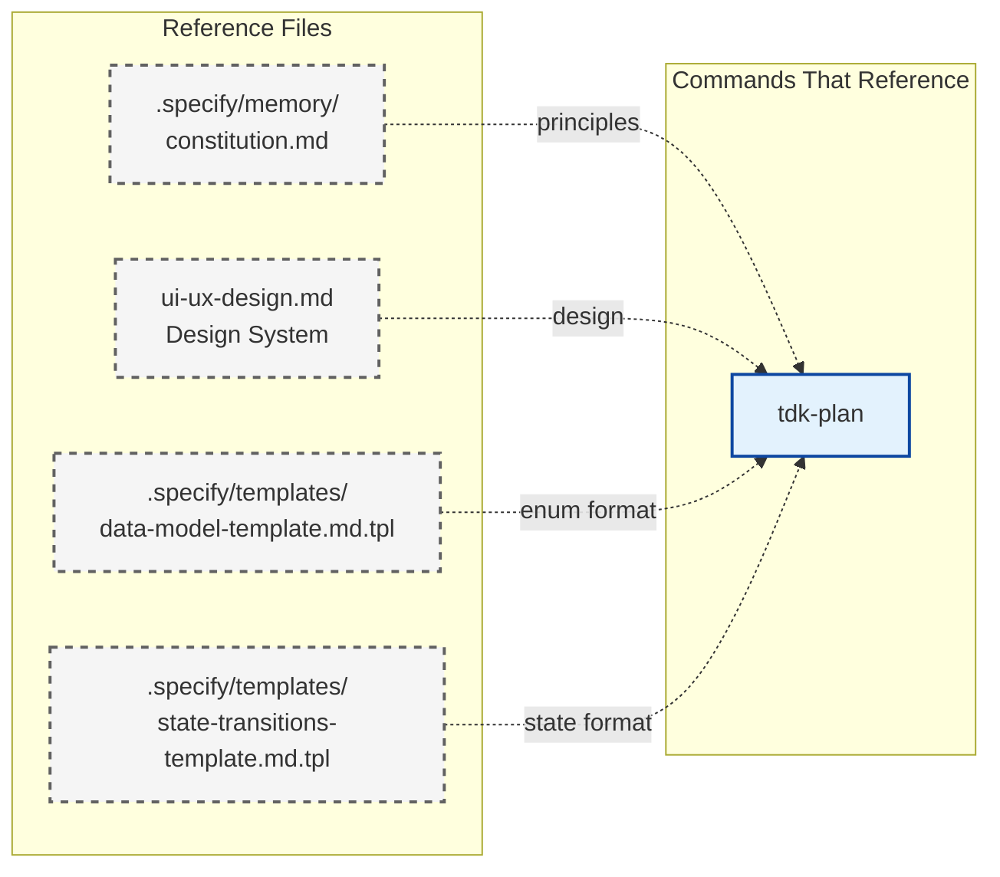
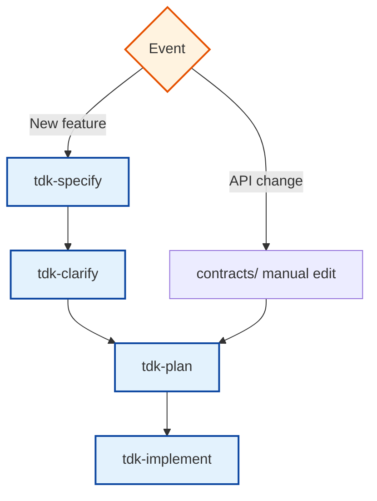

# Tihon Document Flow

> Visual representation of all artifact inputs/outputs across the Tihon command workflow.
> Migrated from speckit-tdk-jp DOCUMENT-FLOW.md and updated for Claude Code slash commands.

---

## Full Workflow Flow



---

## Phase-by-Phase Details

### Phase 0: Specification



**Promote a large work-item → child spec.** A work-item big enough to be its own
sub-feature can be promoted into an independent child spec at `specs/<child-id>/`, linked
to its parent by a single `parent_spec` frontmatter field (no path nesting). The child
re-runs this same Phase 0 pipeline. See
[Promote Convention](./promote-convention.md) for the manual seed flow, the
`[folder/]ticket` `parent_spec` format rule, and the sizing rule.

### Phase 1: Design & Architecture



### Phase 2: Implementation Paths

#### Solo Path (Primary)


`/tdk-implement <id>` runs all runnable rows from `plan.md ## Phases`.
`/tdk-implement <id> --phase NN` runs one selected phase while still honoring dependencies and global stale `in_progress` recovery.

### Unit Testing Pipeline



`ut:auto` runs the full pipeline in one command; use individual commands for manual control. `--sub-workspace` targets a specific workspace (e.g., `backend`, `frontend`). `--standalone` on `ut:plan` skips spec dependency for existing code.

### Config & Workspace Management



Always run `config:diff` before `config:sync` to preview changes. Use `--dry-run` with sync for safe previews. `config:index` generates `document-manager.md` for LLM discoverability.

---

## Artifact Matrix

| Artifact | Created By | Input From | Used By | Update Frequency |
|----------|-----------|------------|---------|-----------------|
| `spec.md` | `/tdk-specify` | User description | `/tdk-plan`, all downstream | Feature start |
| `spec.md` (+ Clarifications) | `/tdk-clarify` | `spec.md` | `/tdk-ba-requirement` | After specify |
| `tasks-breakdown/` | `/tdk-task-breakdown` | clarified `spec.md` | Consumer-owned tracker sync | Optional after clarify |
| `ba-requirement.md` | `/tdk-ba-requirement` | `spec.md` | `/tdk-plan` | For Approval |
| `plan.md` | `/tdk-plan` | `ba-requirement.md`, `constitution.md` | `plan.md ## Phases`, `/tdk-implement [--phase NN]` | Feature start |
| `plan.md ## Phases` | `/tdk-plan` | `ba-requirement.md`, design artifacts | `/tdk-implement [--phase NN]` | Feature start |
| `research/` | `/tdk-plan` | `ba-requirement.md` | Reference | Feature start |
| `data-model.md` | `/tdk-plan` | `ba-requirement.md` | Reference | Feature start |
| `api_design.md` | `/tdk-api-design` | `plan.md` | Reference | For Approval |
| `batch-design.md` | `/tdk-batch-design` | `spec.md`, `research/`, `data-model.md` | Reference | For Approval |
| `test-viewpoint.csv` | `/tdk-test-viewpoint` | `spec.md`, `ba-requirement.md` | Manual reference | After ba-requirement |
| `backend/src/**` | `/tdk-implement` | `plan.md ## Phases` | Testing | Implementation |
| `frontend/pages/**` | `/tdk-implement` | `plan.md ## Phases`, `page-designs/` | Testing, review | Implementation |
| `ut/plan.md` | `/tdk-ut-backfill-plan` | `spec.md` (opt), consumer test skill routing | `/tdk-implement` | Feature UT |
| `ut/phases/{module}.md` | `/tdk-ut-backfill-plan` | `spec.md` (opt), `plan-skill-routing.md` | consumer test skill via `## Delegate Skills` | Feature UT |
| `*.test.ts` / `test_*.py` etc. | consumer test skill | `ut/phases/{module}.md` | Test runner | Feature UT |
| `.specify.yaml` | `/tdk-sub-workdspace-init` | Project config | `config:*`, `ut:*` | Project setup |
| `document-manager.md` | `/tdk-config-index` | All docs files | Manual reference, LLM tools | On demand |

---

## Reference Files (Templates)

These files are **read-only references** used by multiple commands but never modified:



---

## Event-Driven Update Triggers



---

## Artifact Directory Structure

```
.specify/specs/{task-id}/
├── spec.md                             # Phase 0: Feature specification
├── plan.md                             # Phase 1: Implementation plan
├── research/                           # Phase 1: Technology research
├── data-model.md                       # Phase 1: Entity definitions + enums
├── state-transitions.md                # Phase 1: State machine definitions
├── quickstart.md                       # Phase 1: Setup guide
├── contracts/                          # Phase 1: API specifications
│   └── *.yaml
├── design/wireframes/                  # Phase 1: UI wireframes
│   └── wf-*.html
├── page-designs/                       # Phase 1: Screen specifications
│   └── {category}/
│       └── {screen}.md
└── checklists/                         # Quality checklists
    └── requirements.md
```
