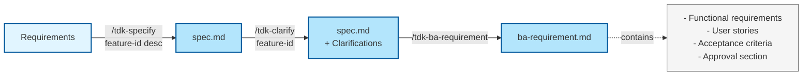
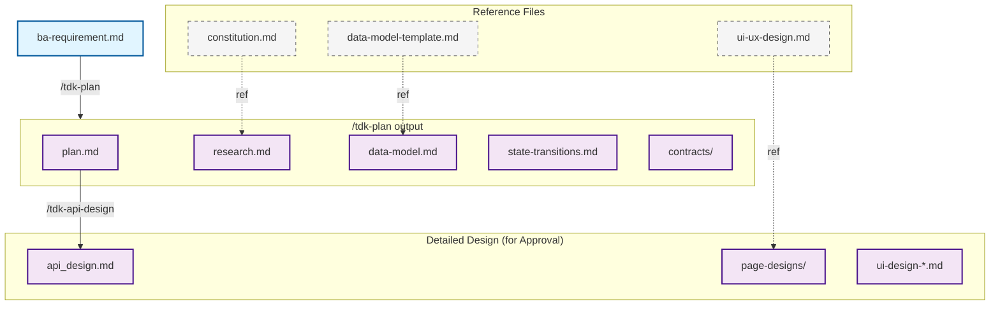
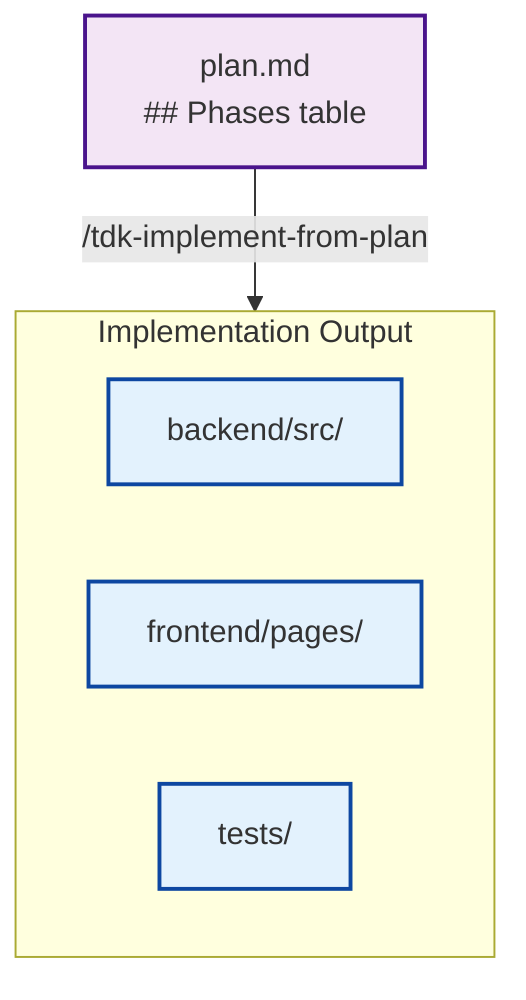
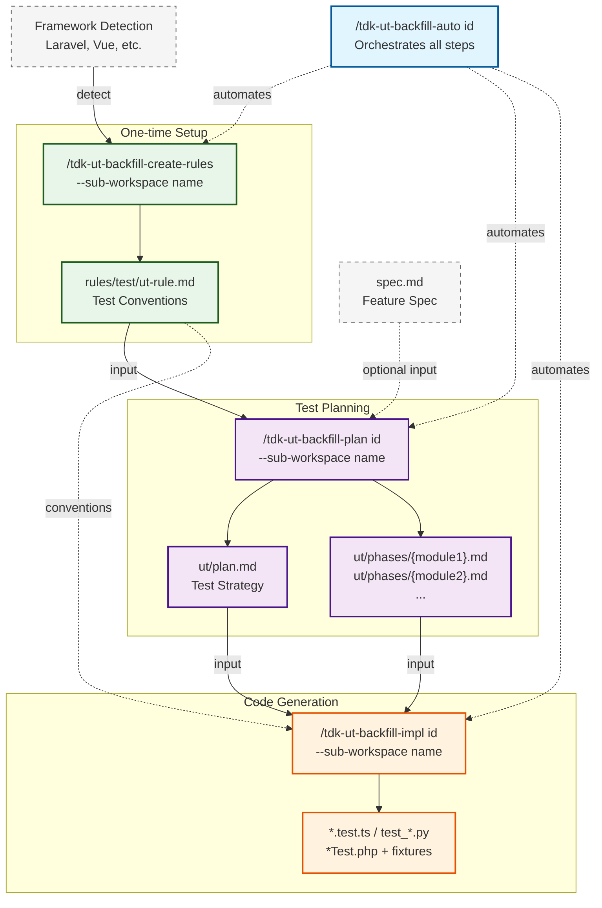
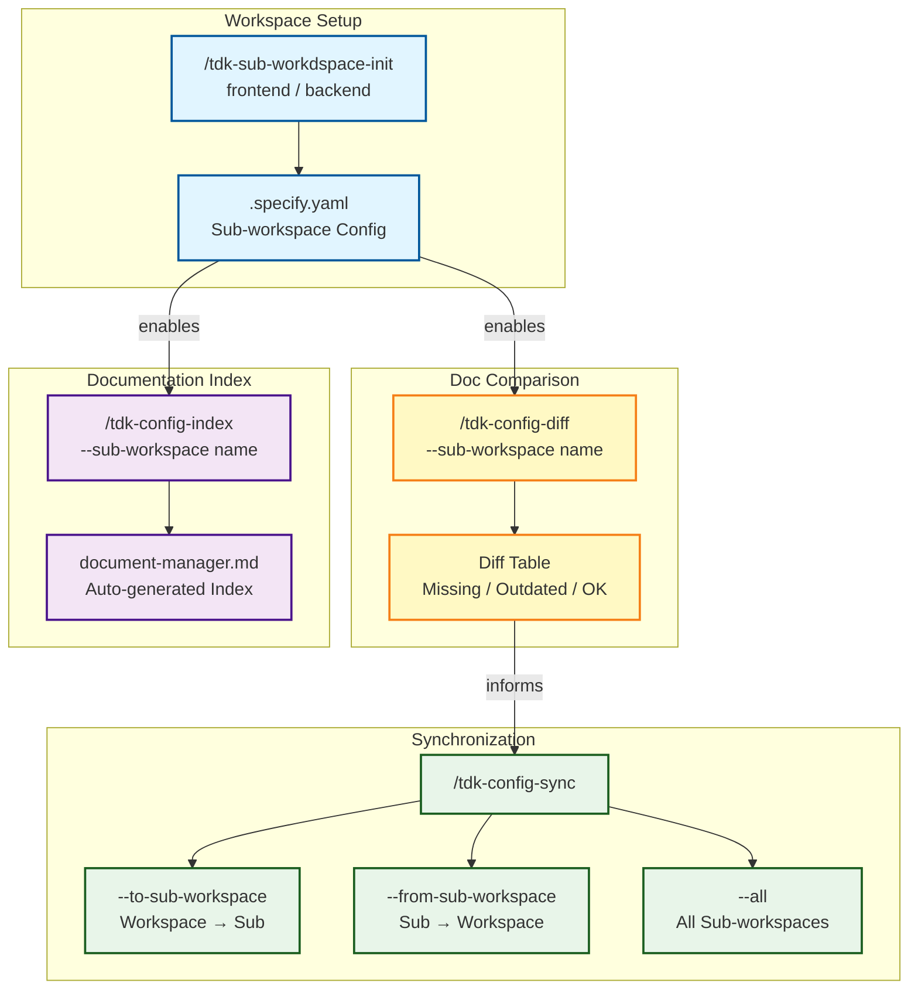
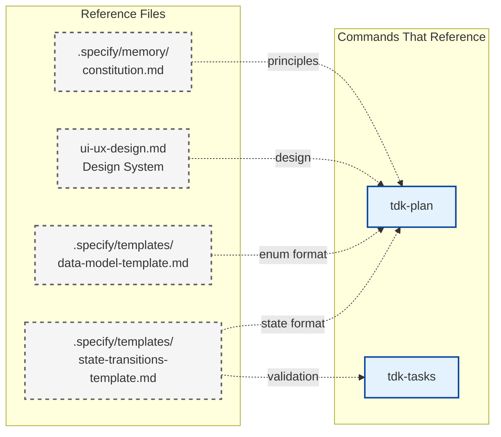

# Tihon Document Flow

> Visual representation of all artifact inputs/outputs across the Tihon command workflow.
> Migrated from speckit-tdk-jp DOCUMENT-FLOW.md and updated for Claude Code slash commands.

---

## Full Workflow Flow

```mermaid
flowchart TD
    %% Phase 0: Specification
    REQ[Requirements<br/>Natural Language]

    %% Phase 0: Feature Specification
    REQ -->|/tdk-specify| SPEC[spec.md<br/>Feature Specification]
    SPEC -->|/tdk-clarify| SPEC_CLARIFIED[spec.md<br/>+ Clarifications]
    SPEC_CLARIFIED -->|/tdk-ba-requirement| BA_REQ[ba-requirement.md<br/>BA Requirements]
    BA_REQ -.->|Approval| BA_REQ
    BA_REQ -->|/tdk-test-viewpoint| TEST_VP[test-viewpoint.csv<br/>Test Viewpoints]

    %% Phase 1: Architecture & Design
    BA_REQ -->|/tdk-plan| PLAN[plan.md<br/>Implementation Plan]
    BA_REQ -->|/tdk-plan| RESEARCH[research.md<br/>Technology Research]
    BA_REQ -->|/tdk-plan| DATAMODEL[data-model.md<br/>+ Enum Definitions]
    BA_REQ -->|/tdk-plan| STATETRANS[state-transitions.md<br/>State Transitions]
    BA_REQ -->|/tdk-plan| CONTRACTS[contracts/<br/>API Specs YAML/MD]
    BA_REQ -->|/tdk-plan| QUICKSTART[quickstart.md<br/>Setup Guide]
    BA_REQ -->|/tdk-plan| WIREFRAMES[design/wireframes/<br/>wf-*.html]

    %% Phase 1: Detailed Design & Approval
    PLAN -->|/tdk-api-design| API_DESIGN[api_design.md<br/>API + DB Design]
    PLAN -->|/tdk-batch-design| BATCH_DESIGN[batch-design.md<br/>Batch Processing Design]
    PAGEDESIGNS[page-designs/<br/>category/screen.md]
    UI_DESIGN[ui-design-*.md<br/>Screen Definition]
    API_DESIGN -.->|Approval| API_DESIGN
    UI_DESIGN -.->|Approval| UI_DESIGN
    PAGEDESIGNS -.->|Approval| PAGEDESIGNS

    %% Phase 2: Implementation (Solo Path - Primary)
    PLAN -->|/tdk-implement-from-plan| CODE_BE[backend/src/<br/>Backend Code]
    PLAN -->|/tdk-implement-from-plan| CODE_FE[frontend/pages/<br/>Frontend Code]

    %% Phase 2: Implementation (Legacy Path - Deprecated)
    RESEARCH -.->|[deprecated] /tdk-tasks| TASKS_LEGACY["tasks.md<br/>(Legacy/Deprecated)"]
    DATAMODEL -.->|[deprecated] /tdk-tasks| TASKS_LEGACY
    STATETRANS -.->|[deprecated] /tdk-tasks| TASKS_LEGACY
    CONTRACTS -.->|[deprecated] /tdk-tasks| TASKS_LEGACY
    PAGEDESIGNS -.->|[deprecated] /tdk-tasks| TASKS_LEGACY
    WIREFRAMES -.->|[deprecated] /tdk-tasks| TASKS_LEGACY
    API_DESIGN -.->|[deprecated] /tdk-tasks| TASKS_LEGACY
    BATCH_DESIGN -.->|[deprecated] /tdk-tasks| TASKS_LEGACY
    UI_DESIGN -.->|[deprecated] /tdk-tasks| TASKS_LEGACY

    TASKS_LEGACY -->|[deprecated] /tdk-implement-task| CODE_BE
    TASKS_LEGACY -->|[deprecated] /tdk-implement-task| CODE_FE
    TASKS_LEGACY -->|[deprecated] /tdk-implement-task| TESTS[tests/<br/>Test Code]

    %% Styling
    classDef phase0 fill:#e1f5ff,stroke:#01579b,stroke-width:2px
    classDef phase1 fill:#f3e5f5,stroke:#4a148c,stroke-width:2px
    classDef phase2 fill:#fff3e0,stroke:#e65100,stroke-width:2px
    classDef phase3 fill:#e8f5e9,stroke:#1b5e20,stroke-width:2px
    classDef phase4 fill:#fff9c4,stroke:#f57f17,stroke-width:2px
    classDef phase5 fill:#ffebee,stroke:#b71c1c,stroke-width:2px
    classDef reference fill:#f5f5f5,stroke:#616161,stroke-width:1px,stroke-dasharray: 5 5
    classDef code fill:#e3f2fd,stroke:#0d47a1,stroke-width:2px
    classDef infra fill:#fce4ec,stroke:#880e4f,stroke-width:2px

    class REQ,SPEC,SPEC_CLARIFIED phase0
    class PLAN,RESEARCH,DATAMODEL,STATETRANS,CONTRACTS,QUICKSTART,WIREFRAMES,PAGEDESIGNS,BATCH_DESIGN phase1
    class TEST_VP phase0
    class CONSTITUTION,UIUX,REF_DATAMODEL,REF_STATE reference
    class CODE_BE,CODE_FE,TESTS code
    class TASKS_LEGACY reference
```

---

## Phase-by-Phase Details

### Phase 0: Specification



### Phase 1: Design & Architecture



### Phase 2: Implementation Paths

#### Solo Path (Primary)


#### Legacy Path (Deprecated)
```mermaid
flowchart TD
    subgraph INPUTS[Design Artifacts]
        RESEARCH[research.md]
        DATAMODEL[data-model.md]
        CONTRACTS[contracts/]
        PAGEDESIGNS[page-designs/]
        API_DESIGN[api_design.md]
        DB_DESIGN[db_design.md]
    end

    TASKS["tasks.md<br/>(Deprecated)"]

    subgraph IMPL_OUTPUT[Implementation Output]
        CODE_BE[backend/src/]
        CODE_FE[frontend/pages/]
        TESTS[tests/]
    end

    INPUTS -->|[deprecated] "/tdk-tasks"| TASKS
    TASKS -->|[deprecated] "/tdk-implement-task"| IMPL_OUTPUT

    classDef input fill:#f3e5f5,stroke:#4a148c,stroke-width:2px
    classDef output fill:#fff3e0,stroke:#e65100,stroke-width:2px,stroke-dasharray: 5 5
    classDef code fill:#e3f2fd,stroke:#0d47a1,stroke-width:2px

    class RESEARCH,DATAMODEL,CONTRACTS,PAGEDESIGNS,API_DESIGN,DB_DESIGN input
    class TASKS output
    class CODE_BE,CODE_FE,TESTS code
```

### Unit Testing Pipeline



`ut:auto` runs the full pipeline in one command; use individual commands for manual control. `--sub-workspace` targets a specific workspace (e.g., `backend`, `frontend`). `--standalone` on `ut:plan` skips spec dependency for existing code.

### Config & Workspace Management



Always run `config:diff` before `config:sync` to preview changes. Use `--dry-run` with sync for safe previews. `config:index` generates `document-manager.md` for LLM discoverability.

---

## Artifact Matrix

| Artifact | Created By | Input From | Used By | Update Frequency |
|----------|-----------|------------|---------|-----------------|
| `spec.md` | `/tdk-specify` | User description | `/tdk-plan`, all downstream | Feature start |
| `spec.md` (+ Clarifications) | `/tdk-clarify` | `spec.md` | `/tdk-ba-requirement` | After specify |
| `ba-requirement.md` | `/tdk-ba-requirement` | `spec.md` | `/tdk-plan` | For Approval |
| `plan.md` | `/tdk-plan` | `ba-requirement.md`, `constitution.md` | `plan.md ## Phases`, `/tdk-implement-from-plan` | Feature start |
| `plan.md ## Phases` | `/tdk-plan` | `ba-requirement.md`, design artifacts | `/tdk-implement-from-plan` (primary), `/tdk-tasks` (legacy) | Feature start |
| `research.md` | `/tdk-plan` | `ba-requirement.md` | `/tdk-tasks` (legacy) | Feature start |
| `data-model.md` | `/tdk-plan` | `ba-requirement.md` | `/tdk-tasks` (legacy) | Feature start |
| `api_design.md` | `/tdk-api-design` | `plan.md` | `/tdk-tasks` (legacy) | For Approval |
| `batch-design.md` | `/tdk-batch-design` | `spec.md`, `research.md`, `data-model.md` | `/tdk-tasks` (legacy) | For Approval |
| `test-viewpoint.csv` | `/tdk-test-viewpoint` | `spec.md`, `ba-requirement.md` | Manual reference | After ba-requirement |
| `tasks.md` (deprecated) | `/tdk-tasks` [deprecated] | Design artifacts (API, DB, Page, Data Model) | `/tdk-implement-task` [deprecated] | Legacy only |
| `backend/src/**` | `/tdk-implement-from-plan` | `plan.md ## Phases` | Testing | Implementation |
| `frontend/pages/**` | `/tdk-implement-from-plan` | `plan.md ## Phases`, `page-designs/` | Testing, review | Implementation |
| `rules/test/ut-rule.md` | `/tdk-ut-backfill-create-rules` | Framework detection | `/tdk-ut-backfill-plan`, `/tdk-ut-backfill-impl` | One-time setup |
| `ut/plan.md` | `/tdk-ut-backfill-plan` | `spec.md` (opt), `ut-rule.md` | `/tdk-ut-backfill-impl` | Feature UT |
| `ut/phases/{module}.md` | `/tdk-ut-backfill-plan` | `spec.md` (opt), `ut-rule.md` | `/tdk-ut-backfill-impl` | Feature UT |
| `*.test.ts` / `test_*.py` etc. | `/tdk-ut-backfill-impl` | `ut/plan.md`, `ut/phases/{module}.md` | Test runner | Feature UT |
| `.specify.yaml` | `/tdk-sub-workdspace-init` | Project config | `config:*`, `ut:*` | Project setup |
| `document-manager.md` | `/tdk-config-index` | All docs files | Manual reference, LLM tools | On demand |

---

## Reference Files (Templates)

These files are **read-only references** used by multiple commands but never modified:



---

## Event-Driven Update Triggers

```mermaid
flowchart TD
    START{Event}

    START -->|New feature| SPECIFY[tdk-specify]
    START -->|API change| UPDATE_CONTRACT[contracts/ manual edit]

    SPECIFY --> CLARIFY[tdk-clarify]
    CLARIFY --> PLAN[tdk-plan]
    PLAN --> IMPLEMENT[tdk-implement-from-plan]
    
    PLAN -.->|[deprecated] legacy path| TASKS[tdk-tasks]
    TASKS -->|[deprecated]| IMPLEMENT_LEGACY[tdk-implement-task]

    UPDATE_CONTRACT --> PLAN

    classDef event fill:#fff3e0,stroke:#e65100,stroke-width:2px
    classDef command fill:#e3f2fd,stroke:#0d47a1,stroke-width:2px
    classDef deprecated fill:#f5f5f5,stroke:#616161,stroke-width:1px,stroke-dasharray: 5 5

    class START event
    class SPECIFY,CLARIFY,PLAN,SPECIFY_PAGES,IMPLEMENT command
    class TASKS,IMPLEMENT_LEGACY deprecated
```

---

## Artifact Directory Structure

```
.specify/specs/{task-id}/
├── spec.md                             # Phase 0: Feature specification
├── plan.md                             # Phase 1: Implementation plan
├── research.md                         # Phase 1: Technology research
├── data-model.md                       # Phase 1: Entity definitions + enums
├── state-transitions.md                # Phase 1: State machine definitions
├── quickstart.md                       # Phase 1: Setup guide
├── contracts/                          # Phase 1: API specifications
│   └── *.yaml
├── design/wireframes/                  # Phase 1: UI wireframes
│   └── wf-*.html
├── page-designs/                       # Phase 1: Screen specifications
│   └── {category}/
│       └── {screen}.md
├── tasks.md                            # Phase 2: Implementation task list (deprecated — use plan.md ## Phases instead)
└── checklists/                         # Quality checklists
    └── requirements.md
```
