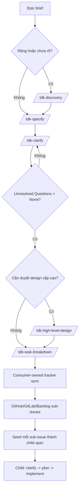

# Hướng Dẫn Bắt Đầu Epic

> Bản tiếng Việt cho member mới bắt đầu với TDK, đặc biệt khi chưa quen đọc tài liệu tiếng Anh.

Dùng guide này khi bạn có một ý tưởng lớn, còn mơ hồ, và cần biến nó thành chuỗi artifact rõ ràng để junior/fresher có thể tiếp tục làm.

## Mô Hình 1 Phút

TDK biến một epic mơ hồ thành các bằng chứng có thể triển khai:

```text
Epic brief
  -> optional /tdk-discovery
  -> /tdk-specify
  -> /tdk-clarify
  -> optional /tdk-high-level-design
  -> /tdk-task-breakdown
  -> consumer-owned tracker sync tạo sub-issues
  -> mỗi sub-issue trở thành một child spec
  -> child spec chạy clarify -> plan -> implement
```

Luật quan trọng nhất:

```text
discovery là context
spec.md là nguồn sự thật của requirement
HLD là design enrichment
task breakdown là work items cho sub-issues
child specs là đơn vị triển khai
plan.md là thứ tự triển khai cho một spec
```

## Có Nên Bắt Đầu Bằng Discovery?

| Tình huống | Bắt đầu bằng | Lý do |
|---|---|---|
| Work còn rộng, mơ hồ, có nhiều cách cắt MVP | `/tdk-discovery` | Cần hiểu problem, persona, MVP trước khi viết spec |
| Feature đã nhỏ và rõ | `/tdk-specify` | Discovery sẽ làm workflow nặng hơn mà không giảm risk |
| Chưa rõ user/persona là ai | `/tdk-discovery` | Cần persona và jobs-to-be-done trước |
| Đã rõ scope, actor, acceptance criteria, edge cases | `/tdk-specify` | Có thể viết spec trực tiếp |

Câu hỏi nhanh: "Mình đã viết được user requirements và success criteria rõ ràng chưa?" Nếu chưa, chạy discovery trước.

## Flow Tổng Quan



Nếu work nhỏ kiểu feature-sized, có thể bỏ qua `task-breakdown` và chạy `/tdk-plan` trực tiếp trên spec hiện tại. Với epic workflow, `task-breakdown` tạo work items để sync sang tracker sub-issues, sau đó mỗi sub-issue có child spec riêng.


## Nội Dung Output File

Khi đọc output, luôn bắt đầu từ file manifest: `discovery/index.md`, `high-level-design/index.md`, hoặc `tasks-breakdown/index.md`. Đừng glob cả thư mục rồi tự đoán file nào đang còn hiệu lực.

### Output của Discovery

| File | Bên trong có gì | Junior nên dùng thế nào |
|---|---|---|
| `discovery/problem.md` | Frontmatter, `## Problem`, `## Affected Users`, `## Current Alternatives`, `## Constraints`, `## Open Questions` | Hiểu epic đang giải quyết pain nào, ai bị ảnh hưởng, constraint nào đã biết |
| `discovery/personas.md` | `## Primary Personas`, `## Secondary Personas`, `## Jobs To Be Done`, `## Assumptions`, `## Open Questions` | Hiểu các nhóm user/actor và vì sao mỗi nhóm có thể cần behavior khác nhau |
| `discovery/mvp-scope.md` | `## In Scope Candidates`, `## Out Of Scope Candidates`, `## MVP Cutline`, `## Risks`, `## Open Questions` | Nhìn được ranh giới MVP đầu tiên trước khi chuyển epic thành requirements |
| `discovery/index.md` | `## Artifact Manifest`, `## Summary`, `## Product-level signals`, `## Ready For Specify` | Bắt đầu đọc từ đây; file này cho biết bộ discovery gồm file nào và đã sẵn sàng chạy `/tdk-specify` chưa |

Discovery không phải requirement authority. Nó chỉ là context để viết `spec.md` đầu tiên.

### Output của Specify

| File | Bên trong có gì | Junior nên dùng thế nào |
|---|---|---|
| `spec.md` | Frontmatter, `# Feature Specification`, các section `## 1` đến `## 9`, và `## Clarifications` để dành cho clarify | Xem đây là nguồn sự thật của scope, requirements, success criteria, open questions |
| `checklists/requirements.md` | Checklist về structure completeness, tagging, content quality, requirement completeness, notes | Review trước khi đi tiếp; item chưa đạt thường nghĩa là spec cần sửa thêm |

Các section quan trọng trong `spec.md`:

| Section | Tác dụng |
|---|---|
| `## 1. Problem Statement` | Problem cụ thể, user bị ảnh hưởng, vì sao cần làm bây giờ |
| `## 2. Scope Boundary` | Cái gì in scope, cái gì out of scope, và lý do |
| `## 3. Impact Surface` | Sub-workspace hoặc module bị ảnh hưởng |
| `## 4. Evaluated Approaches` | Các cách cắt scope và hướng được recommend |
| `## 5. User Requirements & Testing` | `UR-*`, priority, independent test, Given/When/Then acceptance scenarios, edge cases |
| `## 6. Functional Requirements` | `FR-*`, behavior chức năng, key entities |
| `## 7. Success Criteria` | `SC-*`, outcome đo được và không phụ thuộc tech |
| `## 8. Risks & Mitigations` | Risk chính và hướng giảm risk |
| `## 9. Unresolved Questions` | `None` hoặc danh sách câu hỏi cần resolve |
| `## Clarifications` | Lịch sử quyết định do `/tdk-clarify` ghi vào |

Nếu spec được tạo từ một task đã promote hoặc từ sub-issue, frontmatter có thể có thêm `parent_spec` và `promoted_from`.

### Output của Clarify

`/tdk-clarify` không tạo artifact mới. Nó update `spec.md`.

| Vùng được update | Thay đổi gì | Junior nên dùng thế nào |
|---|---|---|
| `## Clarifications` | Thêm session theo ngày, mỗi accepted answer là một dòng `Q -> A` kèm rationale | Đọc để hiểu vì sao một quyết định được chọn |
| Các section requirement hiện có | Update scope, user requirements, functional requirements, key entities, success criteria, edge cases, risks, hoặc terminology | Đọc section đã update như current truth; không chỉ đọc Q/A log |
| `## 9. Unresolved Questions` | Nên trở thành đúng bằng `None` trước khi chạy HLD, task breakdown, hoặc child planning | Dùng section này làm gate trước khi đi tiếp |

Clarify có giá trị vì decision được lưu trong spec, không bị thất lạc trong chat history.

### Output của HLD

| File | Bên trong có gì | Junior nên dùng thế nào |
|---|---|---|
| `high-level-design/index.md` | Frontmatter, `## Source`, `## Artifact Map`, `## Readiness Gate` | Bắt đầu đọc từ đây; nó list các HLD files đang có hiệu lực và validate gate từ spec |
| `high-level-design/requirement-overview.md` | Problem/outcome, scope, actors, requirement map, non-functional goals | Xem `UR-*`, `FR-*`, `SC-*` được chuyển thành design implication như thế nào |
| `high-level-design/project-and-technical-overview.md` | System context, module impact, technical assumptions, integration map, security posture, operability | Hiểu impact cấp hệ thống; detail nào được đánh dấu `assumed` thì cần validate |
| `high-level-design/data-flow.md` | Key entities, read/write flows, external dependencies, state lifecycle, optional diagram | Hiểu data di chuyển và state thay đổi thế nào trước khi chia task |
| `high-level-design/screen-flow.md` | Primary journeys, screen list, steps, branch conditions, related APIs, optional diagram | Hiểu user journey và các touchpoint UI/API |
| `high-level-design/decisions-and-risks.md` | Decisions, rejected alternatives, risks, assumptions to validate, non-blocking follow-ups | Biết cái gì đã chọn, cái gì bị reject, cái gì có thể cần quay lại spec |

HLD chỉ enrich requirement đã có. Nó không tạo `UR-*`, `FR-*`, `SC-*`, task, plan, tracker issue, hoặc code.

### Output của Task Breakdown

| File | Bên trong có gì | Junior nên dùng thế nào |
|---|---|---|
| `tasks-breakdown/index.md` | Frontmatter, link về source spec, bảng `## Tasks`, tracker boundary, sync boundary | Xem đây là manifest chính thức để biết task file nào cần sync |
| `tasks-breakdown/task-NNN-{slug}.md` | Frontmatter, title, `## Objective`, `## Source Requirements`, `## Scope` có In/Out, `## Acceptance Criteria`, `## Notes` | Dùng một task file làm body/source cho một tracker sub-issue |

Bảng task trong `tasks-breakdown/index.md` có:

| Column | Ý nghĩa |
|---|---|
| `#` | Số work-item ổn định, ví dụ `001` |
| `Task` | Title ngắn, đủ nhỏ để thành issue |
| `Source Requirements` | Các reference `UR-*`, `FR-*`, `SC-*` từ `spec.md` |
| `File` | Link đến task file |
| `Status` | Rỗng nghĩa là work item active, hoặc `promoted -> <child-id>` khi work item đã thành child spec |

Task breakdown không phải implementation plan. Nó tạo portable work items để consumer project sync sang GitHub, GitLab, Backlog, Jira, hoặc tracker khác.

### Output của Tracker Sub-Issue và Child Spec

TDK core không tạo external issues. Sau bước consumer-owned tracker sync, mỗi sub-issue bên ngoài nên chứa objective, source requirements, scope, acceptance criteria, và notes lấy từ task file.

Sau đó tạo child spec từ từng sub-issue/task. Output của child spec có cùng shape với `spec.md`, nhưng scope chỉ nằm trong sub-issue đó. Chỉ khi child spec đã clarify xong mới đi tiếp sang `/tdk-plan` và `/tdk-implement`.

## Playbook Từng Skill

### 1. `/tdk-discovery <epic-id> <brief|file> [--force]`

Dùng khi work đủ lớn để cần context cấp epic trước khi viết feature spec.

Ví dụ:

```text
/tdk-discovery feat-001 "User avatar upload, cropping, validation, storage, and moderation"
```

| Item | Chi tiết |
|---|---|
| Input | Epic ID + brief ngắn hoặc file Markdown trong workspace |
| Reads | Project context, constitution, memory nếu có |
| Creates | `discovery/problem.md`, `discovery/personas.md`, `discovery/mvp-scope.md`, `discovery/index.md` |
| Tác dụng | Làm rõ problem, users, MVP cutline, risks, open questions |
| Lệnh tiếp theo | `/tdk-specify <id> <description>` |

Skill này không làm:

- Không tạo `spec.md`.
- Không tạo `UR-*`, `FR-*`, `SC-*`.
- Không tạo plan, task triển khai, code, tracker issue.

Checklist trước khi đi tiếp:

- Mở `discovery/index.md`.
- Kiểm tra problem, persona, MVP scope đã dễ hiểu chưa.
- Nếu MVP boundary vẫn mơ hồ, làm rõ brief trước khi chạy `specify`.

### 2. `/tdk-specify <id> <desc> [--fast]`

Dùng để tạo feature specification. Đây là nguồn sự thật của requirements.

Ví dụ:

```text
/tdk-specify feat-001 Add user avatar upload with image cropping and validation
```

| Item | Chi tiết |
|---|---|
| Input | Feature ID + mô tả bằng ngôn ngữ tự nhiên |
| Reads | Optional `discovery/index.md` nếu đã có discovery |
| Creates | `spec.md`, `checklists/requirements.md` |
| Tác dụng | Định nghĩa problem, scope, impact surface, user requirements, functional requirements, success criteria, risks, unresolved questions |
| Lệnh tiếp theo | `/tdk-clarify <id>` |

Requirement IDs bắt đầu từ đây:

- `UR-*`: user requirements và acceptance scenarios
- `FR-*`: functional requirements
- `SC-*`: success criteria

Skill này không làm:

- Không viết code.
- Không tạo implementation plan.
- Không tạo portable task files.
- Không nên nhét implementation detail như file path, API, framework, database table, trừ khi đó là requirement context đã được chấp nhận.

Checklist trước khi đi tiếp:

- Mở `spec.md`.
- Kiểm tra `## 1. Problem Statement` đủ cụ thể chưa.
- Kiểm tra `## 2. Scope Boundary` có cả in-scope và out-of-scope chưa.
- Kiểm tra `## 5. User Requirements & Testing` có acceptance scenarios chưa.
- Kiểm tra `## 6. Functional Requirements` có stable `FR-*` IDs chưa.
- Review `checklists/requirements.md`.

### 3. `/tdk-clarify <id>`

Dùng để loại bỏ ambiguity trước khi design, task breakdown, hoặc planning.

Ví dụ:

```text
/tdk-clarify feat-001
```

| Item | Chi tiết |
|---|---|
| Input | `spec.md` đã tồn tại |
| Updates | Chính file `spec.md` |
| Tác dụng | Hỏi các câu hỏi có impact cao và ghi câu trả lời ngược vào spec |
| Lệnh tiếp theo | `/tdk-high-level-design`, `/tdk-task-breakdown`, hoặc `/tdk-plan` nếu work nhỏ |

Clarify thường hỏi về:

- scope boundary chưa rõ
- actor/role behavior còn thiếu
- data/entity detail còn thiếu
- success criteria còn mơ hồ
- security, privacy, compliance ambiguity
- edge cases và failure behavior

Skill này không làm:

- Không tạo spec mới.
- Không tạo task.
- Không viết code.

Checklist trước khi đi tiếp:

- Kiểm tra câu trả lời đã nằm trong `## Clarifications`.
- Kiểm tra section requirement liên quan đã được update, không chỉ append Q/A ở cuối.
- Kiểm tra `## 9. Unresolved Questions` đúng bằng `None` trước khi chạy HLD hoặc task breakdown.

### 4. `/tdk-high-level-design <id> [--greenfield] [--force]`

Dùng khi stakeholder cần design cấp cao để review trước breakdown/planning.

Ví dụ:

```text
/tdk-high-level-design feat-001
```

| Item | Chi tiết |
|---|---|
| Input | `spec.md` đã clarify, `Unresolved Questions` là `None` |
| Creates | `high-level-design/index.md` + 5 design artifacts |
| Tác dụng | Biến stable requirements thành product/system design context |
| Lệnh tiếp theo | `/tdk-task-breakdown <id>` cho epic, hoặc `/tdk-plan <id>` cho feature nhỏ |

Files được tạo:

```text
high-level-design/index.md
high-level-design/requirement-overview.md
high-level-design/project-and-technical-overview.md
high-level-design/data-flow.md
high-level-design/screen-flow.md
high-level-design/decisions-and-risks.md
```

Skill này không làm:

- Không tạo implementation plan.
- Không tạo tasks.
- Không viết code.
- Không tạo tracker issues.
- Không tạo requirement IDs mới.

Checklist trước khi đi tiếp:

- Bắt đầu từ `high-level-design/index.md`.
- Chỉ đọc artifacts được list trong index.
- Kiểm tra các design statement có cite `UR-*`, `FR-*`, hoặc `SC-*`.
- Nếu HLD phát hiện requirement mới, quay lại `specify` hoặc `clarify`, không nhét ép vào design.

### 5. `/tdk-task-breakdown <id>`

Dùng khi cần issue-sized Markdown work items để sync sang tracker sub-issues.

Ví dụ:

```text
/tdk-task-breakdown feat-001
```

| Item | Chi tiết |
|---|---|
| Input | `spec.md` đã clarify; optional HLD context |
| Creates | `tasks-breakdown/index.md`, `tasks-breakdown/task-NNN-{slug}.md` |
| Tác dụng | Chuyển parent requirements thành portable work items cho tracker sub-issues |
| Lệnh tiếp theo | Consumer-owned tracker sync, rồi tạo child spec cho từng sub-issue |

Skill này không làm:

- Không tạo GitHub, GitLab, Backlog, Jira, hoặc tracker issues khác.
- Không tạo implementation plan.
- Không viết code.
- Không dùng HLD làm citation source.

Checklist trước khi đi tiếp:

- Mở `tasks-breakdown/index.md`.
- Xem nó là manifest chính thức.
- Mở từng task file được list.
- Kiểm tra mỗi task cite ít nhất một `UR-*`, `FR-*`, hoặc `SC-*`.
- Sync từng task sang tracker sub-issue bằng tooling của consumer project.
- Seed từng synced sub-issue thành child spec để chạy vòng clarify, plan, implement riêng.

## Parent Epic vs Child Spec

Với epic, parent spec là nơi giữ quyền decomposition. Thường không nên plan và implement parent epic như một khối lớn sau khi đã task breakdown.

Flow đúng:

```text
parent spec
  -> /tdk-task-breakdown
  -> tasks-breakdown/index.md
  -> consumer-owned tracker sync
  -> GitHub/GitLab/Backlog sub-issues
  -> child spec cho từng synced sub-issue
  -> child clarify -> child plan -> child implement
```

Parent spec dùng để giữ:

- problem và scope authority
- requirement traceability
- breakdown manifest
- quan hệ parent-child

Mỗi child spec dùng để giữ:

- requirements chi tiết cho một sub-issue
- clarification cho sub-scope đó
- implementation planning
- implementation và verification

TDK core chỉ tạo portable Markdown task files. Consumer project chịu trách nhiệm sync các task files đó thành GitHub, GitLab, Backlog, Jira, hoặc tracker sub-issues khác. Sau sync, epic workflow xem mỗi sub-issue như seed cho một child spec.

## Readiness Gates

| Move | Gate |
|---|---|
| Discovery -> Specify | Problem, persona, MVP context đủ rõ để viết feature spec |
| Specify -> Clarify | `spec.md` tồn tại và requirements checklist đã được review |
| Clarify -> HLD | `## 9. Unresolved Questions` đúng bằng `None` |
| Clarify -> Task Breakdown | `## 9. Unresolved Questions` đúng bằng `None` |
| HLD -> Task Breakdown | HLD index tồn tại và không có requirement mới cần update spec |
| Task Breakdown -> Tracker Sync | `tasks-breakdown/index.md` list task files; mọi task cite `UR-*`, `FR-*`, hoặc `SC-*` |
| Tracker Sync -> Child Spec | Mỗi external sub-issue có đủ task content để seed child spec |
| Child Spec -> Child Plan | Child `spec.md` đã clarify và unresolved questions là `None` |
| Child Plan -> Child Implement | Child `plan.md` có `## Phases` table usable |

## Ví Dụ Thực Tế

Epic ban đầu:

```text
User avatar upload: users can upload an avatar, crop it, validate image size/type, store it, and remove it later.
```

Nếu problem và MVP chưa rõ:

```text
/tdk-discovery feat-001 "User avatar upload, cropping, validation, storage, and removal"
```

Tạo requirement source of truth:

```text
/tdk-specify feat-001 Add user avatar upload with cropping, validation, storage, and removal
```

Làm rõ các gap:

```text
/tdk-clarify feat-001
```

Nếu `spec.md` vẫn còn unresolved questions, trả lời tiếp trước khi đi qua bước sau. Nếu cần stakeholder review design:

```text
/tdk-high-level-design feat-001
```

Break parent epic thành issue-sized work items:

```text
/tdk-task-breakdown feat-001
```

Sync các task files được list sang tracker sub-issues bằng consumer-owned tooling. Sau đó seed mỗi sub-issue thành child spec. Ví dụ:

```text
/tdk-specify feat-002 "Seed from task-001-avatar-upload-validation.md"
/tdk-clarify feat-002
/tdk-plan feat-002
/tdk-implement feat-002
```

Lặp child loop cho từng sub-issue. Không plan và implement parent epic như một khối lớn, trừ khi bạn cố ý quyết định current spec đủ nhỏ để triển khai trực tiếp.

## Lỗi Thường Gặp

| Lỗi | Cách sửa |
|---|---|
| Chạy discovery cho mọi feature nhỏ | Bỏ qua discovery nếu feature đã rõ |
| Xem discovery là requirement | Chỉ `spec.md` sở hữu `UR-*`, `FR-*`, `SC-*` |
| Nhét implementation detail vào spec | Giữ spec ở user value, behavior, scope, success criteria |
| Chạy HLD khi unresolved questions vẫn còn | Chạy `/tdk-clarify` đến khi unresolved questions là `None` |
| Xem HLD là PRD thứ hai | HLD enrich requirement đã có, không tạo requirement mới |
| Plan parent epic ngay sau task breakdown | Sync tasks thành sub-issues, rồi tạo child specs để implement |
| Xem task breakdown là implementation plan | Child `/tdk-plan` mới sở hữu implementation phases |
| Kỳ vọng TDK core tạo tracker issues | Task breakdown tracker-neutral; tracker sync là consumer-owned |

## Troubleshooting

| Triệu chứng | Nguyên nhân thường gặp | Cách sửa |
|---|---|---|
| HLD dừng trước khi ghi file | `## 9. Unresolved Questions` không đúng bằng `None` | Chạy `/tdk-clarify <id>` |
| Task breakdown dừng trước khi ghi file | Spec còn unresolved questions hoặc thiếu stable IDs | Resolve questions và đảm bảo có `UR-*`, `FR-*`, `SC-*` |
| Sub-issue không có đường triển khai | Task đã sync từ breakdown nhưng chưa seed thành child spec | Tạo child spec từ sub-issue/task content |
| Không biết nên đọc file nào tiếp | Đang glob thư mục thay vì đọc manifest | Bắt đầu từ `discovery/index.md`, `high-level-design/index.md`, hoặc `tasks-breakdown/index.md` |
| Requirement conflict với HLD | Requirement mới bị phát hiện quá muộn | Update `spec.md` qua `specify` hoặc `clarify`, rồi regenerate artifact downstream |

## Docs Liên Quan

- [Epic Start Guide English](../../en/guides/epic-start-guide.md)
- [Command Reference](../../en/guides/command-reference.md)
- [Document Flow](../../en/guides/document-flow.md)
- [Full Feature Development Scenario](../../en/guides/scenarios/01-full-feature-development.md)
- [Quy Ước Promote: Work-Item → Child Spec](promote-convention.md)
