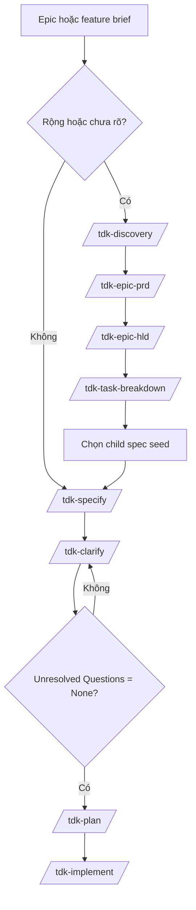
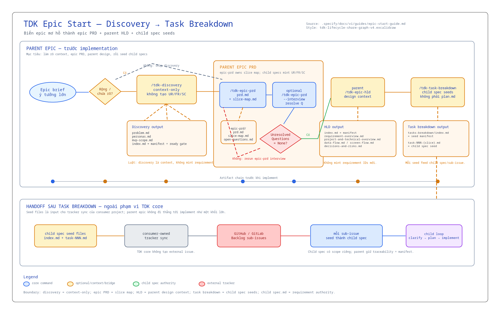

# Hướng Dẫn Bắt Đầu Epic

> Bản tiếng Việt cho member mới bắt đầu với TDK, đặc biệt khi chưa quen đọc tài liệu tiếng Anh.

Dùng guide này khi bạn có một ý tưởng lớn, còn mơ hồ, và cần biến nó thành chuỗi artifact rõ ràng để junior/fresher có thể tiếp tục làm.

## Mô Hình 1 Phút

TDK biến một epic mơ hồ thành các bằng chứng có thể triển khai:

```text
Epic brief
  -> optional /tdk-discovery
  -> /tdk-epic-prd
  -> /tdk-epic-hld
  -> /tdk-task-breakdown
  -> chọn một seed trong tasks-breakdown.md
  -> child /tdk-specify
  -> child /tdk-clarify
  -> child /tdk-plan
  -> child /tdk-implement
```

Luật quan trọng nhất:

```text
discovery là context
epic PRD là product alignment và slice map
epic HLD là parent design context để chia việc an toàn
task breakdown là child spec seeds từ PRD + HLD
child spec.md là nguồn sự thật của requirement
child specs là đơn vị triển khai
plan.md là thứ tự triển khai cho một spec
```

## Có Nên Bắt Đầu Bằng Discovery?

| Tình huống | Bắt đầu bằng | Lý do |
|---|---|---|
| Work còn rộng, mơ hồ, có nhiều cách cắt MVP | `/tdk-discovery` | Cần hiểu problem, persona, MVP trước khi viết spec |
| Discovery có thể hiểu sai intent | `/tdk-discovery <epic-id/spec-id> <brief\|file> --interview` | Interview mode hỏi câu hỏi bám artifact trước khi hoàn tất discovery |
| Artifact discovery hoặc spec đã có cần recheck intent | `/tdk-discovery <id> --interview` hoặc `/tdk-specify <id> --interview` | ID-only interview đọc artifact hiện tại, không regenerate |
| Discovery vẫn quá rộng để thành một spec | `/tdk-epic-prd` | Epic PRD tạo product alignment, blocking questions, và seed cho child specs mà không tạo requirement IDs |
| Feature đã nhỏ và rõ | `/tdk-specify` | Discovery sẽ làm workflow nặng hơn mà không giảm risk |
| Chưa rõ user/persona là ai | `/tdk-discovery` | Cần persona và jobs-to-be-done trước |
| Đã rõ scope, actor, acceptance criteria, edge cases | `/tdk-specify` | Có thể viết spec trực tiếp |

Câu hỏi nhanh: "Mình đã viết được user requirements và success criteria rõ ràng chưa?" Nếu chưa, chạy discovery trước.

Syntax nhanh cho interview mode:

```text
/tdk-discovery <epic-id/spec-id> <brief|file> --interview
/tdk-discovery <epic-id/spec-id> --interview
/tdk-epic-prd <epic-id> [--force] [--interview]
/tdk-specify <epic-id/spec-id> <description> --interview
/tdk-specify <epic-id/spec-id> --interview
```

Với creation-time interview, bắt buộc có `<brief|file>` hoặc `<description>`. Với ID-only replay interview, artifact phải tồn tại sẵn: discovery replay cần đủ bốn file discovery, specify replay cần `spec.md`. Luôn dùng flag `--interview`; positional `interview` không phải mode.

## Flow Tổng Quan



Nếu work nhỏ kiểu feature-sized, dùng path ngắn: `/tdk-specify -> /tdk-clarify -> /tdk-plan -> /tdk-implement`. Với epic workflow, `epic-prd.md` + `epic-prd/` feed parent HLD, HLD feed task breakdown, và `tasks-breakdown.md` + `tasks-breakdown/` feed child /tdk-specify. Child specs không chạy HLD mặc định.



## Đường Đi Chuẩn Cho Epic

Dùng cùng một parent ID cho discovery và epic PRD. Tạo child IDs mới cho từng implementation slice trong `epic-prd/slice-map.md`.

| Bước | Lệnh hoặc action | Gate trước khi đi tiếp |
|---|---|---|
| 1 | `/tdk-discovery <parent-id> <brief\|file> [--interview]` | `discovery.md` cho thấy problem, personas, MVP cut đủ rõ để specify |
| 2 | `/tdk-epic-prd <parent-id> [--interview]` | `epic-prd.md` không còn Blocking Questions và `slice-map.md` không có catch-all slice |
| 3 | `/tdk-epic-hld <parent-id>` | Parent HLD nắm slice boundaries, dependencies, risks, design assumptions mà không tạo requirement IDs |
| 4 | `/tdk-task-breakdown <parent-id>` | Seed files map PRD slices + HLD context thành child specs có thể specify riêng |
| 5 | Chọn một child spec seed | Seed chỉ mô tả một child có thể specify riêng, không copy toàn bộ parent epic |
| 6 | `/tdk-specify <child-id> "<seed>"` | Child spec scope một seed, và `UR-*` / `FR-*` / `SC-*` bắt đầu từ đây |
| 7 | Child `/tdk-clarify` -> `/tdk-plan` -> `/tdk-implement` | Child spec đã clarify trước khi implementation planning |

## Nội Dung Output File

Khi đọc output, luôn bắt đầu từ file manifest: `discovery.md`, `high-level-design.md`, hoặc `tasks-breakdown.md`. Đừng glob cả thư mục rồi tự đoán file nào đang còn hiệu lực.

### Output của Discovery

| File | Bên trong có gì | Junior nên dùng thế nào |
|---|---|---|
| `discovery/problem.md` | Frontmatter, `## Problem`, `## Affected Users`, `## Current Alternatives`, `## Constraints`, `## Open Questions` | Hiểu epic đang giải quyết pain nào, ai bị ảnh hưởng, constraint nào đã biết |
| `discovery/personas.md` | `## Primary Personas`, `## Secondary Personas`, `## Jobs To Be Done`, `## Assumptions`, `## Open Questions` | Hiểu các nhóm user/actor và vì sao mỗi nhóm có thể cần behavior khác nhau |
| `discovery/mvp-scope.md` | `## In Scope Candidates`, `## Out Of Scope Candidates`, `## MVP Cutline`, `## Risks`, `## Open Questions` | Nhìn được ranh giới MVP đầu tiên trước khi chuyển epic thành requirements |
| `discovery.md` | `## Artifact Manifest`, `## Summary`, `## Product-level signals`, `## Ready For Specify` | Bắt đầu đọc từ đây; file này cho biết bộ discovery gồm file nào và đã sẵn sàng chạy `/tdk-specify` chưa |

Discovery không phải requirement authority. Nó chỉ là context để viết `spec.md` đầu tiên.

### Output của Epic PRD

| File | Bên trong có gì | Junior nên dùng thế nào |
|---|---|---|
| `epic-prd.md` | Link về discovery source, artifact map, readiness gate, next commands | Bắt đầu từ đây; nếu còn Blocking Questions thì chưa sẵn sàng cho downstream design hoặc breakdown |
| `epic-prd/prd.md` | Product intent, problem/current state, personas, objectives, scope, MVP appetite, assumptions, risks, no-gos, source trace | Align hướng product, nhưng không xem là requirement spec |
| `epic-prd/slice-map.md` | Slug slice keys, capabilities, actors, outcomes, dependencies, child spec titles, priority | Source cho HLD/task-breakdown; child `/tdk-specify` bắt đầu từ seed file |
| `epic-prd/open-questions.md` | Blocking Questions, Non-Blocking Questions, assumptions cần evidence, source trace | Resolve blockers trước downstream epic design, breakdown, hoặc child specs |

Epic PRD không phải `spec.md`, không tạo tracker issues, và không tạo `UR-*`, `FR-*`, `SC-*`, hoặc `FS-*`.

### Output của Specify

| File | Bên trong có gì | Junior nên dùng thế nào |
|---|---|---|
| `spec.md` | Frontmatter, `# Feature Specification`, các section `## 1` đến `## 9`, và `## Clarifications` để dành cho clarify | Xem đây là nguồn sự thật của scope, requirements, success criteria, open questions |
| `checklists/requirements.md` | Checklist về structure completeness, tagging, content quality, requirement completeness, notes | Review trước khi đi tiếp; item chưa đạt thường nghĩa là spec cần sửa thêm |

Các section quan trọng trong `spec.md`:

| Section | Tác dụng |
|---|---|
| `## 1. Problem Statement` | Problem cụ thể, user bị ảnh hưởng, vì sao cần làm bây giờ |
| `## 2. Scope Boundary` | Cái gì in scope, cái gì out of scope, và lý do |
| `## 3. Impact Surface` | Sub-workspace hoặc module bị ảnh hưởng |
| `## 4. Evaluated Approaches` | Các cách cắt scope và hướng được recommend |
| `## 5. User Requirements & Testing` | `UR-*`, priority, independent test, Given/When/Then acceptance scenarios, edge cases |
| `## 6. Functional Requirements` | `FR-*`, behavior chức năng, key entities |
| `## 7. Success Criteria` | `SC-*`, outcome đo được và không phụ thuộc tech |
| `## 8. Risks & Mitigations` | Risk chính và hướng giảm risk |
| `## 9. Unresolved Questions` | `None` hoặc danh sách câu hỏi cần resolve |
| `## Clarifications` | Lịch sử quyết định do `/tdk-clarify` ghi vào |

Nếu spec được tạo từ một task đã promote hoặc từ sub-issue, frontmatter có thể có thêm `parent_spec` và `promoted_from`.

### Output của Clarify

`/tdk-clarify` không tạo artifact mới. Nó update `spec.md`.

| Vùng được update | Thay đổi gì | Junior nên dùng thế nào |
|---|---|---|
| `## Clarifications` | Thêm session theo ngày, mỗi accepted answer là một dòng `Q -> A` kèm rationale | Đọc để hiểu vì sao một quyết định được chọn |
| Các section requirement hiện có | Update scope, user requirements, functional requirements, key entities, success criteria, edge cases, risks, hoặc terminology | Đọc section đã update như current truth; không chỉ đọc Q/A log |
| `## 9. Unresolved Questions` | Nên trở thành đúng bằng `None` trước child planning | Dùng section này làm gate của child spec trước khi đi tiếp |

Clarify có giá trị vì decision được lưu trong spec, không bị thất lạc trong chat history.

### Output của HLD

| File | Bên trong có gì | Junior nên dùng thế nào |
|---|---|---|
| `high-level-design.md` | Frontmatter, `## Source`, `## Artifact Map`, `## Breakdown Readiness Map`, `## Readiness Gate` | Bắt đầu từ đây; nó list HLD files và validate parent epic gate |
| `high-level-design/requirement-overview.md` | Product objective, scope, personas/jobs, slice source map, breakdown readiness | Xem epic PRD slices chuyển thành child spec seed implication thế nào |
| `high-level-design/project-and-technical-overview.md` | System context, slice boundary map, dependency map, interface assumptions, security posture, operability | Hiểu decomposition impact cấp hệ thống; detail `assumed` cần validate |
| `high-level-design/data-flow.md` | Key entities, cross-slice flows, external dependencies, state lifecycle, optional diagram | Hiểu data/state trước khi tạo child spec seeds |
| `high-level-design/screen-flow.md` | Epic journeys, slice touchpoints, steps, branch conditions, related interfaces, optional diagram | Hiểu user journey và touchpoint UI/API giữa các slice |
| `high-level-design/decisions-and-risks.md` | Slice boundary decisions, rejected alternatives, risks, assumptions, follow-ups | Biết split/merge nào đã chọn, cái gì reject, cái gì cần child clarify |

HLD guide parent decomposition. Nó không tạo `UR-*`, `FR-*`, `SC-*`, child specs, task, plan, tracker issue, hoặc code.

### Output của Task Breakdown

| File | Bên trong có gì | Junior nên dùng thế nào |
|---|---|---|
| `tasks-breakdown.md` | Frontmatter, epic PRD/HLD links, `## Child Spec Seeds`, tracker boundary, sync boundary | Xem đây là manifest chính thức để biết child spec seed nào cần dùng |
| `tasks-breakdown/task-NNN-{slice}.md` | Frontmatter, source slice, suggested child `/tdk-specify` command, boundary, dependencies, assumptions/risks, child clarify questions | Dùng một seed file để bắt đầu một child spec |

Bảng task trong `tasks-breakdown.md` có:

| Column | Ý nghĩa |
|---|---|
| `#` | Số seed ổn định, ví dụ `001` |
| `Slice key` | Source slice từ `epic-prd/slice-map.md` |
| `Child spec title` | Tên child spec được đề xuất |
| `Depends on` | Slice keys hoặc external dependencies |
| `Seed file` | Link đến child spec seed file |
| `Status` | Rỗng cho đến khi child spec/tracker workflow ghi progress |

Task breakdown không phải implementation plan và không tự tạo child specs. Nó tạo portable child spec seeds để dùng với `/tdk-specify <child-id> "<seed>"` hoặc sync sang tracker bằng tooling của consumer.

### Output của Tracker Sub-Issue và Child Spec

TDK core không tạo external issues. Sau bước consumer-owned tracker sync, mỗi sub-issue bên ngoài nên chứa source slice, boundary, dependencies, assumptions/risks, và clarify questions lấy từ seed file.

Sau đó tạo child spec từ từng seed/sub-issue bằng child ID mới. Output của child spec có cùng shape với `spec.md`, nhưng scope chỉ nằm trong seed đó. Chỉ khi child spec đã clarify xong mới đi tiếp sang `/tdk-plan` và `/tdk-implement`.

## Playbook Từng Skill

### 1. `/tdk-discovery <epic-id/spec-id> [<brief|file>] [--force] [--interview]`

Dùng khi work đủ lớn để cần context cấp epic trước khi viết feature spec.

Ví dụ:

```text
/tdk-discovery feat-001 "User avatar upload, cropping, validation, storage, and moderation"
```

Ví dụ interview:

```text
/tdk-discovery <epic-id/spec-id> <brief|file> --interview
/tdk-discovery feat-001 "User avatar upload, cropping, validation, storage, and moderation" --interview
/tdk-discovery feat-001 --interview
```

| Item | Chi tiết |
|---|---|
| Input | Epic ID + brief ngắn hoặc file Markdown trong workspace; ID-only khi replay discovery đã có bằng `--interview` |
| Reads | Project context, constitution, memory nếu có |
| Creates | `discovery/problem.md`, `discovery/personas.md`, `discovery/mvp-scope.md`, `discovery.md` |
| Tác dụng | Làm rõ problem, users, MVP cutline, risks, open questions |
| Lệnh tiếp theo | `/tdk-epic-prd <id>` cho epic rộng, hoặc `/tdk-specify <id> <description>` cho feature nhỏ |

Thêm `--interview` với brief khi epic rộng, nhạy cảm, hoặc dễ ẩn intent mismatch. Nó hỏi câu hỏi bám artifact vừa tạo rồi fold accepted changes vào đúng bốn discovery files. Chỉ dùng `/tdk-discovery <id> --interview` sau khi bốn discovery files đã tồn tại; replay đọc và update artifact hiện tại, không regenerate. Cả hai dạng đều không tạo `discovery/interview.md` hoặc tracker record.

Skill này không làm:

- Không tạo `spec.md`.
- Không tạo `UR-*`, `FR-*`, `SC-*`.
- Không tạo plan, task triển khai, code, tracker issue.

Checklist trước khi đi tiếp:

- Mở `discovery.md`.
- Kiểm tra problem, persona, MVP scope đã dễ hiểu chưa.
- Nếu dùng `--interview`, kiểm tra accepted corrections đã nằm trong `problem.md`, `personas.md`, `mvp-scope.md`, hoặc `discovery.md`; unresolved points nằm trong `## Open Questions` phù hợp.
- Nếu MVP boundary vẫn mơ hồ, làm rõ brief trước khi chạy `specify`.

### 2. `/tdk-epic-prd <epic-id> [--force] [--interview]`

Dùng sau discovery khi epic quá rộng để thành một spec duy nhất.

Ví dụ:

```text
/tdk-epic-prd feat-001 --interview
```

| Item | Chi tiết |
|---|---|
| Input | Epic ID đã có discovery artifacts |
| Reads | `discovery.md`, `discovery/problem.md`, `discovery/personas.md`, `discovery/mvp-scope.md` |
| Creates | `epic-prd.md`, `epic-prd/prd.md`, `epic-prd/slice-map.md`, `epic-prd/open-questions.md` |
| Tác dụng | Align product intent, chặn catch-all slice, tạo seed cho child specs |
| Lệnh tiếp theo | child `/tdk-specify <child-id> "<slice seed>"` |

Thêm `--interview` khi cần challenge product direction hoặc slice boundary trước khi tạo child specs. Dùng `/tdk-epic-prd <id> --interview` sau khi bốn PRD files đã tồn tại để replay alignment mà không regenerate.

Skill này không làm:

- Không tạo `spec.md`.
- Không tạo `UR-*`, `FR-*`, `SC-*`, hoặc `FS-*` IDs.
- Không tạo HLD, task breakdown, plan, code, tracker issue, hoặc product-memory update.

Checklist trước khi đi tiếp:

- Mở `epic-prd.md`.
- Confirm Blocking Questions đã rỗng.
- Confirm `slice-map.md` không có catch-all "all features" hoặc "entire MVP".
- Chọn đúng một slice seed trước khi chạy child `/tdk-specify`.

### 3. `/tdk-specify <epic-id/spec-id> [<desc>] [--fast] [--interview]`

Dùng để tạo feature specification. Đây là nguồn sự thật của requirements.

Ví dụ:

```text
/tdk-specify feat-001 Add user avatar upload with image cropping and validation
```

Ví dụ interview:

```text
/tdk-specify <epic-id/spec-id> <description> --interview
/tdk-specify feat-001 Add user avatar upload with image cropping and validation --interview
/tdk-specify feat-001 --interview
```

| Item | Chi tiết |
|---|---|
| Input | Feature ID + mô tả bằng ngôn ngữ tự nhiên; ID-only khi replay `spec.md` đã có bằng `--interview` |
| Reads | Optional `discovery.md` nếu đã có discovery; existing `spec.md` cho ID-only replay |
| Creates | `spec.md`, `checklists/requirements.md` |
| Tác dụng | Định nghĩa problem, scope, impact surface, user requirements, functional requirements, success criteria, risks, unresolved questions |
| Lệnh tiếp theo | `/tdk-clarify <id>` |

Thêm `--interview` với description khi muốn challenge draft spec với intent của bạn trước unresolved-question handling. Sau khi `spec.md` tồn tại, dùng `/tdk-specify <id> --interview` để replay alignment gate mà không tạo spec mới. `--fast --interview` chỉ hợp lệ khi có description: `--fast` điều khiển độ sâu draft, `--interview` điều khiển alignment check.

Requirement IDs bắt đầu từ đây:

- `UR-*`: user requirements và acceptance scenarios
- `FR-*`: functional requirements
- `SC-*`: success criteria

Skill này không làm:

- Không viết code.
- Không tạo implementation plan.
- Không tạo child spec seed files.
- Không nên nhét implementation detail như file path, API, framework, database table, trừ khi đó là requirement context đã được chấp nhận.

Checklist trước khi đi tiếp:

- Mở `spec.md`.
- Kiểm tra `## 1. Problem Statement` đủ cụ thể chưa.
- Kiểm tra `## 2. Scope Boundary` có cả in-scope và out-of-scope chưa.
- Kiểm tra `## 5. User Requirements & Testing` có acceptance scenarios chưa.
- Kiểm tra `## 6. Functional Requirements` có stable `FR-*` IDs chưa.
- Review `checklists/requirements.md`.

### 3. `/tdk-clarify <id>`

Dùng để loại bỏ ambiguity trước child planning.

Ví dụ:

```text
/tdk-clarify feat-001
```

| Item | Chi tiết |
|---|---|
| Input | `spec.md` đã tồn tại |
| Updates | Chính file `spec.md` |
| Tác dụng | Hỏi các câu hỏi có impact cao và ghi câu trả lời ngược vào spec |
| Lệnh tiếp theo | `/tdk-plan <child-id>` |

Clarify thường hỏi về:

- scope boundary chưa rõ
- actor/role behavior còn thiếu
- data/entity detail còn thiếu
- success criteria còn mơ hồ
- security, privacy, compliance ambiguity
- edge cases và failure behavior

Skill này không làm:

- Không tạo spec mới.
- Không tạo task.
- Không viết code.

Checklist trước khi đi tiếp:

- Kiểm tra câu trả lời đã nằm trong `## Clarifications`.
- Kiểm tra section requirement liên quan đã được update, không chỉ append Q/A ở cuối.
- Kiểm tra `## 9. Unresolved Questions` đúng bằng `None` trước child planning.

### 4. `/tdk-epic-hld <epic-id> [--force]`

Dùng trên parent epic sau `/tdk-epic-prd` và trước `/tdk-task-breakdown`.

Ví dụ:

```text
/tdk-epic-hld feat-001
```

| Item | Chi tiết |
|---|---|
| Input | `epic-prd.md`, `prd.md`, `slice-map.md`, `open-questions.md` |
| Creates | `high-level-design.md` + 5 design artifacts |
| Tác dụng | Biến epic PRD slices thành parent product/system design context để breakdown an toàn |
| Lệnh tiếp theo | `/tdk-task-breakdown <epic-id>` |

Files được tạo:

```text
high-level-design.md
high-level-design/requirement-overview.md
high-level-design/project-and-technical-overview.md
high-level-design/data-flow.md
high-level-design/screen-flow.md
high-level-design/decisions-and-risks.md
```

Skill này không làm:

- Không tạo implementation plan.
- Không tạo child spec seeds.
- Không viết code.
- Không tạo tracker issues.
- Không tạo requirement IDs mới.

Checklist trước khi đi tiếp:

- Bắt đầu từ `high-level-design.md`.
- Chỉ đọc artifacts được list trong stage manifest.
- Kiểm tra design statements trace về epic PRD sections hoặc slice keys.
- Nếu HLD phát hiện slice hoặc product decision mới, quay lại `/tdk-epic-prd --interview` hoặc update epic PRD.

### 5. `/tdk-task-breakdown <epic-id>`

Dùng khi cần child spec seed Markdown từ parent epic.

Ví dụ:

```text
/tdk-task-breakdown feat-001
```

| Item | Chi tiết |
|---|---|
| Input | `epic-prd.md` + `epic-prd/`; `high-level-design.md` + `high-level-design/` |
| Creates | `tasks-breakdown.md`, `tasks-breakdown/task-NNN-{slice}.md` |
| Tác dụng | Chuyển parent PRD slices và HLD context thành child spec seeds |
| Lệnh tiếp theo | Child `/tdk-specify <child-id> "<seed>"` |

Skill này không làm:

- Không tạo GitHub, GitLab, Backlog, Jira, hoặc tracker issues khác.
- Không tạo child specs.
- Không tạo implementation plan.
- Không viết code.
- Không tạo `UR-*`, `FR-*`, `SC-*`, hoặc `FS-*`.

Checklist trước khi đi tiếp:

- Mở `tasks-breakdown.md`.
- Xem nó là manifest chính thức.
- Mở từng seed file được list.
- Kiểm tra mỗi seed cite source slice key và PRD/HLD refs.
- Start một child spec từ mỗi seed được chọn.
- Chạy child clarify, plan, implement. Không chạy HLD trong child flow mặc định.

## Parent Epic vs Child Spec

Với epic, parent discovery/PRD/HLD/task-breakdown artifacts là decomposition context. Child specs là implementation authority. Không nên plan và implement parent epic như một khối lớn sau task breakdown.

Flow đúng:

```text
parent epic artifacts
  -> /tdk-epic-prd
  -> /tdk-epic-hld
  -> /tdk-task-breakdown
  -> tasks-breakdown.md
  -> child spec seed files
  -> consumer-owned tracker sync
  -> GitHub/GitLab/Backlog sub-issues
  -> child spec cho từng synced sub-issue
  -> child clarify -> child plan -> child implement
```

Parent epic artifacts dùng để giữ:

- product intent và MVP boundary
- slice map và source traceability
- parent design context
- child spec seed manifest

Mỗi child spec dùng để giữ:

- requirements chi tiết cho một sub-issue
- clarification cho sub-scope đó
- implementation planning
- implementation và verification

TDK core chỉ tạo portable Markdown child spec seed files. Consumer project chịu
trách nhiệm sync các seed đó thành GitHub, GitLab, Backlog, Jira, hoặc tracker
sub-issues khác. Sau sync, epic workflow xem mỗi sub-issue như seed cho một
child spec.

## Readiness Gates

| Move | Gate |
|---|---|
| Discovery -> Epic PRD | Problem, persona, MVP context đủ rõ để product alignment |
| Epic PRD -> HLD | `epic-prd/open-questions.md` không có blocking questions và `slice-map.md` không có catch-all slice |
| HLD -> Task Breakdown | HLD index tồn tại và đánh dấu parent design sẵn sàng breakdown |
| Task Breakdown -> Child Spec | `tasks-breakdown.md` list seed files; mỗi seed cite source slice key và PRD/HLD refs |
| Child Specify -> Child Clarify | Child `spec.md` tồn tại và requirements checklist đã được review |
| Child Spec -> Child Plan | Child `spec.md` đã clarify và unresolved questions là `None` |
| Child Plan -> Child Implement | Child `plan.md` có `## Phases` table usable |

## Ví Dụ Thực Tế

Epic ban đầu:

```text
User avatar upload: users can upload an avatar, crop it, validate image size/type, store it, and remove it later.
```

Nếu problem và MVP chưa rõ:

```text
/tdk-discovery feat-001 "User avatar upload, cropping, validation, storage, and removal"
```

Nếu discovery cần alignment check trước khi ảnh hưởng tới requirement:

```text
/tdk-discovery feat-001 "User avatar upload, cropping, validation, storage, and removal" --interview
```

Tạo epic PRD:

```text
/tdk-epic-prd feat-001 --interview
```

Tạo parent design context:

```text
/tdk-epic-hld feat-001
```

Break parent epic thành child spec seeds:

```text
/tdk-task-breakdown feat-001
```

Tạo và clarify một child spec từ seed:

```text
/tdk-specify feat-002 "Seed from tasks-breakdown/task-001-avatar-upload-validation.md"
/tdk-clarify feat-002
```

Sau đó plan và implement child:

```text
/tdk-plan feat-002
/tdk-implement feat-002
```

Lặp child loop cho từng seed được chọn. Không plan và implement parent epic như một khối lớn.

## Lỗi Thường Gặp

| Lỗi | Cách sửa |
|---|---|
| Chạy discovery cho mọi feature nhỏ | Bỏ qua discovery nếu feature đã rõ |
| Bỏ qua discovery interview mode cho epic context rủi ro cao | Dùng `/tdk-discovery <epic-id/spec-id> <brief\|file> --interview` trước `/tdk-specify` |
| Regenerate artifact chỉ để recheck intent | Dùng `/tdk-discovery <id> --interview` hoặc `/tdk-specify <id> --interview` sau khi artifact đã tồn tại |
| Gõ positional `interview` như một mode | Dùng flag `--interview` |
| Đi tìm `discovery/interview.md` sau `--interview` | Interview decisions được fold vào bốn discovery files hiện có |
| Xem discovery là requirement | Chỉ `spec.md` sở hữu `UR-*`, `FR-*`, `SC-*` |
| Nhét implementation detail vào spec | Giữ spec ở user value, behavior, scope, success criteria |
| Chạy HLD khi epic PRD chưa sẵn sàng | Resolve PRD blocking questions và catch-all slices trước |
| Xem HLD là PRD thứ hai | HLD guide decomposition; update epic PRD khi product direction đổi |
| Plan parent epic ngay sau task breakdown | Tạo child specs từ seeds, rồi plan từng child |
| Xem task breakdown là implementation plan | Child `/tdk-plan` mới sở hữu implementation phases |
| Kỳ vọng TDK core tạo tracker issues | Task breakdown tracker-neutral; tracker sync là consumer-owned |

## Troubleshooting

| Triệu chứng | Nguyên nhân thường gặp | Cách sửa |
|---|---|---|
| HLD dừng trước khi ghi file | Epic PRD còn blocking questions hoặc catch-all slices | Update hoặc interview epic PRD |
| Task breakdown dừng trước khi ghi file | Epic HLD thiếu hoặc parent readiness gates fail | Chạy `/tdk-epic-hld <id>` và resolve parent readiness issues |
| Sub-issue không có đường triển khai | Task đã sync từ breakdown nhưng chưa seed thành child spec | Tạo child spec từ seed content |
| Không biết nên đọc file nào tiếp | Đang glob thư mục thay vì đọc manifest | Bắt đầu từ `discovery.md`, `high-level-design.md`, hoặc `tasks-breakdown.md` |
| Requirement conflict với HLD | Product/slice decision phát hiện quá muộn | Update epic PRD hoặc child spec ở đúng lane, rồi regenerate downstream artifacts |

## Docs Liên Quan

- [Epic Start Guide English](../../en/guides/epic-start-guide.md)
- [TDK Skills Guide](../../en/guides/skills-guide.md)
- [Document Flow](../../en/guides/document-flow.md)
- [Full Feature Development Scenario](../../en/guides/scenarios/01-full-feature-development.md)
- [Quy Ước Promote: Child Spec Seed → Child Spec](promote-convention.md)
