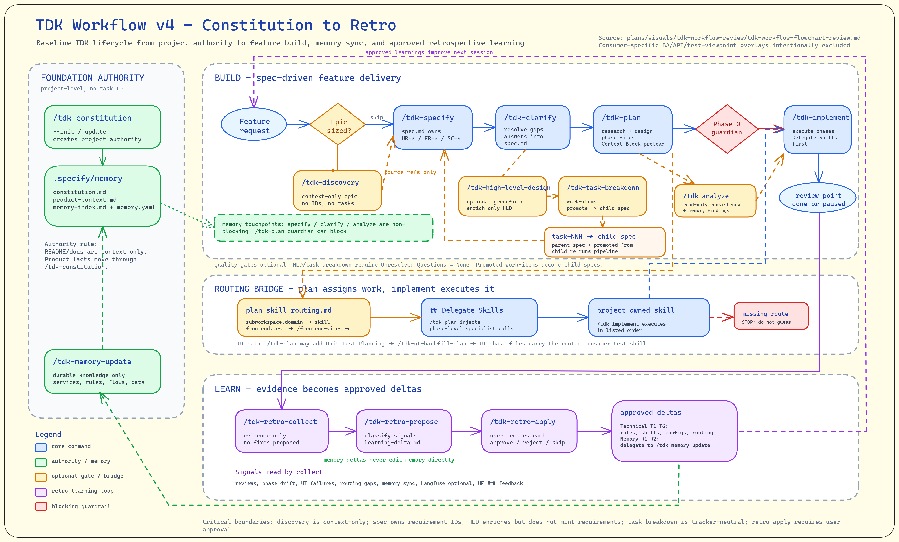

# TDK Skills Guide

> **Last updated**: 2026-07-18
>
> **Source baseline**: TDK `60977e8 v1.103.1`
>
> **Chạy ở đâu**: Tất cả command `/tdk-*` được gõ trong **Claude Code chat interface** như VSCode extension hoặc Claude CLI prompt, KHÔNG gõ trong terminal hoặc bash shell.

---

## Mục Lục

- [Vì sao dùng TDK?](#vì-sao-dùng-tdk)
- [Tổng Quan](#tổng-quan)
- [Danh Bạ Skill](#danh-bạ-skill)
- [Bảng Tra Nhanh](#bảng-tra-nhanh)
- [Bắt Đầu Nhanh](#bắt-đầu-nhanh)
- [Tham Chiếu Sử Dụng](#tham-chiếu-sử-dụng)
- [Workflow Map](#workflow-map)
- [Các Tình Huống Sử Dụng](#các-tình-huống-sử-dụng)
- [Gợi Ý Và Best Practices](#gợi-ý-và-best-practices)
- [Khắc Phục Sự Cố](#khắc-phục-sự-cố)

---

## Vì sao dùng TDK?

TDK là framework specification-driven development giúp tạo specs, optional portable task breakdowns, plans, và code từ natural language. Bạn mô tả feature; TDK dẫn bạn qua toàn bộ artifact chain — từ requirements đến implementation sẵn sàng đưa vào production.

TDK là bản native cho Claude Code của framework này.

## Tổng Quan

TDK command suite cung cấp workflow **specification-driven development**. Bạn mô tả feature bằng natural language, optional capture epic discovery và PRD context trước, rồi commands dẫn bạn qua specification, optional design và task breakdown, planning, và implementation.

### Workflow Pipeline



```text
                    ┌─────────────────────────────────────────────────────────────────────┐
                    │                   SPECIFICATION-DRIVEN WORKFLOW                     │
                    └─────────────────────────────────────────────────────────────────────┘

  EPIC SETUP (optional, parent-level)
  ┌──────────────┐    ┌───────────┐    ┌────────────┐    ┌──────────┐    ┌────────────────┐
  │ constitution │    │ discovery │───>│ epic-prd   │───>│ epic-hld │───>│ task-breakdown │
  │ project ctx  │    │ context   │    │ slice map  │    │ design   │    │ child seeds    │
  └──────────────┘    └───────────┘    └────────────┘    └──────────┘    └───────┬────────┘
                                                                                  │
                                                                                  v

  FEATURE / CHILD SPEC LOOP
  ┌──────────────┐    ┌──────────┐    ┌──────────┐    ┌────────────────┐    ┌───────────────────┐
  │ feature brief│───>│ specify  │───>│ clarify  │───>│      plan      │───>│ implement         │
  │ or child seed│    │ (--fast) │    │ (should) │    │ plan.md phases │    │ phase execution   │
  └──────────────┘    └────┬─────┘    └────┬─────┘    └───────┬────────┘    └─────────┬─────────┘
                           │               │                  │                       │
                           v               v                  v                       v
                      ┌──────────┐   ┌──────────────┐   ┌──────────────┐       ┌──────────────┐
                      │quality   │   │spec.md gaps  │   │routed test   │       │status/analyze│
                      │gate in spec│  │resolved      │   │skill         │       │any time      │
                      └──────────┘   └──────────────┘   └──────────────┘       └──────────────┘

  PROJECT-LEVEL (no task ID needed):
  ┌──────────────┐    ┌─────────────────────┐    ┌──────────────────────────┐
  │ constitution │    │ sub-workspace:init  │    │ config:diff/sync/index   │
  └──────────────┘    │ sub-workspace:list  │    └──────────────────────────┘
                      └─────────────────────┘
```

**Minimal feature flow**: `specify` -> `clarify` -> `plan` -> `implement`

**Epic flow**: `constitution` (project-level) -> optional `discovery` -> `epic-prd` -> `epic-hld` -> `task-breakdown` -> child `specify` -> child `clarify` -> child `plan` -> child `implement`

Với selective harness install, đảm bảo các workflow command bạn định dùng đã
được include: feature commands cho minimal specs, parent epic commands cho
discovery/PRD/HLD/breakdown, hoặc cả hai khi đi full epic-to-child flow. Nếu
một command `/tdk-` không có, chạy lại harness installer với workflow commands
cần dùng.

Với feature-sized work, mặc định bỏ qua discovery, epic PRD, HLD, và task breakdown. Nếu feature nhỏ và rõ, spec hiện tại đi thẳng đến `plan` và `implement`. Với broad epic, `epic-prd.md` cộng với `epic-prd/` biến discovery thành product alignment và slice map, `/tdk-epic-hld` thêm parent design context, và `/tdk-task-breakdown` tạo child spec seeds. Mỗi seed sau đó bắt đầu một child `/tdk-specify` loop.

Mỗi command đọc output của command trước đó. Với minimal feature work, chain là `spec.md` -> `plan.md` với `## Phases` -> source code. Với epic-sized work, optional `discovery.md` cộng với `discovery/` feed `epic-prd.md` cộng với `epic-prd/`; epic PRD feed parent HLD; parent HLD feed task breakdown; task breakdown seed child specs. Child specs không chạy HLD by default.

`/tdk-epic-hld` luôn dùng built-in design lenses và có thể optional đọc `{docs.path}/custom-workflow/high-level-design-skill-routing.md` cho advisory consumer design skills. File HLD routing này tách biệt với `delegate-routing.md`, vốn vẫn là implementation/test routing cho planning và UT workflows.

### Quyền Sở Hữu Plugin Và Bộ Base Gắn Kết

Quyền sở hữu plugin xác định phạm vi đóng gói và bảo trì source cùng artifact đã
tạo; nó không đổi tên command `/tdk-*` hoặc thay đổi đường dẫn artifact.

| Plugin | Phạm vi sở hữu |
|---|---|
| `tdk-core` | Bàn giao child feature (`specify`, `clarify`, `plan`, `implement`, analysis/status) cùng cổng hook/runtime dùng chung |
| `tdk-inception` | Nền tảng project/workspace: greenfield/brownfield intake, constitution, architecture, layout/config, dependency policy, và sub-workspace docs |
| `tdk-epic` | Discovery, PRD, HLD, và task breakdown ở cấp parent epic |
| `tdk-utils` | Các tiện ích dùng chung cho scout, research, tra cứu docs, context, brainstorm, và giải quyết vấn đề |
| `tdk-memory` | Các command domain memory và memory agent |
| `tdk-test-api` | Lập kế hoạch API test, tạo testcase, và sinh mã Playwright TypeScript |
| `tdk-retro` | Thu thập retrospective, đề xuất bài học, và áp dụng bài học đã được duyệt |
| `tdk-scaffold` | Đề xuất automation, scaffold skill/agent, routing, và các recipe có guard |

Mỗi lần cài harness đều phân giải thành bộ base gắn kết gồm `tdk-core`,
`tdk-inception`, `tdk-memory`, và `tdk-utils`. Chọn plugin tùy chọn chỉ bổ sung
workflow vào base; nó không tạo bản cài core-only hoặc inception-only độc lập
về runtime. Xem [Setup Guide](setup/setup-guide.md) để biết bộ chọn và hướng dẫn
cài lại sạch.

---

## Danh Bạ Skill

Section này là contact-card directory cho user-facing TDK skills. Dùng khi cần summary nhanh skill làm gì, có mode/option nào, và khi nào dùng. Dùng [Cheat Sheet](#cheat-sheet) để xem command syntax ngắn gọn và [Usage Reference](#usage-reference) để xem input, output, dependency.

### Visibility Rules

Included:

- `tdk-*` skills trừ khi frontmatter ghi `user-invocable: false`
- verified compatibility routes vẫn có `SKILL.md` hiện hành
- support guides mà user gọi trực tiếp, như `tdk-skill-guide` và `tdk-setup-guide`

Excluded:

- `_shared` folders
- helper skills có `user-invocable: false`
- generic helper skills là internal implementation details

### Core Workflow

| Skill | Summary | Main modes/options | Dùng khi |
|-------|---------|--------------------|----------|
| `/tdk-discovery` | Tạo optional epic context trước product alignment. | `<epic-id> [brief\|file]`, `--force`, `--interview` | Work đủ rộng để problem, persona, và MVP context nên tồn tại trước epic PRD. |
| `/tdk-epic-prd` | Biến discovery thành epic PRD, slice map, và blocking questions. | `<epic-id>`, `--force`, `--interview` | Discovery đã tồn tại và bạn cần product alignment trước decomposition. |
| `/tdk-specify` | Tạo hoặc interview feature/child `spec.md`. | `<id> [desc]`, `--fast`, `--interview` | Bạn sẵn sàng viết requirement authority cho một feature hoặc child slice. |
| `/tdk-clarify` | Hỏi targeted questions và ghi answer lại vào `spec.md`. | `<id>` | `spec.md` có gaps cần resolve trước planning. |
| `/tdk-epic-hld` | Tạo parent epic high-level design context. | `<epic-id>`, `--force` | Epic PRD tồn tại và cần design lenses trước child breakdown. |
| `/tdk-task-breakdown` | Generate child spec seed Markdown từ epic PRD cộng HLD. | `<epic-id>`, `--force` | Một epic cần các child slices có thể spec độc lập. |
| `/tdk-plan` | Generate implementation plan và conditional supporting artifacts. | `<id> [content]`, `--fast`, `--hard`, `--tdd`, `--ut-backfill`, `--red-team`, `--validate`, `--migrate-artifacts` | `spec.md` đã sẵn sàng thành implementation phases; chỉ dùng migration cho legacy feature folder. |
| `/tdk-implement` | Execute runnable rows từ `plan.md ## Phases`. | `<id>`, `--phase NN` | Plan đã tồn tại và một hoặc nhiều implementation phases đã ready. |
| `/tdk-consistency-check` | Cross-artifact consistency check trên spec, plan, và constitution. | `<id>`, `--deep` | Bạn cần read-only verification trên spec, plan, và phases; thêm `--deep` để verify claim của plan so với source. |
| `/tdk-status` | Hiển thị workflow progress. | `<id>` | Bạn cần read-only status snapshot. |

> **Đã đổi tên:** `/tdk-analyze` trở thành `/tdk-consistency-check` từ tdk-core v13.0.0. Tên cũ không còn resolve — tên mới nói đúng thứ skill kiểm tra (artifact consistency), và `--deep` thêm bước verify có giới hạn các claim của plan so với source.

### Project And Architecture

| Skill | Summary | Main modes/options | Dùng khi |
|-------|---------|--------------------|----------|
| `/tdk-constitution` | Quản lý constitution authority, Arc42 summaries, và Typed Memory v3 routes. | `/tdk-constitution` (update), `/tdk-constitution --init <brief\|file>` | Project governance hoặc binding durable facts cần init/update. |
| `/tdk-greenfield-start` | New-project intake và safe route recommendation. | `[brief\|file]`, `--full`, `--quick`, `--unknown` | Bắt đầu project mới và chưa chắc nên chạy TDK path nào trước. |
| `/tdk-brownfield-start` | Observe-first onboarding cho existing repository. | `[repo-root]`, `--full`, `--config-only`, `--unknown` | Onboard repo có sẵn mà chưa muốn mutate layout/config quá sớm. |
| `/tdk-architecture-advisor` | Ghi project-level architecture options, decision, hoặc recovery report. | `[input\|file]`, `--recover-existing`, `--unknown` | Cần architecture guidance mà không đổi runtime config hoặc source code. |
| `/tdk-workspace-layout-propose` | Đề xuất workspace layout markdown và JSON. | `[input\|file]`, `--from-existing`, `--unknown` | Architecture evidence nên thành reviewable layout proposal. |
| `/tdk-boundary-map` | Compatibility route cho workspace layout proposal. | `[input\|file]`, `--from-existing`, `--unknown` | Legacy users gọi route cũ. Ưu tiên `/tdk-workspace-layout-propose`. |
| `/tdk-workflow-config-apply` | Review/apply `.specify/.specify.json` changes từ layout evidence. | no flags, `--dry-run`, `--reconcile`, `--yes --expect-hash <hash>`, `--topology <path>` | Layout proposal ready cho guarded runtime config review/apply. |
| `/tdk-workspace-dependency-policy` | Ghi dependency policy report và optional enforcement snippets. | `[layout\|file]`, `--audit`, `--suggest` | Approved layout evidence nên thành reviewable dependency guidance. |
| `/tdk-module-boundary-policy` | Compatibility route cho dependency policy. | `[topology\|file]`, `--audit`, `--suggest` | Legacy users gọi module-boundary route cũ. Ưu tiên `/tdk-workspace-dependency-policy`. |
| `/tdk-golden-path-scaffold` | Tạo hoặc apply guarded golden-path scaffold recipe. | `[layout\|file]`, `--dry-run`, `--yes`, `--preset <name>` | Approved layout/policy evidence nên thành safe empty structure/templates. |

### Workspace And Config

| Skill | Summary | Main modes/options | Dùng khi |
|-------|---------|--------------------|----------|
| `/tdk-config-diff` | Compare workspace và sub-workspace docs. | `--sub-workspace`, `--detailed` | Trước khi sync docs giữa workspace layers. |
| `/tdk-config-sync` | Synchronize docs giữa workspace và sub-workspaces. | `--from-sub-workspace`, `--to-sub-workspace`, `--all`, `--force`, `--dry-run` | Sau khi diff cho thấy docs nên được copy. |
| `/tdk-config-index` | Generate/update document manager index. | `--sub-workspace`, `--full` | Docs cần dễ discover hơn cho LLM tools. |
| `/tdk-sub-workspace-init` | Initialize sub-workspace config entry. | `[name]` | Monorepo/service boundary cần docs/rules context riêng. |
| `/tdk-sub-workspace-list` | List configured sub-workspaces. | no flags | Bạn cần inventory sub-workspace config. |
| `/tdk-sub-workspace-docs` | Generate arc42-lite docs cho một hoặc tất cả sub-workspaces. | `--sub-workspace NAME`, `--all`, `--force` | Sub-workspace docs cần README, architecture, interfaces, data-flow, và engineering pages. |
| `/tdk-sub-workspace-automation-recommend` | Recommend skills/agents cho một sub-workspace. | `--sub-workspace <name>`, `--no-community-search` | Existing sub-workspace docs nên drive automation recommendations. |
| `/tdk-scaffold-from-recommendation` | Scaffold approved skill/agent recommendation stubs. | `[path]`, `--dry-run`, `--skills-only`, `--agents-only` | Reviewed automation recommendation được approve để scaffold. |

### Testing And API

| Skill | Summary | Main modes/options | Dùng khi |
|-------|---------|--------------------|----------|
| `/tdk-plan --tdd` / `--ut-backfill` | Fold test-first hoặc backfill planning vào `/tdk-plan` phases. | `<id>`, `--sub-workspace`, `--module`, `--standalone` (chỉ backfill) | Existing feature/code cần test-first hoặc routed unit-test phases như một phần của cùng plan. |
| `/tdk-test-api-plan` | Generate API test plan từ endpoints. | OpenAPI, scout, hoặc manual endpoint input | API coverage cần structured plan trước testcase generation. |
| `/tdk-test-api-generate-testcase` | Generate per-endpoint API testcase files và execution manifest. | reads API test plan | Test plan ready để thành concrete testcase files. |
| `/tdk-test-api-gen-code-playwright-ts` | Generate Playwright TypeScript API test code. | reads testcase files và execution manifest | Testcase files nên thành executable Playwright API tests. |

### Memory And Retro

| Skill | Summary | Main modes/options | Dùng khi |
|-------|---------|--------------------|----------|
| `/tdk-memory-init` | Khởi tạo memory hoặc materialize 20 template mà không phỏng vấn domain. | `--memory-root`, `--ensure-templates`, `--refresh-templates` | Cần memory file-backed hoặc nâng cấp template. |
| `/tdk-memory-update` | Add hoặc modify domain knowledge. | natural-language memory updates | Business rules, services, data models, flows, hoặc decisions thay đổi. |
| `/tdk-memory-query` | Query project memory bằng natural language. | query text | Planning/implementation cần memory context. |
| `/tdk-memory-changelog` | Record staged memory changes trong `CHANGELOG.md`. | staged `.specify/memory/` diff | Memory edits ready để document trước commit. |
| `/tdk-memory-checksum` | Kiểm tra integrity bằng Node.js; repair chỉ sau khi được duyệt. | `--memory-root`, `--fix` | Phát hiện drift hoặc chẩn đoán `memory.yaml` lỗi mà không tự chấp nhận byte bị sửa. |
| `/tdk-retro-collect` | Collect retrospective feedback sau TDK spec/session. | reviews, drift, UT results, traces, user feedback | Completed workflow nên feed learning loop. |
| `/tdk-retro-propose` | Propose technical hoặc memory learning deltas từ feedback. | `retro-feedback.md` | Feedback cần reviewable learning changes. |
| `/tdk-retro-apply` | Apply approved learning deltas. | approved `learning-delta.md` entries | Accepted retro learnings nên update skills/docs/memory. |

Memory skills cần Node.js >=18, không cần Python hay máy chủ transport ngoài.
`memory.yaml` giữ version `"2"`; receipt template là phần bổ sung tùy chọn.
Manifest lỗi chặn writer trước mutation. Guardian lỗi được lưu là NOT CHECKED
và chặn implement cho tới khi xác minh được hoặc user cho phép chạy không kiểm
tra memory. Custom root áp dụng trong memory skills; existence gate phía TDK
vẫn dùng `.specify/memory/`.

### Guide And Research Utilities

| Skill | Summary | Main modes/options | Dùng khi |
|-------|---------|--------------------|----------|
| `/tdk-skill-guide` | Interactive guide cho skills, commands, scenarios, search, và tips. | no args, `<skill-name>`, `scenario <N>`, `search <keyword>`, `tips <skill-name>` | Bạn cần help dùng TDK skill từ installed docs/source. |
| `/tdk-setup-guide` | Interactive setup guide và verifier. | no args, `check`, `verify`, `troubleshoot`, `<topic>` | Cần environment setup, prerequisite checks, hoặc troubleshooting. |
| `/tdk-scout` | Codebase navigation và two-tier source analysis. | task-specific scout input | Planning cần repo structure, relevant files, và code context. |
| `/tdk-handoff` | Giữ context cho một mục đích để người nhận review và xác minh lại; chỉ capture. | `[task-id \| issue-url \| focus]`, `--kind`, `--slug`; [usage](#handoff-capture) | Session khác cần context, proposal cần review, hoặc lỗi trong consumer cần upstream triage. |
| `docs-seeker` | Route documentation queries tới Context7, GitHub, hoặc web fallbacks. | docs query text | Bạn cần current library/API docs khi làm việc trong TDK. |

### Detailed Mode Notes

#### `/tdk-plan`

| Mode | Effect |
|------|--------|
| default | Normal planning workflow từ `spec.md`, có research/design artifacts khi cần. |
| `--fast` | Minimal planning path cho work nhỏ rõ; skip research/review nặng hơn. Không tương thích với `--tdd` và `--ut-backfill`. |
| `--hard` | Planning nghiêm ngặt hơn với expanded research và review. Có thể kết hợp với `--tdd` hoặc `--ut-backfill`. |
| `--tdd` | Thêm các section tests-first (`Tests Before` / `Refactor` / `Tests After` / `Test Quality Gate` / `Regression Gate`) vào implementation phases. |
| `--ut-backfill` | Tạo backfill-focused phases (`Code Summary` / `Mocks & Fixtures Required` / `Test Matrix` / `Test Quality Gate`) cho existing code. Hỗ trợ `--sub-workspace <name>`, `--module <name>` (yêu cầu `--sub-workspace`), và `--standalone`. |
| `--red-team` | Review existing plan theo adversarial focus. Recovery state nằm trong `.tdk-tmp`; chỉ final timestamped report ở `reports/`. |
| `--validate` | Interview/validate existing plan. Freeform content trở thành validation focus. |
| `--migrate-artifacts` | Dry-run việc gộp legacy checklist/data-model/quickstart/prose contract, rồi yêu cầu confirmation trước transaction có backup. |

Default outputs: existing `spec.md`, `plan.md`, và `phases/*.md`. Optional
`research/`, `reports/`, và machine-consumable `contracts/` chỉ tồn tại khi có
declared consumer và được index trong `plan.md`. Data model, prose contract, và
runbook nằm trong owner phase.

Executable experiment có thể dùng `phase_type: spike`; downstream phases giữ
`blocked` đến khi `/tdk-implement` ghi evidence và result được approve hoặc plan
được revise.

Test-mode phases có các row `Test Quality Gate`. TDK sở hữu baseline rubric,
traceability, và gate row completion; consumer `test` skill được route sở hữu
framework commands và numeric coverage policy.

Codex harness install cần generated Codex command artifacts. Default
distribution payload không chứa các generated artifacts này, nên dùng setup
CLI `convert` / Codex install path thay vì sửa `distribute.json` cho test-mode
planning.

#### `/tdk-specify`

| Mode | Effect |
|------|--------|
| default | Create hoặc update `spec.md` từ feature description và context có sẵn. |
| `--fast` | Token-efficient specification cho work rõ. |
| `--interview` | Recheck existing hoặc newly generated spec qua targeted questions. |

Output: `spec.md`, gồm `## Specification Quality Gate`. `/tdk-clarify` rerun
embedded gate này sau requirement changes.

#### Architecture Inception

Dùng `greenfield-start` hoặc `brownfield-start` trước khi project shape chưa chắc chắn. Dùng `architecture-advisor` cho options/decision/recovery dạng report-only. Dùng `workspace-layout-propose` cho proposal-only layout artifacts. Chỉ dùng `workflow-config-apply` sau khi layout evidence đã ready cho guarded config review/apply.

#### Memory And Retro

Memory skills maintain durable domain knowledge. Memory v3 dùng
`memory-index.md` làm source of truth cho route/template và dùng `memory.yaml`
cùng file đó làm control plane. `constitution.md` cùng Typed Memory v3 routes
dưới `decisions/`, `risks-and-debt/`, `quality-requirements/`, `integrations/`,
`operations/`, và `glossary/` lưu authoritative facts với `binding: true`.
`arc42/` chứa các summary `binding: false` link tới typed binding facts. Retro
skills collect những gì đã xảy ra, propose changes, và chỉ apply approved
deltas. Giữ hai nhóm này tách biệt: retrospectives propose; memory updates lưu
accepted domain knowledge.

#### API Test Generation

API test work là chain ba bước:

```text
/tdk-test-api-plan -> /tdk-test-api-generate-testcase -> /tdk-test-api-gen-code-playwright-ts
```

Dùng unit-test backfill riêng khi mục tiêu là project/module unit testing thay vì API testcase/code generation.

### Internal Helpers Not Listed As User Commands

Các helper này tồn tại trong source nhưng không được catalog như direct user commands: `_shared`, `tdk-load-project-context`, `tdk-validate-task-id`, `brainstorming`, `common`, `context-engineering`, `obsidian-brain`, `problem-solving`, `research`, và các helper `user-invocable: false` khác.

---

## Bảng Tra Nhanh

| # | Command | Description |
|---|---------|-------------|
| 0 | `/tdk-discovery <epic-id> [<brief\|file>] [--force] [--interview]` | Optional epic discovery context trước `tdk-epic-prd`; ID-only `--interview` recheck existing discovery artifacts |
| 0a | `/tdk-epic-prd <epic-id> [--force] [--interview]` | Optional epic product alignment, slice map, và blocking-question gate sau discovery; ID-only `--interview` recheck existing PRD artifacts |
| 1 | `/tdk-specify <id> [<desc>] [--interview]` | Tạo child hoặc feature spec, hoặc run ID-only `--interview` trên existing `spec.md` |
| 2 | `/tdk-specify <id> <desc> --fast [--interview]` | Quick specification, skip brainstorm, ít token hơn; `--fast --interview` hợp lệ |
| 3 | `/tdk-clarify <id>` | Hỏi tối đa 5 targeted questions để fill spec gaps |
| 4 | `/tdk-epic-hld <epic-id> [--force]` | Generate parent epic high-level design artifacts từ epic PRD |
| 5 | `/tdk-task-breakdown <epic-id> [--force]` | Generate child spec seed Markdown từ epic PRD + HLD |
| 7 | `/tdk-plan <id> [content] [flags]` | Generate implementation plan với design artifacts |
| 10 | `/tdk-consistency-check <id> [--deep]` | Cross-artifact consistency check; `--deep` verify claim của plan so với source |
| 11 | `/tdk-status <id>` | Hiển thị workflow progress, read-only, bất cứ lúc nào |
| 13 | `/tdk-constitution` (update) hoặc `/tdk-constitution --init <brief\|file>` | Update project authority hoặc initialize constitution và Memory v3 artifacts |
| 14 | `/tdk-greenfield-start [brief\|file] [--full\|--quick\|--unknown]` | New-project intake và routing report |
| 15 | `/tdk-brownfield-start [repo-root] [--full\|--config-only\|--unknown]` | Existing-repo onboarding và safe setup recommendations |
| 16 | `/tdk-architecture-advisor [input\|file] [--recover-existing\|--unknown]` | Project architecture options, decision, hoặc recovery reports |
| 17 | `/tdk-workspace-layout-propose [input\|file] [--from-existing\|--unknown]` | Workspace layout proposal markdown và JSON |
| 17c | `/tdk-boundary-map [input\|file] [--from-existing\|--unknown]` | Deprecated compatibility route cho workspace layout proposal |
| 18 | `/tdk-workspace-dependency-policy [layout\|file] [--audit\|--suggest]` | Optional workspace dependency policy report và non-applied enforcement snippets |
| 18c | `/tdk-module-boundary-policy [topology\|file] [--audit\|--suggest]` | Deprecated compatibility route cho workspace dependency policy |
| 19 | `/tdk-golden-path-scaffold [layout\|file] [--dry-run\|--yes] [--preset <name>]` | Guarded golden-path scaffold plan và recipe |
| — | **Unit Testing** | |
| 20 | `/tdk-plan <id> --tdd` \| `/tdk-plan <id> --ut-backfill` | Fold TDD hoặc unit-test backfill planning vào `/tdk-plan` phases |
| — | **Config & Workspace** | |
| 21 | `/tdk-config-diff` | Compare workspace vs sub-workspace docs |
| 22 | `/tdk-config-sync` | Sync docs giữa workspace và sub-workspaces |
| 23 | `/tdk-config-index` | Generate/update document manager index |
| 24 | `/tdk-workflow-config-apply [(no flags)\|--dry-run\|--reconcile\|--yes --expect-hash <hash>] [--topology <path>]` | Interactive runtime config review/apply từ workspace layout proposal |
| 25 | `/tdk-sub-workspace-init` | Initialize sub-workspace mới |
| 26 | `/tdk-sub-workspace-list` | List tất cả configured sub-workspaces |
| 27 | `/tdk-sub-workspace-docs [--sub-workspace NAME\|--all] [--force]` | Generate arc42-lite docs dưới `<docsPath>/sub-workspaces/<name>/` |
| 28 | `/tdk-sub-workspace-automation-recommend --sub-workspace <name> [--no-community-search]` | Recommend skills/agents cho một selected sub-workspace |
| 29 | `/tdk-scaffold-from-recommendation [path] [--dry-run] [--skills-only] [--agents-only]` | Scaffold reviewed skills/agents từ approved recommendation |
| — | **Primary Implementation** | |
| 33 | `/tdk-implement <id> [--phase NN]` | Execute implementation trực tiếp từ `plan.md ## Phases` |
| — | `/tdk-handoff [task-id \| issue-url \| focus] [--kind continuation\|spec\|investigation\|feature\|upstream-bug] [--slug <slug>]` | Capture một packet local; review và chia sẻ thủ công, không chạy lifecycle hay thao tác tracker |

---

## Bắt Đầu Nhanh

Dùng file này để tra cứu command. Nếu cần workflow từng bước để chạy thật, bắt đầu bằng scenario khớp với tình huống của bạn:

| Tình huống | Bắt đầu với |
|---|---|
| Setup hoặc command installation chưa xong | [Setup Guide](setup/setup-guide.md) |
| Epic rộng, ý tưởng mơ hồ, hoặc work cần child spec seeds | [Epic Start Guide](scenarios/00-epic-start-guide.md) |
| Một child seed rõ hoặc một feature nhỏ cần implement | [Child Feature Implementation](scenarios/01-child-feature-implementation.md) |
| Feature nhỏ đã hiểu rõ và có thể skip brainstorm | [Quick Specification](scenarios/02-quick-specification.md) |
| Cần status snapshot hoặc progress check | [Progress Tracking](scenarios/04-progress-tracking.md) |
| Project mới cần architecture và layout guidance | [Greenfield Full Start, Architecture, Topology](scenarios/10-greenfield-full-start-architecture-topology.md) |

Để xem đầy đủ danh sách scenario, dùng [Scenario Catalog](scenarios/scenario-catalog.md). Để xem quan hệ input/output giữa files, dùng [Workflow Map](workflow-map.md). Giữ guide này để tra cứu command syntax, flags, modes, inputs, và outputs.

---

## Tham Chiếu Sử Dụng

### Core Commands

| Command | Syntax | Key Flags | Input | Output | Depends On |
|---------|--------|-----------|-------|--------|------------|
| discovery | `/tdk-discovery <epic-id> [<brief\|file>] [--force] [--interview]` | `--force`, `--interview` | Project context, constitution/memory, brief hoặc file; existing discovery files cho ID-only `--interview` | `discovery/problem.md`, `discovery/personas.md`, `discovery/mvp-scope.md`, `discovery.md` | Optional sau constitution, trước epic-prd |
| epic-prd | `/tdk-epic-prd <epic-id> [--force] [--interview]` | `--force`, `--interview` | Existing `discovery.md`, `problem.md`, `personas.md`, `mvp-scope.md`; existing PRD files cho ID-only `--interview` | `epic-prd.md`, `epic-prd/prd.md`, `epic-prd/slice-map.md`, `epic-prd/open-questions.md` | discovery |
| specify | `/tdk-specify <id> [<desc>] [--interview]` | `--interview` | `.specify.env`; explicit feature description hoặc `tasks-breakdown` seed; existing `spec.md` cho ID-only `--interview` | `spec.md` với embedded quality gate | None, hoặc child seed từ task breakdown |
| specify (fast) | `/tdk-specify <id> <desc> --fast [--interview]` | `--fast`, `--interview` | `.specify.env` | `spec.md` với embedded quality gate | None |
| clarify | `/tdk-clarify <id>` | — | `spec.md` | `spec.md` updated | specify |
| high-level-design | `/tdk-epic-hld <epic-id>` | `--force` | `epic-prd.md`, `prd.md`, `slice-map.md`, `open-questions.md`; optional HLD routing | `high-level-design.md` + 5 design artifacts | epic-prd |
| task-breakdown | `/tdk-task-breakdown <epic-id>` | `--force` | `epic-prd.md` + `epic-prd/`; `high-level-design.md` + `high-level-design/` | `tasks-breakdown.md`, `tasks-breakdown/task-NNN-*.md` child spec seed files | high-level-design |
| plan | `/tdk-plan <id> [content] [flags]` | `--fast`, `--hard`, `--tdd`, `--ut-backfill`, `--red-team`, `--validate`, `--migrate-artifacts` | `spec.md` cộng clarified requirements và optional context | `plan.md`, `phases/*.md`; conditional indexed `research/`, `reports/`, machine `contracts/` | clarify |
| implement | `/tdk-implement <id> [--phase NN]` | `--phase NN` | `plan.md` | Source code, `plan.md` Status column | plan |
| consistency-check | `/tdk-consistency-check <id>` | `--deep` | `spec.md`, `plan.md ## Phases` | Report, không tạo file | plan |
| status | `/tdk-status <id>` | — | Feature directory | Progress report, không tạo file | specify |

`/tdk-plan` nhận freeform content sau `<id>` trong mọi mode. Default, `--fast`, và `--hard` xem content là planning instruction; `--red-team` xem là review focus; `--validate` xem là validation focus. Mode flags có thể đứng sau `<id>` trước hoặc sau content.

### Handoff Capture

Dùng handoff để chuyển context, không phải cấp quyền thực thi work.
[Skill sở hữu contract](../../../plugins/tdk-utils/skills/tdk-handoff/SKILL.md)
quy định input gates và capture boundaries;
[artifact schema](../../../plugins/tdk-utils/skills/tdk-handoff/references/artifact-schema.md)
sở hữu packet fields và evidence requirements. Gọi trong agent chat:

```text
/tdk-handoff [task-id | issue-url | focus] [--kind continuation|spec|investigation|feature|upstream-bug] [--slug <slug>]
```

Kind tường minh chọn mục đích; task ID hay issue URL là provenance, không phải
yêu cầu fetch, assign, hay tạo work. Dùng focus đã loại thông tin nhạy cảm và
slug chữ/số viết thường dạng kebab-case, tối đa 50 ký tự. Không có flag đổi
output hay overwrite. Mục đích hoặc capture host chưa rõ cần được làm rõ trước
khi ghi.

**Capture host và người nhận.** Host là workspace local đang tồn tại, đã được
xác nhận và sở hữu packet; recipient là nơi người nhận có thể hành động sau đó.
Ví dụ, lỗi trong `consumer-app` được giữ ở `.specify/handoffs/` của consumer
đó, ngay cả khi maintainer checkout cũng đang mở. Với upstream bug, lấy target
và suggested tracker canonical từ
[upstream-owner.txt](../../../plugins/tdk-utils/skills/tdk-handoff/references/upstream-owner.txt),
không suy ra từ command name đã đổi branding, consumer, hay distribution/release
repository. Ghi tên người/team không có nghĩa assign. Mục đích `spec`,
`investigation`, và `feature` rõ ràng mặc định hướng tới consumer, trừ khi chỉ
định nơi nhận khác.

**Chuẩn bị và quyền sở hữu.** Cần Bun có Markdown capabilities mà skill yêu cầu
và bundle `scripts/handoff-export.js` đi kèm skill. Resolve exporter tương đối
với skill đang được load, kể cả bản đổi branding; consumer không cần cây
`.specify/scripts/ts` hay npm dependencies. Thiếu prerequisite thì dừng capture;
chuẩn bị bên ngoài invocation theo [Setup Guide](setup/setup-guide.md).
Capture không install, build, bootstrap, chạy check/reproduction mới, và không
yêu cầu AK, Git, task, project configuration hay tracker authentication.
[Exporter](../../../plugins/tdk-utils/skills/tdk-handoff/scripts/handoff-export.js) sở hữu output
`.specify/handoffs/yyyyMMdd-slug.md` tương đối với host và từ chối file đã tồn
tại. Collision cần một slug tường minh khác, không tự đánh số, thay thế, hay
chuyển output directory.

**Evidence và disclosure.** Giữ context đã biết, không chép transcript hay raw
diff. Phân biệt live observation có thời điểm, thông tin user-reported/chưa xác
minh, và command result trước đó. Evidence thiếu phải ghi đúng
`Not captured in this session`; link chưa đọc chỉ là pointer. Xem
[redaction boundary](../../../plugins/tdk-utils/skills/tdk-handoff/references/redaction-patterns.md)
trước capture và kiểm tra file kết quả trước khi chia sẻ. Pattern redaction
và số lần redaction được báo không bảo đảm an toàn để công khai.

#### Chọn kind

Các ví dụ giúp chọn mục đích và người nhận. Context là thông tin minh họa do
người gửi cung cấp, **user-reported, unverified**, không phải bằng chứng đã chạy
check hay reproduction. Evidence không có vẫn là
`Not captured in this session`; không tự bịa để điền packet.

**Continuation — tiếp tục cùng work trong consumer.**

```text
/tdk-handoff "Resume pagination integration" --kind continuation --slug pagination-resume
```

Goal: hoàn tất pagination integration; giai đoạn hiện tại: implementation;
blocker: API edits local chưa được đóng gói. Done: API handler draft và web
design review; Remaining: API review/tests và web integration. Decision: giữ
response fields hiện tại. Giữ riêng snapshot của API và web repository,
gồm branch, HEAD, dirty state, và thời điểm quan sát khi đã biết; giá trị thiếu
là `Not captured in this session`. Người nhận kiểm tra worktree thực tế và
cách nhận outstanding edits trước tiên; packet không vận chuyển code local.

**Spec — giữ conditional seed, không khẳng định sẵn sàng build.**

```text
/tdk-handoff "Prepare CSV export seed" --kind spec --slug csv-export-seed
```

Destination: `consumer-app`. Seed/source summary: CSV adapter cho report rows
hiện tại. Outcome/acceptance: xuất cột `id,label` đúng thứ tự, một output row
cho mỗi input row được cung cấp. Scope/source-work boundary: chỉ adapter;
non-goals: report implementation, thay đổi API/schema, và scheduling.
Dependency/interface: rows read-only có `id` và `label`, chờ API owner duyệt.
Assumption: adapter được phép truy cập rows, chưa xác nhận. Risk: interface
chưa duyệt có thể đổi. Clarification: xác nhận access và row contract.
Readiness vẫn **blocked cho tới khi interface được duyệt và access được xác
nhận**. Người nhận cụ thể và authoritative source pointer:
`Not captured in this session`; link không thay thế portable summary.

**Investigation — chuyển câu hỏi và evidence, không giả định root cause.**

```text
/tdk-handoff "Investigate duplicate rows after refresh" --kind investigation --slug duplicate-rows
```

Destination: `consumer-app`. Question: vì sao refresh làm trùng rows?
Expected: một row cho mỗi ID; actual: ID trùng sau refresh, user-reported và
không reproduced trong capture. Hypothesis: refresh append thay vì replace;
conclusion: `Not captured in this session`. Prior experiment/outcome: xóa
cache không loại được duplicate; command/time:
`Not captured in this session`. Impact: totals sai lệch. Unknown: duplication
ở source hay client. Exit condition: dừng khi evidence xác định duplication
path hoặc data-source owner xác nhận upstream duplication. Người nhận xác
minh lại evidence trước khi chọn safe observation tiếp theo; không bắt buộc
chuyển sang specify.

**Feature — đề xuất giá trị, không ngụ ý scope đã được duyệt.**

```text
/tdk-handoff "Consider pending-job cancellation" --kind feature --slug pending-job-cancel
```

Destination: `consumer-app`. Who: operations staff; problem: job đưa nhầm vào
queue không thể rút lại; value: tránh work không cần thiết. Use case: hủy pending
job trước execution. Proposed scope/acceptance: hủy pending job và hiển thị
final state; ngắt running job nằm ngoài scope. Constraint: giữ permission
checks. Rationale: hủy pending job khác với ngắt work đang chạy. Unknowns:
permission model và queue-state races. Người nhận xác nhận nhu cầu và constraints
trước khi chấp nhận scope hay chọn feature workflow thông thường của consumer.

**Upstream bug — capture trong consumer để maintainer triage thủ công.**

```text
/tdk-handoff "Report missing schema reference after flat install" --kind upstream-bug --slug missing-schema-reference
```

Host/source: `consumer-app`; recipient target/tracker: giá trị canonical từ
identity reference phía trên. Expected: đọc được bundled schema; actual:
reference lookup thất bại. Known minimal repro: mở handoff skill đã flat-install
và theo schema reference của nó; failing command:
`Not captured in this session`. Impact: không thể dựng packet.
Workaround do người gửi xác nhận, chưa được kiểm tra trong capture: đọc reference
từ plugin installation hiện có còn nguyên vẹn. Environment: Linux, Bun, OMP;
runtime/harness versions: `Not captured in this session`. Component: handoff
skill references. Source-plugin version/hash và installed-harness version/hash
là evidence riêng biệt, mỗi giá trị ở đây là `Not captured in this session`;
version labels trùng nhau không đủ chứng minh content giống nhau. Maintainer
kiểm tra lại source-versus-installed state và reported behavior trước khi quyết
định triage hay tạo issue.

#### Workflow thủ công của người nhận

Người gửi review file để tìm context nhạy cảm còn sót và nội dung mất ý nghĩa,
rồi chia sẻ thủ công. Người nhận xem packet là snapshot: xác minh intended
project, Current state, assumptions, và local edits còn thiếu trong môi trường
live của mình trước khi hành động. Capture không tạo spec, task, branch, issue,
assignment, publication, dispatch, hay tự động resume.

Với `spec` seed, giữ unresolved questions và blocked readiness ngay cả khi
không truy cập được source. Chỉ sau khi người nhận giải quyết readiness gates
và kiểm tra prerequisite của project theo
[specify owner](../../../plugins/tdk-core/skills/tdk-specify/SKILL.md) mới được
tự chọn một ID mới hợp lệ và gọi thủ công
`/tdk-specify <new-id> "<self-contained seed>"`. Không dùng lại provenance ID,
không bịa `--source`, và không xem capture là automatic specify hay lifecycle
linkage. Các kind khác đi theo quyết định review riêng cho mục đích của chúng,
không ép vào specification workflow.

### Project Inception Commands

| Command | Syntax | Key Flags | Input | Output | Depends On |
|---------|--------|-----------|-------|--------|------------|
| greenfield:start | `/tdk-greenfield-start [brief\|file] [--full\|--quick\|--unknown]` | `--full`, `--quick`, `--unknown` | Project brief, optional README/docs | `.specify/configurations/inception/project-inception.md` với readiness, assumptions, unresolved questions, và recommendation confidence | None |
| brownfield:start | `/tdk-brownfield-start [repo-root] [--full\|--config-only\|--unknown]` | `--full`, `--config-only`, `--unknown` | Existing repo evidence, optional scout output | `.specify/configurations/inception/brownfield-onboarding.md` với observed evidence tách khỏi inferred recommendations | None |
| architecture:advisor | `/tdk-architecture-advisor [input\|file] [--recover-existing\|--unknown]` | `--recover-existing`, `--unknown` | Inception, onboarding, discovery, spec, scout, README, hoặc bounded repo evidence | `.specify/configurations/architecture/architecture-options.md`, `.specify/configurations/architecture/architecture-decision.md`, hoặc `.specify/configurations/architecture/architecture-recovery.md` | Optional sau start/scout/discovery |
| workspace-layout:propose | `/tdk-workspace-layout-propose [input\|file] [--from-existing\|--unknown]` | `--from-existing`, `--unknown` | Architecture reports, inception/onboarding evidence, scout, README, hoặc bounded repo evidence | `.specify/configurations/workspace-layout/workspace-layout-proposal.md`, `.specify/configurations/workspace-layout/workspace-layout-proposal.json` | Optional sau advisor/start/scout |
| boundary:map | `/tdk-boundary-map [input\|file] [--from-existing\|--unknown]` | `--from-existing`, `--unknown` | Compatibility route cho layout proposal | legacy `.specify/configurations/workspace-topology/workspace-topology.md`, legacy `.specify/configurations/workspace-topology/workspace-topology.json` | Compatibility only |
| workflow-config:apply | `/tdk-workflow-config-apply [(no flags)\|--dry-run\|--reconcile\|--yes --expect-hash <hash>] [--topology <path>]` | no flags, `--dry-run`, `--reconcile`, `--yes`, `--expect-hash`, `--accept-overwrites`, `--topology` | `workspace-layout-proposal.json`, legacy `workspace-topology.json`, existing JSON `.specify/.specify.json` | Interactive patch review/apply; explicit preview/apply cho automation | Optional sau layout proposal hoặc human-authored proposal |
| workspace-dependency:policy | `/tdk-workspace-dependency-policy [layout\|file] [--audit\|--suggest]` | `--audit`, `--suggest` | `workspace-layout-proposal.json`, `workspace-layout-proposal.md`, legacy topology artifacts, `.specify/.specify.json`, repo stack evidence | `workspace-dependency-policy.md`, optional `enforcement-snippets.md` | Optional sau layout review/apply |
| module-boundary:policy | `/tdk-module-boundary-policy [topology\|file] [--audit\|--suggest]` | `--audit`, `--suggest` | Compatibility route cho dependency policy | legacy `module-boundary-policy.md`, optional `enforcement-snippets.md` | Compatibility only |
| golden-path:scaffold | `/tdk-golden-path-scaffold [layout\|file] [--dry-run\|--yes] [--preset <name>]` | `--dry-run`, `--yes`, `--preset` | approved layout/config evidence, architecture decision/recovery, optional dependency policy | `golden-path-scaffold-plan.md`, `golden-path-recipe.json`, `generated-files-report.md` | Optional sau layout/policy review |
| sub-workspace:docs | `/tdk-sub-workspace-docs [--sub-workspace NAME\|--all] [--force]` | `--sub-workspace`, `--all`, `--force` | `.specify/.specify.json`, sub-workspace source, scout output, optional dependency policy | `README.md`, `architecture.md`, `interfaces.md`, `data-flow.md`, `engineering.md` theo sub-workspace | Sau config apply |
| sub-workspace:automation-recommend | `/tdk-sub-workspace-automation-recommend --sub-workspace <name> [--no-community-search]` | `--sub-workspace`, `--no-community-search` | selected sub-workspace docs, dependency policy, official docs, local installed skill catalog, optional `npx skills find` hoặc skills.sh lookup | `automation-recommendation.md` | Sau sub-workspace docs |
| scaffold:from-recommendation | `/tdk-scaffold-from-recommendation [path] [--dry-run] [--skills-only] [--agents-only]` | `--dry-run`, `--skills-only`, `--agents-only` | approved `automation-recommendation.md` hoặc legacy recommendation file | Scaffolded skill/agent starter files | Sau recommendation approval |

Greenfield và brownfield start commands là report/routing entrypoints. Chúng không tạo specs, plans, tracker issues, source code, hoặc `.specify/.specify.json`. Greenfield full mode chạy project-inception interview trước strong routing. Quick mode ghi unanswered critical gaps. Unknown mode chỉ classify nếu chưa đủ minimum facts. Brownfield full mode dùng bounded repo evidence, config-only mode tập trung vào `.specify` state, và unknown mode recommend một evidence-backed next route.

`/tdk-architecture-advisor` là project-level và report-only. Standard mode ghi architecture options và decision artifact. Nếu evidence chưa đủ cho accepted decision, decision artifact dùng `Status: Deferred`. `--recover-existing` mặc định ghi `architecture-recovery.md` và chỉ ghi/update `architecture-decision.md` sau explicit user confirmation. `--unknown` ghi evidence gaps và recommend next safe route.

Syntax: `/tdk-architecture-advisor [input|file] [--recover-existing|--unknown]`.

`/tdk-workspace-layout-propose` là project-level và proposal-only. Standard mode ghi `workspace-layout-proposal.md` và `workspace-layout-proposal.json` từ architecture evidence. `--from-existing` giữ JSON giới hạn ở observed folders/packages by default và ghi desired-state deltas trong markdown. `--unknown` ghi readiness guidance và tránh overwrite JSON khi evidence chưa đủ.

Syntax: `/tdk-workspace-layout-propose [input|file] [--from-existing|--unknown]`.

Compatibility syntax: `/tdk-boundary-map [input|file] [--from-existing|--unknown]`.

`/tdk-workflow-config-apply` wrap TypeScript CLI guarded apply flow. Với normal human use, chạy không flag:

```text
/tdk-workflow-config-apply
```

Skill chạy dry-run, parse `planHash`, hiển thị diff/warnings/confirmation findings, hỏi có apply không, rồi gọi CLI với `--yes --expect-hash <planHash>` internally. Dùng `--reconcile` để review brownfield config drift mà không apply.

Automation vẫn có thể dùng explicit CLI-shaped sequence:

```bash
bun src/index.ts config topology apply --dry-run --topology .specify/configurations/workspace-layout/workspace-layout-proposal.json
bun src/index.ts config topology apply --topology .specify/configurations/workspace-layout/workspace-layout-proposal.json --yes --expect-hash "$PLAN_HASH"
```

Apply cần existing JSON `.specify/.specify.json` và apply-eligible proposal dưới `.specify/configurations/workspace-layout/` hoặc legacy topology dưới `.specify/configurations/workspace-topology/`. Same-name overwrites, architecture type changes, và normalized path collisions cần explicit approval trước khi pass `--accept-overwrites`. `--reconcile` vẫn report-only.

`/tdk-workspace-dependency-policy` là optional policy/report work sau layout review. Standard mode ghi `.specify/configurations/workspace-dependency-policy/workspace-dependency-policy.md`. `--audit` compare existing repo evidence với layout intent và chỉ ghi findings. `--suggest` ghi `.specify/configurations/workspace-dependency-policy/enforcement-snippets.md` với copy-after-review snippets cho detected stacks như Nx, Turborepo, ESLint, TypeScript ESLint, hoặc dependency-cruiser. Non-JS tools giữ manual/deferred trừ khi có matching repo evidence.

Syntax: `/tdk-workspace-dependency-policy [layout|file] [--audit|--suggest]`.

Compatibility syntax: `/tdk-module-boundary-policy [topology|file] [--audit|--suggest]`.

`/tdk-golden-path-scaffold` là guarded scaffold workflow sau layout review. Dry-run ghi `.specify/configurations/golden-path/golden-path-scaffold-plan.md`, `.specify/configurations/golden-path/golden-path-recipe.json`, và `.specify/configurations/golden-path/generated-files-report.md`. Apply mode cần `--yes` và `golden-path-recipe.json` với `status: approved`, rồi chỉ tạo allowlisted skeleton artifacts như empty directories, `.gitkeep`, `.specify` guidance docs, và explicitly templated config files.

Syntax: `/tdk-golden-path-scaffold [layout|file] [--dry-run|--yes] [--preset <name>]`.

`/tdk-sub-workspace-docs` generate arc42-lite docs set gồm năm file cho một configured sub-workspace hoặc tất cả configured sub-workspaces: `README.md`, `architecture.md`, `interfaces.md`, `data-flow.md`, và `engineering.md` dưới `<docsPath>/sub-workspaces/<name>/`. Nó update managed AUTO-GEN sections và không delete old generated docs.

Syntax: `/tdk-sub-workspace-docs [--sub-workspace NAME|--all] [--force]`.

`/tdk-sub-workspace-automation-recommend` recommend skills và agents cho một selected sub-workspace. Nó đọc selected sub-workspace docs, workspace dependency policy, official docs hoặc primary sources, local installed skill catalog, và optional direct community lookup qua `npx skills find` hoặc skills.sh. Nó không support `--all` và không dùng `ck:find-skills`.

Syntax: `/tdk-sub-workspace-automation-recommend --sub-workspace <name> [--no-community-search]`.

`/tdk-scaffold-from-recommendation` đọc approved recommendation và tạo starter skill/agent files. Nó ưu tiên `.specify/configurations/automation-recommendations/sub-workspaces/<name>/automation-recommendation.md` và giữ legacy recommendation file fallbacks.

Syntax: `/tdk-scaffold-from-recommendation [path] [--dry-run] [--skills-only] [--agents-only]`.

`/tdk-delegate-routing` quản lý route file tường minh mà planning và UT workflows
dùng. Dùng nó để diff `delegate-routing-proposal.json` do scaffold sinh ra,
register các entry đã duyệt với `--yes`, và verify proposal. Tạo route file lần
đầu là bước prompt, không phải command — copy
`.specify/templates/plan/delegate-routing-template.tpl` sang
`{docs.path}/custom-workflow/delegate-routing.md`.

Một delegate là `/skill` hoặc `@agent`; cả hai loại có thể nằm chung một dòng route.

Syntax: `/tdk-delegate-routing <diff|register|verify> [--proposal <path>] [--yes]`.

#### Migration Từ Route File Cũ

Route file đã đổi tên. Project đang chạy cần hai bước, một bắt buộc và một tuỳ chọn:

1. **Bắt buộc — đổi tên route file:**

   ```bash
   mv {docs.path}/custom-workflow/plan-skill-routing.md {docs.path}/custom-workflow/delegate-routing.md
   ```

   `/tdk-plan`, `/tdk-implement`, và `routing delegate` chỉ đọc tên mới. Chúng
   không bao giờ đọc route từ file cũ; chỉ phát hiện và cảnh báo `Legacy routing
   file detected; rename to delegate-routing.md and migrate @agent syntax`.

2. **Tuỳ chọn — thêm token `@agent`.** Route file chỉ có skill vẫn chạy nguyên
   như cũ sau khi đổi tên. Chỉ thêm `@agent` vào dòng route khi muốn
   `/tdk-implement` chạy phase đó qua agent:

   ```markdown
   ## backend
   - implement: /your-backend-skill, @your-backend-agent
   ```

Command giờ là `/tdk-delegate-routing` với ba action — `diff`, `register`, và
`verify`. Các action cũ `init`, `inspect`, `check`, `optimize` đã bị gỡ.

### UT Commands

| Command | Syntax | Key Flags | Input | Output | Depends On |
|---------|--------|-----------|-------|--------|------------|
| unit-test planning | `/tdk-plan <id> --tdd` \| `/tdk-plan <id> --ut-backfill` | `--sub-workspace`, `--module`, `--standalone` (chỉ backfill) | `spec.md` optional, consumer test skill routing | `plan.md`, `phases/phase-NN-*.md` với TDD hoặc backfill sections | plan |

### Config Commands

| Command | Syntax | Key Flags | Input | Output | Depends On |
|---------|--------|-----------|-------|--------|------------|
| config:diff | `/tdk-config-diff` | `--sub-workspace` required, `--detailed` | Workspace + sub-workspace docs | Diff table, không file | sub-workspace:init |
| config:sync | `/tdk-config-sync` | `--from-sub-workspace`, `--to-sub-workspace`, `--all`, `--force`, `--dry-run` | Docs paths | Synced files | sub-workspace:init |
| config:index | `/tdk-config-index` | `--sub-workspace`, `--full` | All docs files | `document-manager.md` | None |
| config topology apply | `bun src/index.ts config topology apply [--dry-run] [--reconcile] [--topology <path>] [--yes --expect-hash <hash>] [--accept-overwrites]` | `--dry-run`, `--reconcile`, `--topology`, `--yes`, `--expect-hash`, `--accept-overwrites` | `workspace-layout-proposal.json`, legacy `workspace-topology.json`, existing JSON `.specify/.specify.json` | JSON dry-run patch preview hoặc guarded config write | None |

> Harness install, convert, và convert-flat được quản lý bởi standalone setup CLI trong source checkout. Chúng không thuộc consumer-facing workflow CLI được document ở đây. Xem setup CLI README trong source checkout để biết usage.

### Sub-workspace Commands

| Command | Syntax | Key Flags | Input | Output | Depends On |
|---------|--------|-----------|-------|--------|------------|
| sub-workspace:init | `/tdk-sub-workspace-init [name]` | — | Project config | `.specify/.specify.json`, rules/docs path config | None |
| sub-workspace:list | `/tdk-sub-workspace-list` | — | `.specify/.specify.json` | Table display, không file | sub-workspace:init |

### Other Commands

| Command | Syntax | Key Flags | Input | Output | Depends On |
|---------|--------|-----------|-------|--------|------------|
| constitution | `/tdk-constitution` (update) hoặc `/tdk-constitution --init <brief\|file>` | `--init <brief\|file>` | Existing `constitution.md`, Memory v3 control plane, accepted brief/deltas, templates | `constitution.md`; `memory-index.md` và `memory.yaml` khi init bootstrap memory còn thiếu; `arc42/` summaries; typed Memory v3 files khi có evidence | None, project-level |

### Primary Implementation Path

| Command | Syntax | Key Flags | Input | Output | Depends On |
|---------|--------|-----------|-------|--------|------------|
| implement | `/tdk-implement <id> [--phase NN]` | `--phase NN` | `plan.md` with ## Phases | Source code, `plan.md` Status column | plan |

`/tdk-implement` đọc `## Phases` table từ `plan.md` và execute tất cả runnable phases by default, mark progress trong Status column. Dùng `/tdk-implement <id> --phase NN` để execute một numeric phase; selected mode không auto-run dependencies. Phù hợp nhất với small/medium features có thể complete trong một session.

**Re-running `/tdk-plan` after implementation:**

- **(a) Update phases only** — Khi feature scope mở rộng hoặc phases đổi: re-run `/tdk-plan <id>`; command overwrite `plan.md`, bạn mất current Status-column progress.
- **(b) Append new phases** — Khi thêm follow-up work: manually add rows vào existing `## Phases` table trong `plan.md`, rồi resume với `/tdk-implement <id> [--phase NN]`.

## Workflow Map

Xem [workflow-map.md](workflow-map.md) để có full Mermaid flow diagrams mô tả quan hệ input/output giữa commands và files.

**Summary flow, Primary Path:**

```text
req → /specify → spec.md → /clarify → spec.md (clarified)
  → /plan → plan.md + phases/*.md; optional indexed research/, reports/, machine contracts/
  → /implement → source code
```

---

## Các Tình Huống Sử Dụng

Walkthrough chi tiết nằm trong [Scenario Catalog](scenarios/scenario-catalog.md). File này cố ý chỉ giữ nội dung command reference để scenario pages là source of truth cho workflow từng bước.

---

## Gợi Ý Và Best Practices

### Hiệu Quả Workflow

- **Dùng `/tdk-specify --fast`** cho feature nhỏ, đã hiểu rõ. Default mode có brainstorm exploration cho unclear scope. Auto-detect chọn mode dựa trên description complexity.
- **Thêm `--interview`** khi hidden assumptions sẽ tốn kém nếu sai. Command hỏi artifact-grounded alignment questions và chỉ ghi accepted artifact changes hoặc unresolved questions.
- **Dùng ID-only `--interview`** chỉ cho existing artifacts: `/tdk-discovery <id> --interview` cần bốn discovery files, `/tdk-epic-prd <id> --interview` cần bốn epic PRD files, và `/tdk-specify <id> --interview` cần `spec.md`.
- **Luôn chạy `clarify`** trước `plan` — nó bắt ambiguities sớm, giảm rework trong implementation.
- **Chạy `analyze` trước `implement`** — nó bắt spec-plan-tasks inconsistencies có thể tạo bug.
- **Dùng `status` thoải mái** — nó read-only và hiển thị phần đã xong vs. còn lại.

### Các Flag Thường Gặp

| Flag | Used by | Purpose |
|------|---------|---------|
| `--sub-workspace <name>` | `/tdk-plan --ut-backfill`, config commands | Target sub-workspace cụ thể, ví dụ `frontend`, `backend` |
| `--force` | `/tdk-config-sync` | Overwrite existing artifacts không cần confirmation |
| `--dry-run` | config:sync, workflow-config:apply | Preview changes mà không ghi files; workflow config apply emit `planHash` cho automation/debug |
| `--standalone` | `/tdk-plan --ut-backfill` | Generate UT phases cho existing code không có spec |
| `--tdd` / `--ut-backfill` | `/tdk-plan` | Chọn test-first hoặc backfill sections cho generated phases |

### Khi Nào Skip Optional Commands

| Command | Skip khi... |
|---------|-------------|
| `discovery` | Work đã feature-sized hoặc problem/personas/MVP boundary đã rõ |
| `epic-prd` | Work feature-sized, hoặc discovery không cần product alignment và child spec slicing |
| `clarify` | Spec đã detailed và unambiguous |
| `checklist` | Feature không có quality dimensions phức tạp như UX, security, API |
| `analyze` | Small feature với simple spec/plan/tasks chain |
| `constitution` | Project principles đã established và stable |

---

## Khắc Phục Sự Cố

| Error | Cause | Resolution |
|-------|-------|------------|
| "spec.md not found" | Chạy `plan` hoặc implementation trước `specify` | Run `/tdk-specify <id> <description>` trước |
| "plan.md not found" | Chạy implementation trước `plan` | Run `/tdk-plan <id>` trước |
| "Invalid prefix" | Task ID prefix không nằm trong allowed list | Check `ERCSPEC_PREFIX_LIST` trong `.specify/.specify.env` |
| "Task ID already exists" | `spec.md` hoặc existing guarded artifact đã tồn tại | Work trên existing feature hoặc dùng ID khác. Directory có `discovery.md` nhưng không có `spec.md` là parent epic directory; tiếp tục với `/tdk-epic-prd <id>` |
| "Discovery already exists" | `discovery.md` đã tồn tại | Re-run `/tdk-discovery ... --force` chỉ khi cố ý replace discovery context |
| "Discovery replay interview requires existing discovery artifacts" | Chạy `/tdk-discovery <id> --interview` trước khi đủ bốn discovery files | Create discovery trước bằng `/tdk-discovery <id> <brief\|file> --interview` |
| "Epic PRD requires existing discovery artifacts" | Chạy `/tdk-epic-prd <id>` trước khi bốn discovery files tồn tại | Create discovery trước bằng `/tdk-discovery <id> <brief\|file>` |
| "Epic PRD already exists" | `epic-prd.md` đã tồn tại | Re-run `/tdk-epic-prd ... --force` chỉ khi replace PRD artifacts, hoặc dùng `--interview` để replay alignment |
| "Spec replay interview requires existing `spec.md`" | Chạy `/tdk-specify <id> --interview` trước spec creation | Create spec trước bằng `/tdk-specify <id> <description> --interview` |
| "Did you mean `--interview`?" | Dùng positional `interview` như mode | Thay `interview` bằng flag `--interview` |
| "No UT skill found" | Chạy UT commands khi chưa có consumer UT skill | Tạo skill trong `.claude/skills/{name}/SKILL.md` với UT conventions |
| Script execution fails | Windows không có Git Bash | Cài Git for Windows, có Git Bash |
| "Feature not found" | Sai task ID hoặc folder | Check `.specify/specs/` để xem existing features; verify prefix trong `.specify.env` |
| Checklist gate blocks implement | Checklist items chưa complete | Complete checklist items hoặc confirm proceed khi được hỏi |

### Thứ Tự Command Nhanh

Nếu một command báo thiếu prerequisite, dùng [Workflow Map](workflow-map.md) để xem file inputs/outputs và dùng [Scenario Catalog](scenarios/scenario-catalog.md) để chọn đúng runnable workflow. Short path cho feature-sized work là:

```text
specify [--fast] -> clarify -> plan -> implement -> status
```

Với broad epic, bắt đầu bằng [Epic Start Guide](scenarios/00-epic-start-guide.md) thay vì plan parent epic trực tiếp.

---

*¹ Thuật ngữ "skill" đến từ kiến trúc nội bộ của Claude Code, nơi commands được define bằng skill files. Trong thực tế, "command" và "skill" có thể dùng thay thế nhau khi nói về các item `/tdk-*`.*
