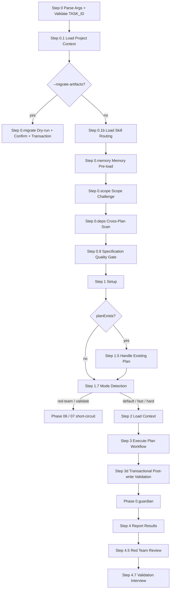

## ⛔ CRITICAL: Error Handling

**If ANY script returns an error, you MUST:**
1. **STOP immediately** — Do NOT attempt workarounds or auto-fixes.
2. **Report the error** — Show the exact error message to the user.
3. **Wait for user** — Ask user how to proceed before taking any action.

**DO NOT:**
- Try alternative approaches when scripts fail.
- Create branches manually when script validation fails.
- Guess or assume what the user wants after an error.
- Continue with partial results.

---

## User Input

```text
$ARGUMENTS
```

You **MUST** consider the user input before proceeding (if not empty).

## Core Principles

**YAGNI · KISS · DRY.** Implement only what is required. Prefer simple over clever. Single source of truth. Be honest, brutal, straight to the point, and concise.

## Boundary Declaration

**This command produces:**
- Implementation plan (`plan.md`)
- Executable implementation phases (`phases/phase-NN-*.md`)
- Conditional research, durable reports, and machine-consumable contracts when
  a named downstream consumer requires them

**This command does NOT:**
- Write implementation code.
- Execute tests.
- Create PRs or commits.
- Write unit tests itself (`--tdd` / `--ut-backfill` generate test-first or backfill phase sections; UT implementation is handled by `/tdk-implement` through `## Delegate Skills` in generated phase files).

## When to Use

- Plan a new feature implementation.
- Architect a system design.
- Evaluate technical approaches.
- Break down complex requirements into ordered phases.

## Process Flow (Authoritative)



**This diagram is the authoritative workflow.** Prose sections below provide detail per node.

## Workflow

### Step 0 — Parse Arguments & Validate Task ID
**Inline.** <!-- safety-critical: deterministic split before any script invocation -->
Split `$ARGUMENTS` into `TASK_ID`, `FLAGS`, `BACKFILL_TARGET`, and `USER_CONTENT`.

- `TASK_ID`: first argument token. It must be a valid task ID. Validate only this cleaned token with `tdk-validate-task-id` and host skill name `/tdk-plan`.
- `FLAGS`: known mode flags `--fast | --hard | --tdd | --ut-backfill | --red-team | --validate | --migrate-artifacts`, allowed anywhere after `TASK_ID`. Flags fall into three independent categories: speed (`--fast`, `--hard`), test (`--tdd`, `--ut-backfill`), action (`--red-team`, `--validate`, `--migrate-artifacts`). When `--ut-backfill` is present, also accept backfill targeting flags `--sub-workspace <name>`, `--module <name>` (requires `--sub-workspace`), and `--standalone`; these targeting flags are unknown-flag STOP errors when `--ut-backfill` is absent.
- `BACKFILL_TARGET`: only populated when `--ut-backfill` is present. Shape: `{ sub_workspace: string | "", module: string | "", standalone: boolean }`. Remove targeting flags and their values from `USER_CONTENT`.
- `USER_CONTENT`: remaining non-flag text after `TASK_ID`, preserving order. Empty string if no content was supplied.

Reject with STOP if the first argument token is missing or invalid, a known mode flag appears before `TASK_ID`, any token beginning with `--` is not an exact whitelisted mode flag, more than one flag from the same category (speed / test / action) is present, `--fast` is combined with `--tdd` or `--ut-backfill`, `--migrate-artifacts` is combined with any speed, test, targeting, red-team, or validate flag, a backfill targeting flag appears without `--ut-backfill`, `--sub-workspace` or `--module` is missing its value, or `--module` appears without `--sub-workspace`. Unknown flag or category conflict → STOP with explicit error (see `references/modes.md`). If `tdk-validate-task-id` STOPs → halt. Store: `TASK_ID`, `TASK_ID_SOURCE`, `FLAGS`, `BACKFILL_TARGET`, `USER_CONTENT`.

### Script Command Contract
**Inline.** <!-- script invocation contract -->
Before any direct Bun script command in this skill or its references, resolve the project root at the agent layer using the active coding harness/session context. Ask the user for the project root if you cannot identify it confidently.

```bash
bash -lc '
PROJECT_DIR="$1"
if [ -z "$PROJECT_DIR" ] || [ ! -d "$PROJECT_DIR/.specify/scripts/ts" ]; then
  echo "Invalid project root: $PROJECT_DIR" >&2
  exit 1
fi
(cd "$PROJECT_DIR/.specify/scripts/ts" && bun src/commands/...)
' -- "<agent-resolved-project-root>"
```

Replace `<agent-resolved-project-root>` with the actual absolute project root; do not pass the placeholder literally. Invoke scripts from the resolved root with `(cd "$PROJECT_DIR/.specify/scripts/ts" && bun src/commands/...)`. If the Bun command exits non-zero, follow the critical error handling rule above.

### Step 0.1 — Load Project Context
**Inline.** <!-- script invocation -->
Invoke `tdk-load-project-context` with the validated `TASK_ID`. Store: `PROJECT_CONTEXT`, `FEATURE_DIR`.

### Step 0.migrate — Opt-in Legacy Artifact Migration

Load: `references/migrate-artifacts-workflow.md`
Run only when `FLAGS` contains `--migrate-artifacts`, immediately after project
context resolves `FEATURE_DIR`. Execute the dry-run/confirmation transaction
and end the command; skip skill routing, memory, scope, dependency scan, setup,
existing-plan handling, design, red-team, and validation.

### Step 0.1b — Load Skill Routing
Load: `references/delegate-routing-injection.md`
Resolve delegate routing file per reference. Parse sub-workspace sections. Store: `SKILL_ROUTING` map. Missing file → AskUserQuestion per reference (opt-in create or skip with empty map).

When `FLAGS` contains `--red-team` or `--validate`, do not run the interactive missing-file AskUserQuestion/create flow from this step. Those action flags still MUST always perform exact-path inline routing reads inside their own workflows.

### Step 0.memory — Memory Pre-load
Load: `references/gates.md`
Run only if `.specify/memory/memory-index.md` exists. Pre-load Context Block; carry it forward to Phase 0.guardian. Non-blocking — continue on failure.

### Step 0.scope — Scope Challenge
Load: `references/scope-challenge.md`
Skip if `--fast`, spec.md `$ARGUMENTS` <20 words, "just plan / quick / already decided" signals, or prior scope already recorded. Otherwise: 3-question batched AskUserQuestion → route EXPANSION / HOLD / REDUCTION → write `scope_mode:` + append `## Scope Challenge` session block.

### Step 0.deps — Cross-Plan Dependencies Scan
Load: `references/cross-plan-deps.md`
Skip if `--fast` in `FLAGS` (Step 1.7 hasn't resolved `MODE` yet at this point in the flow). Otherwise invoke `(cd "$PROJECT_DIR/.specify/scripts/ts" && bun src/commands/util/scan-cross-plan-deps.ts --current <TASK_ID> --json)`, parse findings, optionally auto-fix D1 bidirectional gaps via AskUserQuestion + dirty-tree gate (Validation S3 D12). Advisory only — never STOPs plan creation.

### Step 0.9 — Specification Quality Gate Preflight

Derive `featureSpec` and `featureDir` from the already resolved project context
and task ID without creating files or directories. Run this read-only gate
before `setup-plan.ts` so a blocked spec cannot leave a new `plan.md` template.

Run:

```bash
(cd "$PROJECT_DIR/.specify/scripts/ts" && bun src/commands/util/validate-specification-quality-gate.ts "{featureSpec}" --legacy-checklist "{featureDir}/checklists/requirements.md" --json)
```

An embedded `pass` gate is accepted. `warn` is accepted only with no blocking
issues. A legacy spec may use an existing `checklists/requirements.md` only
when the embedded gate is absent; report this fallback explicitly. STOP on
`fail`, malformed gate data, blocking issues, or when both gate and legacy
fallback are missing.

### Step 1 — Setup
**Inline.** <!-- safety-critical script invocation -->
Run `(cd "$PROJECT_DIR/.specify/scripts/ts" && bun src/commands/util/setup-plan.ts {task_id} --json)`. Parse JSON for `taskId`, `featureSpec`, `implPlan`, `featureDir`, `hasGit`, **`planExists`**.

### Step 1.5 — Handle Existing Plan
Load: `references/handle-existing-plan.md`
**Trigger:** only if `planExists == "true"`. Implements Rewrite / Append / Abort + F13 Soft Dirty Guard + F19 Lowercase Enforcement + Phase File Content Template.

### Step 1.7 — Mode Detection
Load: `references/modes.md`
Resolve `MODE` from `FLAGS`: `fast` | `hard` | `red-team` | `validate` | `default` (no flag). Resolve `test_mode` independently from `FLAGS`: `tdd` | `ut_backfill` | `none` (no test flag). Conflict / unknown → already STOPped at Step 0. `--red-team` / `--validate` short-circuit to Phase 06 / 07 over the existing plan and skip Steps 2–4, using `USER_CONTENT` as focus text when non-empty. Other modes continue to Step 2 and use `USER_CONTENT` as planning instruction when non-empty; `test_mode` and `BACKFILL_TARGET` carry forward to Step 3b Design and the plan output contract.

### Step 2 — Load Context
Load: `references/gates.md`
Read `featureSpec` and `.specify/memory/constitution.md`. Apply Constitution Check + Skip Conditions. Choose UPDATE vs REGENERATE mode based on Step 1.5 outcome. Per-step skip rules under each mode are defined in `references/modes.md`.

**New spec format sections to read**: ## 1. Problem Statement, ## 2. Scope Boundary, ## 3. Impact Surface, ## 5. User Requirements & Testing (with `[sw/module]` tags), ## 6. Functional Requirements (with tags), ## 7. Success Criteria, ## 8. Risks & Mitigations.

### Step 3 — Execute Plan Workflow

#### 3a — Research
Load: `references/research-phase.md`

#### 3b — Design
Load: `references/design-phase.md`
Includes Solution Design, Embedded Brainstorming, Sequential Thinking for phase decomposition, and UT Phase Auto-inclusion.

#### 3c — Plan Layout & Output
Load: `references/plan-output-contract.md`
STOP before writing `plan.md`, `phases/*.md`, or any conditional supporting
artifact unless `references/plan-output-contract.md` has been loaded
successfully in this step. Use the loaded contract as the only source for
output layout, frontmatter, phase file conventions, supporting-artifact index,
quality checklist, Decisions Made table, and sanitization rules; do not guess
or reconstruct the layout from memory.

### Step 3d — Transactional Post-write Validation

Using the already loaded `references/plan-output-contract.md`, run its four
post-write gates in the frozen order. New/rewrite validate every generated phase;
append validates the appended phase while the disjointness gate validates every
`parallel_safe: auto` phase in the plan. Build that gate's `ACCESS_SETS_JSON`
input yourself from each `auto` phase's `## Related Code Files` bullets, exactly
as the contract's gate 4 specifies.
This gate runs before `Phase 0.guardian` and Step 4 reporting.

On invalid output, an unexpected non-zero exit, malformed JSON, or runtime/I/O
failure, remove only invocation-new files, report exact diagnostics, and STOP.
Do not repair, downgrade, retain an orphan phase/table row, or continue to
guardian, reporting, red-team, or the validation interview.

### Step 3e — Seed Git Map

Skip entirely when `PROJECT_CONTEXT.subWorkspaces` is empty or absent — the key is always present as `[]`
when unset, so test for an empty array, not a missing key.

Otherwise seed `{FEATURE_DIR}/git-map.md` so the branching picture is reviewable with the plan instead of
appearing for the first time at implement time. Runs after Step 3d, because it reads the
`## Related Code Files` bullets that gate has just validated.

1. Collect every path under `## Related Code Files` across the generated phases and prefix-match them against
   `PROJECT_CONTEXT.subWorkspaces[].path`. Paths matching none belong to the root repo — skip them. Skip a
   sub-workspace whose directory is not its own repository.
2. Resolve each affected repository's fetch remote before dispatch, then seed its base ref. A confirmed
   milestone with an upstream uses that upstream's remote even when it is not the first remote; a local-only
   milestone needs no fetch. Without a milestone, use the sole remote, or leave the remote unresolved and
   ask when several exist. A repository on `develop` must not be handed `origin/main` for the user to correct
   by hand at every implement run.

   ```bash
   AFFECTED_SUBS=(...)        # workspace-relative paths of the repos matched in step 1
   AFFECTED_MILESTONES=(...)  # same order; empty string means this repo has no confirmed milestone
   FETCH_TMP=$(mktemp -d)

   # `timeout` is absent from a stock macOS. Resolve it once, then prove it can actually enforce a
   # deadline: plain `timeout` only sends SIGTERM, and a transport that blocks the signal — SSH, a
   # credential helper, an unreaped child — survives it and hangs this step forever. So
   # `--kill-after` is required, and a `timeout` without it counts as no timeout at all.
   #
   # This block must not run under `set -e`: `return 99` has to reach `echo "$?"` below.
   TIMEOUT_BIN=$(command -v timeout || command -v gtimeout || true)
   FETCH_DEADLINE=10          # seconds; kill-after adds 5 to cover SIGTERM-ignoring processes

   # Capability probe, exactly once.
   if [ -n "$TIMEOUT_BIN" ] && ! "$TIMEOUT_BIN" --kill-after=1 1 true >/dev/null 2>&1; then
     TIMEOUT_BIN=""           # present but cannot enforce a deadline — treat as absent
   fi

   # Sentinel 99, not 127: `timeout 1 <nonexistent-command>` already exits 127 while `timeout`
   # itself is perfectly available, so 127 would misattribute an exec failure to a missing binary.
   RUN_FETCH() {
     if [ -z "$TIMEOUT_BIN" ]; then
       return 99              # no enforceable deadline available: skip the network entirely
     fi
     "$TIMEOUT_BIN" --kill-after=5 "$FETCH_DEADLINE" "$@"
   }

   IDX=0
   for SUB in "${AFFECTED_SUBS[@]}"; do
     # Index, not a sanitized path: two different paths can sanitize to the same string, which is
     # exactly how one repository's failure ends up reported against another.
     KEY="$IDX"
     MILESTONE="${AFFECTED_MILESTONES[$IDX]:-}"
     echo "$SUB" > "$FETCH_TMP/$KEY.sub"
     IDX=$((IDX + 1))

     REMOTE=""
     REMOTE_STATE=""
     if [ -n "$MILESTONE" ]; then
       UPSTREAM=$(git -C "$PROJECT_DIR/$SUB" rev-parse --symbolic-full-name \
         "$MILESTONE@{upstream}" 2>/dev/null || true)
       case "$UPSTREAM" in
         refs/remotes/*)
           REMOTE=$(git -C "$PROJECT_DIR/$SUB" config "branch.$MILESTONE.remote" 2>/dev/null || true)
           if [ -z "$REMOTE" ] || [ "$REMOTE" = "." ]; then REMOTE_STATE="multiple_remotes"; fi
           ;;
         *)
           if git -C "$PROJECT_DIR/$SUB" show-ref --verify --quiet "refs/heads/$MILESTONE"; then
             REMOTE_STATE="local_milestone"
           else
             REMOTE_STATE="unresolved_milestone"
           fi
           ;;
       esac
     else
       set -- $(git -C "$PROJECT_DIR/$SUB" remote)
       case "$#" in
         0) REMOTE_STATE="no_remote" ;;
         1) REMOTE="$1" ;;
         *) REMOTE_STATE="multiple_remotes" ;;
       esac
     fi
     echo "$REMOTE" > "$FETCH_TMP/$KEY.remote"
     (
       case "$REMOTE_STATE" in
         no_remote)
           echo 98 > "$FETCH_TMP/$KEY.rc"
           : > "$FETCH_TMP/$KEY.head"
           : > "$FETCH_TMP/$KEY.err"
           ;;
         unresolved_milestone)
           echo 95 > "$FETCH_TMP/$KEY.rc"
           : > "$FETCH_TMP/$KEY.head"
           echo "confirmed milestone is unresolved" > "$FETCH_TMP/$KEY.err"
           ;;
         local_milestone)
           echo 97 > "$FETCH_TMP/$KEY.rc"
           : > "$FETCH_TMP/$KEY.head"
           : > "$FETCH_TMP/$KEY.err"
           ;;
         multiple_remotes)
           echo 96 > "$FETCH_TMP/$KEY.rc"
           : > "$FETCH_TMP/$KEY.head"
           echo "multiple remotes require confirmation" > "$FETCH_TMP/$KEY.err"
           ;;
         *)
           GIT_TERMINAL_PROMPT=0 RUN_FETCH git -C "$PROJECT_DIR/$SUB" fetch --quiet "$REMOTE" \
             2>"$FETCH_TMP/$KEY.err"
           echo "$?" > "$FETCH_TMP/$KEY.rc"
           git -C "$PROJECT_DIR/$SUB" symbolic-ref "refs/remotes/$REMOTE/HEAD" 2>/dev/null \
             > "$FETCH_TMP/$KEY.head" || true
           ;;
       esac
     ) &
   done
   wait
   ```

   `GIT_TERMINAL_PROMPT=0` is required: a remote needing credentials would otherwise open an interactive
   prompt inside a step that must never block. Read each repository back through its `.sub` file so a
   result is always attributed to the path that produced it.

   Read the per-repository results only after `wait`. Seeding resolves the triple
   `(Base ref, Base commit, kind)` using the **Base resolution** table in
   `tdk-branch-preflight/references/git-map-contract.md` — that table is the single definition, and the
   outcomes below are its tier 3 through tier 6 inputs:

   | Condition | `Base ref` seeded | Note |
   |---|---|---|
   | `rc` = 95 (confirmed milestone has neither an upstream nor a local branch) | unresolved | `confirmed milestone is unresolved`; require user resolution and do not fall through to a default remote |
   | `rc` = 96 (several remotes and no upstream-selected remote) | unresolved | `multiple remotes require confirmation`; ask for the remote, then run the same bounded fetch once for that confirmed remote before resolving the triple |
   | `rc` = 97 (confirmed local-only milestone) | `refs/heads/<milestone>` | resolve through tier 2; no fetch |
   | `rc` = 98 (no remote) and `refs/heads/{featureEnv.mainBranch}` resolves | `refs/heads/{featureEnv.mainBranch}` | `no remote; seeded local mainBranch` |
   | `rc` = 98 and that local branch does not resolve | `refs/heads/{featureEnv.mainBranch}` | `no remote and local mainBranch is unresolved; requires confirmation` |
   | `rc` = 0 and `<remote>/HEAD` resolves | the resolved value, for example `refs/remotes/origin/develop` | — |
   | `rc` = 0 but `<remote>/HEAD` is unset | `refs/remotes/<remote>/{featureEnv.mainBranch}` | `<remote>/HEAD unset; seeded from mainBranch` |
   | `rc` = 99 | `refs/remotes/<remote>/{featureEnv.mainBranch}` | `no enforceable fetch deadline (timeout unavailable or --kill-after unsupported); skipped fetch, seeded from mainBranch` |
   | `rc` ≠ 0 otherwise, including the deadline firing | `refs/remotes/<remote>/{featureEnv.mainBranch}` | `fetch failed: <short reason>; seeded from mainBranch` |

   A repository whose milestone is already confirmed uses tier 1 or tier 2. Tier 1 fetches the remote named
   by the milestone's upstream; tier 2 performs no fetch. A no-remote repository with no confirmed milestone
   may use its local `mainBranch` only when that branch resolves; otherwise it has no canonical triple and
   the batched confirmation must require user resolution. A milestone that was confirmed but resolves neither
   locally nor remotely is also a question for the user — it never silently falls back to the default branch.

   Each repository with a remote is fetched at most once, and every such fetch is bounded by
   `FETCH_DEADLINE` + `--kill-after` (10s + 5s here); the repositories run in parallel, so the whole
   step is bounded by that same budget rather than by the number of repositories. A no-remote repository
   runs no fetch.

   Fetching is best-effort and must never stop the plan. Offline, unauthenticated, or unreachable remotes
   fall back to their remote `mainBranch` and carry a note into the Step 4 report — notes belong in the
   report, not in `git-map.md`, whose schema is closed. A plan is a thinking artifact and must complete
   without a network.

   The fetch is the only network access here, and it is read-only: no branch is created, nothing is checked
   out, nothing is pruned.
3. Write the seed rows with `Branch` and `Worktree path` as `-`. **Omit `feature_branch` from the
   frontmatter when creating the file; when it is already present, keep it.** Plan time records intent
   only: it creates nothing, and fetches read-only to seed base refs. For every resolved triple, write its
   commit into `base_commit_by_repo[<sub>]`; when a base cannot resolve, omit that key entirely — **never
   serialize `-` as a base commit**.

   **Reseeding is idempotent per repository.** Step 3e is a `git-map.md` writer and runs again on every
   rewrite and on every phase append, so it must not undo an implement run. Read the existing file
   first, then, per repository:

   | Existing row state | Reseed does |
   |---|---|
   | no row | add the seed row |
   | `seed`, `pending` | update `Milestone`, `Base ref`, and the resolved `base_commit_by_repo` entry; remove that entry when the new base is unresolved |
   | `realized`, `realized-unverified`, `cleaning`, `cleaned` | **leave the row and its map entries exactly as they are** |
   | `feature_branch` already in frontmatter | keep it — reseed never removes the discriminator |

   Reseed may only **add** intent for a repository new to `subWorkspaces` and **update** one that has not
   been realized. Demoting a realized row is the explicit `reset` operation in the git-map contract, not
   a side effect of appending a phase.

   Without this, the sequence *implement → cleanup → append a phase → implement* erases `feature_branch`,
   `Branch`, `Worktree path` and all three frontmatter maps; preflight then loses the resume path and
   offers to recreate precisely what the user just cleaned up.

The absent `feature_branch` is what marks the file as a plan seed rather than a completed run — see
`tdk-branch-preflight/references/git-map-contract.md`. `/tdk-implement` re-verifies every seeded value
against live git, confirms it with the user, and only then creates anything.

This is a plan artifact like any other: list it in `## Supporting Artifacts` rather than adding a section to
`plan.md`, whose structure and frontmatter remain closed to the explicit schema
in `references/plan-output-contract.md`, including its optional memory-gate fields.

### Phase 0.guardian — Business Logic Validation
Load: `references/gates.md` <!-- semantics in same file as Step 0.memory -->
Evaluate coverage, fast mode, task decision, and fallback in that order. Zero
binding coverage can skip; unknown coverage cannot silently bypass requested
validation. Follow the persistent gate-state and authorization contract.
Otherwise spawn `tdk-memory-agent` using the caller-owned `mode: validate` control
header from `references/gates.md`. Validate the complete Guardian Report before
acting on `BLOCK_IMPL` / `REVIEW` / `CLEAR`. Preserve NOT CHECKED semantics and
persistent gate state; do not weaken the plan blocking gate.

### Step 4 — Report Results
**Inline.** <!-- terminal output, <10 lines -->
Command ends after Phase 1 design. Report: branch, `implPlan` path, generated artifacts, `## Decisions Made` summary. When `MODE != default`, print the one-line banner from `references/modes.md` (e.g. `Mode: fast — research / scope / deps / guardian / red-team / validate / UT skipped.`).

### Step 4.5 — Red Team Review
Load: `references/red-team-workflow.md`
Skip if `MODE in {default, fast}` AND `--red-team` not set. Otherwise spawn the 3 hostile personas (skeptic + security + reliability) in parallel, adjudicate via markdown-table + free-text reply, apply accepted findings as session-prefixed markers, append `## Red Team Review` to `plan.md`. Use `USER_CONTENT` as reviewer focus when non-empty. Bumps `red_team_session: N`.

### Step 4.7 — Validation Interview
Load: `references/validate-workflow.md`
Skip if `MODE == "fast"`. Otherwise: orphan-detect any prior `(in-progress)` session (Resume / Discard / Cancel via AskUserQuestion + trust-ask). On fresh run, prompt user `Run validation interview? [y/N]` (auto-yes on `--validate` action). Generate 3–8 questions via template framework, biasing toward `USER_CONTENT` as validation focus when non-empty, batch in groups of 4, write `## Validation Log` with `(in-progress) → (completed | partial)` marker + `validation_cursor` resume state. Bumps `validation_session: N`.

## Required Reference Load Contract

For every internal `Load: references/X.md` directive, resolve the target from `SKILL_BASE_DIR`, the directory containing this `SKILL.md`, to the expected absolute path `SKILL_BASE_DIR/references/X.md`. Before proceeding with the current step:

1. Verify the expected absolute path exists and is readable.
2. Read the first line and STOP if it begins with `<!-- DO NOT LOAD`.
3. Read the full file successfully before using any instruction from that reference.

On missing, unreadable, or stubbed internal references, STOP and report the expected absolute path and current step. Do not try alternate paths, fallback layouts, or partial reconstruction from memory.

This contract applies only to internal `references/*.md` loads. Project-specific files governed by `references/delegate-routing-injection.md` keep their documented AskUserQuestion / skip behavior.

## Subcommands

| Command | Reference | Purpose |
|---------|-----------|---------|
| `/tdk-plan <ID> --red-team` | `references/red-team-workflow.md` | Spawn 3 hostile personas (skeptic + security + reliability), adjudicate findings, apply session-prefixed markers. |
| `/tdk-plan <ID> --validate` | `references/validate-workflow.md` | Template-based 3–8 question interview across 8 categories (3 tdk-prioritized + 5 ck-plan). Resume-able via `validation_cursor`. |

<!-- Phase 01 intentionally created the table with header only (F13 + S2.F1); rows populate as features ship. -->

## Quality Standards

- Thorough and specific; long-term maintainability over cleverness.
- Address security and performance concerns up front.
- Detailed enough for a junior developer to execute.
- Validate against existing codebase patterns and constitution.

## Key Rules

- Use absolute paths in plan artifacts.
- ERROR on gate failures or unresolved clarifications — see `references/gates.md`.

**Remember:** plan quality determines implementation success.
