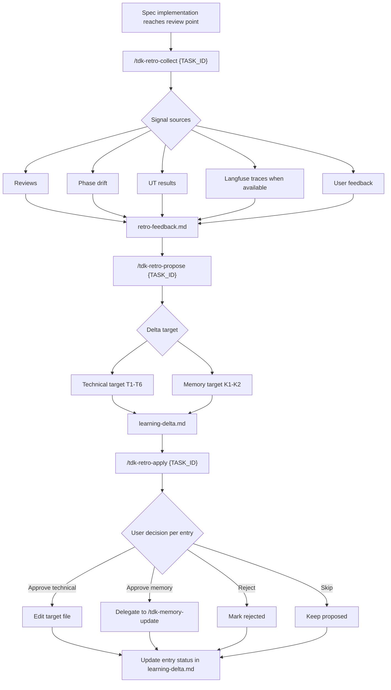

# TDK Retro Plugin

`tdk-retro` adds a human-approved self-learning loop after a TDK spec implementation. It collects implementation feedback, proposes concrete learning deltas, then applies only the entries the user approves.

## Skills

| Skill | Purpose | Input | Output |
|---|---|---|---|
| `tdk-retro-collect` | Collect evidence-backed signals from reviews, phase drift, UT results, Langfuse traces when available, and user feedback. | `{TASK_ID}` | `{FEATURE_DIR}/retro-feedback.md` |
| `tdk-retro-propose` | Convert active feedback signals into reviewable technical or memory learning deltas. | `{TASK_ID}` | `{FEATURE_DIR}/learning-delta.md` |
| `tdk-retro-apply` | Ask for user approval per delta, apply approved technical edits, delegate approved memory edits, and update entry statuses. | `{TASK_ID}` | Updated target files and `{FEATURE_DIR}/learning-delta.md` statuses |

## Artifacts

| File | Owner | Notes |
|---|---|---|
| `retro-feedback.md` | `tdk-retro-collect` | Observation artifact only. No proposed fixes. |
| `learning-delta.md` | `tdk-retro-propose` and `tdk-retro-apply` | Proposal + status tracking artifact. |
| `.specify/memory/*` | `tdk-memory-update` | `tdk-retro-apply` delegates memory edits instead of editing memory files directly. |

## Basic Flow

1. Finish or pause a TDK spec implementation.
2. Run `/tdk-retro-collect {TASK_ID}` to write or update `retro-feedback.md`.
3. Run `/tdk-retro-propose {TASK_ID}` to generate up to 10 proposed deltas in `learning-delta.md`.
4. Run `/tdk-retro-apply {TASK_ID}` to approve, reject, skip, or apply each delta.
5. Review changed rules, skills, docs, or memory files before committing.

## Flow Chart

## Path Resolution Rules

- `tdk-retro-collect` uses full prerequisite validation because phase drift requires `plan.md` and phase files.
- `tdk-retro-propose` uses path-only feature resolution and stops only when `retro-feedback.md` is missing.
- `tdk-retro-apply` uses path-only feature resolution and stops only when `learning-delta.md` is missing.
- Fixture fallback checks `.specify/examples/specs/{TASK_ID}/`; propose/apply do not require fixture `plan.md`.

## Feedback Updates

`tdk-retro-collect` can create or update `retro-feedback.md`.

- New feedback gets the next `UF-###` ID and `status: active`.
- Existing active feedback is preserved during update runs.
- Removed feedback is marked `status: removed` so future propose runs ignore it.
