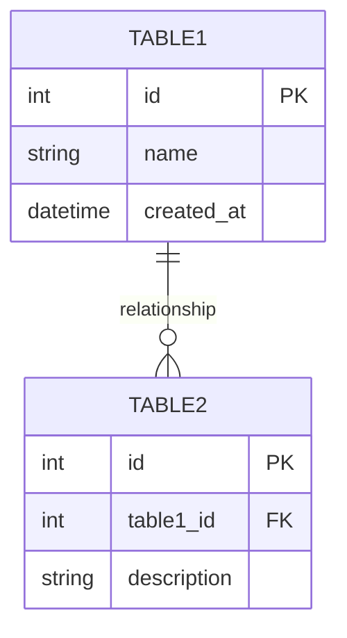

# Data Model Template

This file is a reference template for generating `data-model.md` for new features.

## Database Design Rules

### Primary Key Convention
- All tables use auto increment INTEGER primary keys: `id INT AUTO_INCREMENT PRIMARY KEY`
- No UUIDs for primary keys to optimize performance and storage
- Foreign keys reference the INTEGER primary key of related tables

### Naming Conventions
- Table names: snake_case, plural (e.g., `business_operators`, `landing_pages`)
- Column names: snake_case (e.g., `created_at`, `company_name`)
- Foreign keys: `{table_name}_id` (e.g., `operator_id`, `product_id`)
- Indexes: `idx_{table}_{columns}` (e.g., `idx_products_operator_status`)

### Standard Columns
- All tables include: `created_at DATETIME`, `updated_at DATETIME`
- Soft delete tables include: `deleted_at DATETIME NULL`
- Multi-tenant tables include: `operator_id INT` (foreign key to business_operators)

### Mermaid Diagram Maintenance
- **CRITICAL**: When any changes are made to this data-model.md file, the corresponding `data-model.mermaid` file MUST be updated
- The mermaid file should reflect the current state of all tables, columns, relationships, and enums
- Updates must include:
  - New/modified table structures
  - Changed column definitions, types, and constraints
  - Updated enum values
  - Modified relationships between entities
  - New indexes (if relevant to the diagram)
- The mermaid diagram serves as a visual representation for documentation and development teams

### State Transition Maintenance
- All entity state transitions should be documented in a separate `state-transitions.md` file
- Each transition MUST include an explicit trigger and any preconditions (business/data constraints)
- When adding/changing enum status values or behavior in this file, you MUST update `state-transitions.md` in the same PR
- When statuses are represented by boolean flags (e.g., `is_published`), document the logical states and transitions in `state-transitions.md`
- Application logic and API contracts MUST enforce only transitions allowed by `state-transitions.md`

## Enum Definitions

Enum definitions should be grouped by category and follow this format:

### Category Name
```sql
-- Description of the enum
ENUM enum_name ('value1', 'value2', 'value3')
```

**Common Categories**:
- Business & Subscription
- Product & Content
- SNS Platforms
- Payment & Transactions
- Analytics & Engagement
- System & Status

**Example**:

```sql
### Product & Content
-- Product lifecycle status
ENUM product_status ('draft', 'active', 'inactive', 'deleted')

-- Currency codes (ISO 4217)
ENUM currency_code ('JPY', 'USD', 'EUR')
```

**Status Enums** (require state-transitions.md):
- Lifecycle statuses: `product_status`, `order_status`, `user_status`
- Process statuses: `approval_status`, `verification_status`, `review_status`
- Workflow statuses: `campaign_status`, `task_status`, `request_status`
- Boolean states: `is_published`, `is_active` (document as 2-state machines)

## Entity Tables

Entity table definitions follow this format:

```sql
CREATE TABLE table_name (
  id INT AUTO_INCREMENT PRIMARY KEY,
  column_name TYPE CONSTRAINTS,
  foreign_key_id INT,
  created_at DATETIME NOT NULL DEFAULT CURRENT_TIMESTAMP,
  updated_at DATETIME NOT NULL DEFAULT CURRENT_TIMESTAMP ON UPDATE CURRENT_TIMESTAMP,
  deleted_at DATETIME NULL,

  FOREIGN KEY (foreign_key_id) REFERENCES other_table(id),
  INDEX idx_table_column (column_name)
);
```

**Constraints to document**:
- NOT NULL
- UNIQUE
- DEFAULT values
- CHECK constraints (for enum validation)
- Foreign key ON DELETE/ON UPDATE behavior

**Relationships**:
- One-to-Many: Document via foreign keys
- Many-to-Many: Create junction tables
- One-to-One: Use UNIQUE constraint on foreign key

## Mermaid Diagram

Include a visual ER diagram using Mermaid syntax:



**Cardinality notation**:
- `||--o{` : One to Many
- `||--||` : One to One
- `}o--o{` : Many to Many

## Usage Instructions

When generating a new `data-model.md`:

1. **Copy Structure**: Use this template as the base structure
2. **Extract Enums**: Identify all enum-like fields from the feature spec
3. **Group Enums**: Categorize enums by business domain
4. **Define Tables**: Create table definitions based on entities in the spec
5. **Document Relationships**: Add foreign keys and relationships
6. **Create Diagram**: Generate Mermaid ER diagram
7. **Check State Transitions**: If status enums exist, ensure `state-transitions.md` is also generated
