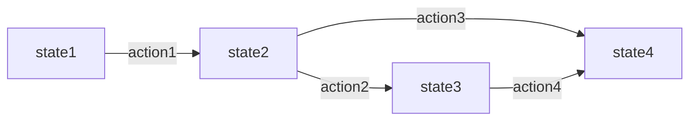

# State Transitions Template

This file is a reference template for generating `state-transitions.md` for new features.

## Governance Rules
- Every transition MUST specify:
  - **Trigger**: who/what initiates the transition (user action, API call, scheduler, webhook, background job)
  - **Preconditions**: required data/state constraints that must be true before transition
  - **Postconditions**: invariant updates and required side effects (timestamps, counters, denorm fields)
  - **Audit**: what gets logged (who, when, from_state → to_state, context)
- Only transitions described here are allowed. APIs and services MUST enforce them.
- If an enum or status behavior changes, update this file and add/adjust tests in the same PR.
- Database constraints: keep the enum values aligned with these states; use CHECK constraints and foreign keys where applicable.
- Soft delete vs hard delete: when soft delete is a state, document the allowed entry points and irreversibility.

---

## State Flow Template

For each status enum that requires state machine documentation:

### 1) [Entity Name] Status Flow

**States**: state1, state2, state3, state4

**Diagram (Mermaid)**


**Transitions**

#### state1 -> state2
- **Trigger**: [Who/what initiates] (e.g., operator publishes via UI, API PUT /resource/:id/status)
- **Preconditions**:
  - [Required field validations] (e.g., name required, price > 0)
  - [Required relationships] (e.g., must have at least one image)
  - [Permission checks] (e.g., operator.verification_status != 'suspended')
- **Postconditions**:
  - [State update] (e.g., resource.status = 'state2')
  - [Timestamp updates] (e.g., updated_at, first_published_at if null)
  - [Side effects] (e.g., send notification, update cache)
- **Audit**: [Log event name] (e.g., resource_status_change)

#### state2 -> state3
- **Trigger**: [Action description]
- **Preconditions**: [Requirements]
- **Postconditions**: [Updates and side effects]
- **Audit**: [Log event]

[Continue for all transitions...]

**Validation Contract**
- Any API that sets [entity.status] MUST validate according to the above and reject otherwise
- Reject with: `409 Conflict` or `422 Unprocessable Entity`
- Include machine-readable error code in response

---

## Common State Flow Patterns

### Lifecycle Status Pattern (4 states)
```
draft -> active -> inactive -> deleted
```
**Use for**: Products, Content, Campaigns, Resources

### Process Status Pattern (5 states)
```
pending -> completed/failed -> refunded/disputed
```
**Use for**: Transactions, Payments, Orders, Requests

### Approval Workflow Pattern (3 states)
```
pending -> approved/rejected
```
**Use for**: Reviews, Verifications, Submissions

### Boolean State Pattern (2 states)
```
unpublished <-> published
```
**Use for**: Toggle states (is_active, is_published, is_enabled)

---

## Cross-Entity Invariants

Document any cross-entity constraints related to state transitions:

**Example**:
- Deleting a Product (soft) should not auto-delete landing pages or posts, but API must prevent publishing new posts for deleted products
- Transactions for deleted products remain immutable; refunds/disputes still allowed according to policy
- When a landing page is unpublished, future scheduled posts referencing it must be cancelled or moved back to draft with a reason
- Operator suspended: products cannot be moved to active; scheduled posts must be paused until reinstated

---

## Implementation Guidance

### API Layer
- Accepts intent (trigger), validates preconditions, applies state change, persists, emits domain events
- Return `409 Conflict` or `422 Unprocessable Entity` on invalid transition
- Include machine-readable error code

### Persistence Layer
- Transactions ensure atomic state updates and side effects (timestamps, counters)
- Add partial indexes if needed for common state queries (e.g., `idx_resource_status_scheduled_at`)

### Observability
- Emit structured logs for state changes with correlation ids; ship to logging service
- Create metrics counters for transitions, failures, and retries

### Testing
- Unit tests per transition (happy + 1-2 edge cases)
- Integration tests for webhook/event flows
- Property-based tests for idempotent event handling

---

## Usage Instructions

When generating a new `state-transitions.md`:

1. **Identify Status Enums**: Extract all status enums from `data-model.md`
2. **Determine Pattern**: Choose appropriate state flow pattern (Lifecycle, Process, Approval, Boolean)
3. **Create Mermaid Diagram**: Visualize all allowed transitions
4. **Document Each Transition**: Include trigger, preconditions, postconditions, audit for every arrow in diagram
5. **Add Validation Contracts**: Specify API enforcement rules
6. **Cross-Entity Constraints**: Document any interactions with other entities
7. **Implementation Guidance**: Reference common patterns for consistency

**Status Enums to Document**:
- Lifecycle: `product_status`, `order_status`, `user_status`, `campaign_status`
- Process: `transaction_status`, `payment_status`, `request_status`
- Approval: `approval_status`, `verification_status`, `review_status`
- Workflow: `sns_post_status`, `task_status`, `workflow_status`
- Boolean: `is_published`, `is_active`, `is_enabled` (as 2-state machines)

**Skip if**:
- Enum is not a status (e.g., `currency_code`, `device_type`, `platform`)
- Enum has no business logic transitions (e.g., static lookup values)
