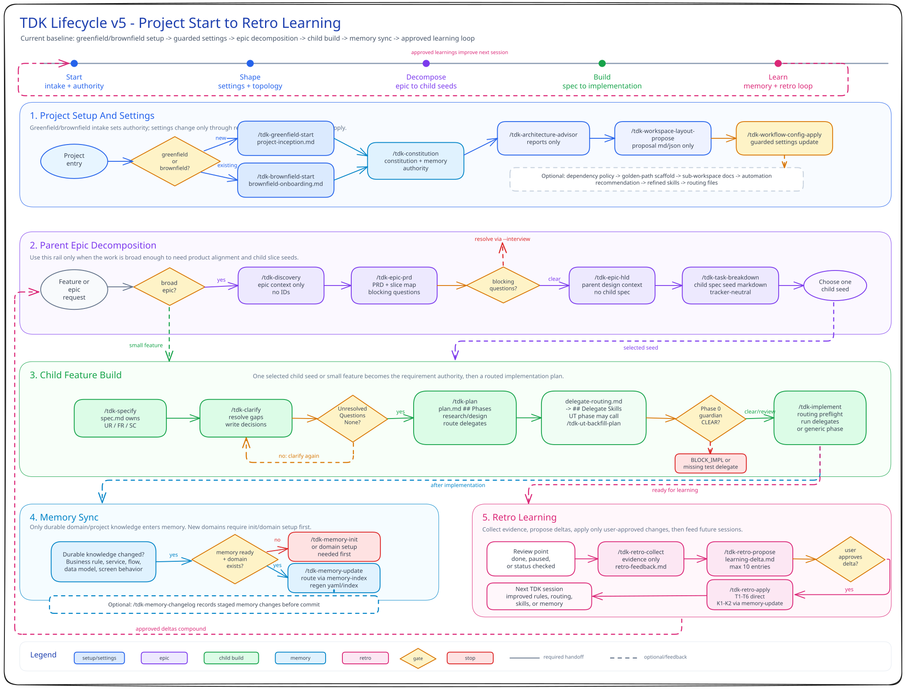

# TDK - TiHon Development Kit

**TDK (TiHon Development Kit)** is a specification-driven development toolkit for AI coding agents. It helps a consumer project move from intent to specs, plans, implementation, review, and durable project memory.

TDK currently targets **Claude Code** and supports generated **Codex** harness artifacts. Cursor, Copilot, and Antigravity support are coming soon.

Core idea: write the work down first. Broad work becomes discovery, epic PRD, high-level design, and child spec seeds. Small clear work starts at a feature spec. Implementation follows the accepted plan and feeds review/memory afterward.



## Fast Path

Use this when you are installing TDK from a source checkout into a consumer project.

### 1. Clone TDK Source

```bash
git clone <tdk-source-url> tdk
cd tdk
CONSUMER_ROOT=/path/to/consumer-project
```

### 2. Distribute the Payload

```bash
bash distribute.sh "$CONSUMER_ROOT" --dry-run
bash distribute.sh "$CONSUMER_ROOT" --yes
```

This copies the configured `.specify/` payload into the consumer project. The default payload includes the workflow plugins, dependency policy, guides, templates, scripts, schemas, setup script, and release manifest.

### 3. Bootstrap the Consumer Project

Run from the consumer project root after `.specify/` exists:

```bash
cd "$CONSUMER_ROOT"
bash .specify/setup.sh
```

This checks prerequisites, installs TypeScript dependencies, verifies setup, and registers available plugin metadata from the consumer project's `.specify/` directory.

### 4. Install a Harness

Run harness install from the TDK source checkout:

```bash
cd /path/to/tdk/packages/tdk-setup
```

For Claude Code:

```bash
bun src/index.ts install "$CONSUMER_ROOT" --harness claude --all-plugins --dry-run
bun src/index.ts install "$CONSUMER_ROOT" --harness claude --all-plugins --yes
```

For Codex:

```bash
# Maintainers: generate Codex packages in the TDK source checkout when needed.
bun src/index.ts convert --dry-run
bun src/index.ts convert

# After generated packages exist in the consumer project's .specify/codex-plugins/:
bun src/index.ts install "$CONSUMER_ROOT" --harness codex --all-plugins --dry-run
bun src/index.ts install "$CONSUMER_ROOT" --harness codex --all-plugins --yes
```

Claude and Codex installs are separate runs. A combined Claude+Codex install is unsupported.

Important Codex caveat: `install --harness codex` reads generated packages from the consumer project's `.specify/codex-plugins/` directory. The default `distribute.json` payload currently does not copy `.specify/codex-plugins/**`, so make those generated packages available before running the Codex install.

## How You Use TDK

Type `/tdk-*` workflow commands in the agent chat, not in a terminal. Use terminal commands only for shell snippets such as `bash`, `bun`, `git`, or test runners.

### Greenfield to Sub-Workspace Setup

Use this when starting a new project or shaping a repo into sub-workspaces:

```text
/tdk-greenfield-start "Project brief..." --full
/tdk-constitution --init .specify/configurations/inception/project-inception.md
/tdk-architecture-advisor .specify/configurations/inception/project-inception.md
/tdk-workspace-layout-propose .specify/configurations/architecture/architecture-decision.md
/tdk-workflow-config-apply
/tdk-workspace-dependency-policy .specify/configurations/workspace-layout/workspace-layout-proposal.json
/tdk-sub-workspace-docs --all
```

The config apply step previews changes first. Approve it only after the shown diff matches the intended workspace layout.

### Start a Large Epic

Use this when the work is broad, vague, or likely to split into multiple child features:

```text
/tdk-discovery epic-001 "Broad epic brief"
/tdk-epic-prd epic-001 --interview
/tdk-epic-hld epic-001
/tdk-task-breakdown epic-001
```

For selective harness installs, make sure the parent epic commands are
included. Include child feature commands too when you want to continue from
task breakdown into `/tdk-specify`, `/tdk-clarify`, `/tdk-plan`, and
`/tdk-implement`.

Then choose one generated child seed and promote it into a child spec:

```text
/tdk-specify feat-001 "Seed from tasks-breakdown/task-001-slice.md"
/tdk-clarify feat-001
/tdk-plan feat-001
/tdk-implement feat-001
```

### Start a Small Spec

Use this when the feature or fix is already clear enough to skip the parent epic flow:

```text
/tdk-specify feat-001 "Small feature or fix description"
/tdk-clarify feat-001
/tdk-plan feat-001
/tdk-implement feat-001
```

Run `/tdk-clarify` until unresolved questions are gone or explicitly deferred. Treat `spec.md` as the requirement authority.

### Implement a Plan

`/tdk-implement` has three execution forms:

```text
/tdk-implement <task-id>
/tdk-implement <task-id> --phase NN
/tdk-implement <task-id> --parallel
```

The default serial form executes ready phases in plan-table order. `--phase NN`
(also accepted as `--phase=NN`) runs one selected phase serially after its
dependencies are satisfied. Both keep the existing routing, recovery, review,
test, and status behavior. `--phase` and `--parallel` are mutually exclusive.

Claude Code supports `--parallel` as a dynamic wave controller. Generated plans
mark a phase `parallel_safe: auto` only when its complete access set is known;
otherwise they emit `parallel_safe: never` with a factual reason. Untouched
legacy phases with no parallel metadata are serial barriers. The default serial
command or `--phase NN` remains the legacy serial escape hatch. During a
parallel run, the controller executes a `never` or legacy barrier through the
selected serial path under its retained lease, then ends so the next invocation
can recompute the plan state.

Parallel safety comes from the exact `## Related Code Files` entries in each
phase. `Read` grants read access only; `Modify`, `Create`, and `Delete` grant
exact write ownership. Read/read overlap is allowed. Write/write and either
direction of read/write overlap, including ancestor/descendant paths, cannot
share a wave. Generated, ignored, migration, lock, shared-global, broad, or
otherwise unbounded effects force serial execution. Dependencies are resolved
again after each successful wave, in numeric order, with a fixed cap of four
workers.

Worker admission requires a clean Git worktree with no staged, unstaged, or
untracked changes. The project root and every selected access path must be on a
proven case-sensitive POSIX filesystem. WSL paths are supported only with exact
case; native Windows, DrvFS, case-insensitive or unknown roots, and an unsupported
nested mount under an access path are rejected. Two read-only concurrency
canaries must also prove concurrent spawn and join before the controller acquires
its repo-wide fenced lease; there is no silent serial fallback.

The controller snapshots the whole wave, dispatches one synchronous concurrent
batch, audits every reported path against declared ownership, runs shared gates
after all workers join, and only then publishes whole-wave completion. Status
frontmatter and the `plan.md` table use a recovery journal for crash-atomic
whole-wave persistence. Any worker, gate, malformed-result, or audit failure
leaves every admitted sibling `in_progress`; explicit recovery reconciles an
interrupted journal, ends that invocation, and requires a clean rerun. Leases
have no automatic timeout or theft path.

Parallel, serial `/tdk-implement`, and every mutating `/tdk-plan` flow use one
atomic repo-wide mutation reservation under the Git common directory. A held
reservation stops the later invocation; no path waits, steals, or ages it out.
Pre-mutation cancellation releases immediately. Cancellation or interruption
after mutation retains the reservation and recovery evidence until exact status
reconciliation and stable verification complete. Clear is state-based, never
TTL-, PID-, or mtime-based. Status/WAL files publish through durable atomic
replacement. Wave admission keeps a mutation marker until its finalized audit
and all-phase completion; planner writes keep a durable feature snapshot until
validated finalization or verified rollback. Git-backed projects are required for mutating workflows. V1
dispatch is synchronous, so there is no worker timeout or controller polling loop.

Parallel implementation is Claude-first in V1. The generated Codex
`tdk-implement` skill contains an early `--parallel` STOP before task validation,
reference loading, or project mutation. On Codex, rerun `/tdk-implement <task-id>`
without `--parallel` to use the default serial path; harness identity is fixed by
conversion rather than runtime environment guessing.

### Review, Status, and Tests

Use status and review commands after planning or implementation:

```text
/tdk-status feat-001
/tdk-plan feat-001 --validate
/tdk-plan feat-001 --red-team
/tdk-plan feat-001 --tdd
/tdk-plan feat-001 --ut-backfill --sub-workspace backend
```

`--validate` interviews the plan for missing assumptions. `--red-team` reviews the plan adversarially. `--tdd` folds tests-first phases into the implementation plan. `--ut-backfill` plans unit-test coverage for existing code and routes test implementation through the configured consumer test skill.

### Update Memory and Learning

Use memory for accepted durable project knowledge. Use retro for post-work learning proposals:

```text
/tdk-memory-update "Accepted business rule, architecture decision, or domain fact"
/tdk-retro-collect
/tdk-retro-propose
/tdk-retro-apply
```

Retrospectives propose changes. Memory updates store accepted domain knowledge.

## Maintainer Setup Notes

`distribute.sh` is a source-checkout maintainer tool. It reads root-relative `ship` and `doNotShip` rules from `distribute.json`.

Current default shipped payload:

- `.specify/_shared/`
- `.specify/plugins/`
- `.specify/claude-rules/`
- `.specify/scripts/`
- `.specify/templates/`
- `.specify/setup.sh`
- `.specify/schemas/`
- `.specify/docs/`
- `.specify/.specify.json.example`
- `.specify/release-manifest.json`

Current default omitted payload:

- `.specify/codex-plugins/**`
- `.specify/CHANGELOG.md`

Regenerate the source release manifest before shipping when payload files or `distribute.json` change:

```bash
bun .claude/skills/tdk-bump/scripts/generate-release-manifest.ts --project-root . --write
```

Normal updates and removals require a regular, non-symlink target file whose
SHA-256 still matches the prior target release manifest. `--yes` approves the sync
prompt and `--yes-delete` separately approves removals; neither bypasses ownership
proof. Payload changes are applied before the release manifest is replaced, and a
failed run restores transaction backups while keeping the previous manifest.

`--force` is different: it is an explicit destructive override. Every regular
target file at a current release path is replaced with the current source output,
even when consumer bytes changed or the target manifest has missing, stale, or
legacy MD5 ownership metadata. Only paths listed in the current source manifest or
the prior target manifest are in scope; unrelated target files remain untouched.
Symlink, path-containment, nonregular-node, source-manifest, rollback, and manifest
publication checks still apply.

Preview a legacy or branded consumer migration first, then approve sync and any
prior-manifest-only deletion independently:

```bash
bash distribute.sh "$CONSUMER_ROOT" --prefix sample --force --dry-run
bash distribute.sh "$CONSUMER_ROOT" --prefix sample --force --yes --yes-delete
```

Use `--no-delete` instead when stale prior-manifest paths must be preserved. Force
backs up each overwrite/delete candidate before mutation and attempts to restore
those bytes on an ordinary copy, delete, publication, `INT`, `TERM`, `HUP`, or
unexpected-exit failure. Signals during final manifest publication are deferred
until the payload and manifest form a consistent committed state. Physical
snapshot checks detect target races before mutation and around manifest
publication, but they are not a filesystem lock or atomic compare-and-swap: an
external change after the final check can escape detection. If an external change
blocks restoration, rollback preserves it instead of overwriting it and reports
manual inspection; other restoration failures can also leave rollback incomplete.

For branded consumer payload text, pass a prefix:

```bash
bash distribute.sh "$CONSUMER_ROOT" --prefix sample --dry-run
bash distribute.sh "$CONSUMER_ROOT" --prefix sample --yes
```

Use the same prefix for harness install:

```bash
cd packages/tdk-setup
bun src/index.ts install "$CONSUMER_ROOT" --harness claude --all-plugins --prefix sample --yes
```

`--prefix sample` rewrites safe distributed payload text from `tdk-`/`tdk`/`TDK` to `sample-`/`sample`/`SAMPLE`. It keeps manifest-managed plugin paths and generated package paths source-identical when those paths are shipped.

See [tdk-setup README](packages/tdk-setup/README.md) for the full setup CLI reference, including plugin selection, Codex conversion, and `convert-flat`.

## Core Workflows

| Workflow | Start here |
|---|---|
| Install or troubleshoot setup | [Setup Guide](.specify/docs/en/guides/setup/setup-guide.md) |
| New greenfield project and sub-workspaces | [Greenfield Full Start](.specify/docs/en/guides/scenarios/10-greenfield-full-start-architecture-topology.md) |
| Broad epic to child specs | [Epic Start Guide](.specify/docs/en/guides/scenarios/00-epic-start-guide.md) |
| Small child feature implementation | [Child Feature Implementation](.specify/docs/en/guides/scenarios/01-child-feature-implementation.md) |
| Command and artifact relationships | [Workflow Map](.specify/docs/en/guides/workflow-map.md) |
| Command catalog and tips | [TDK Skills Guide](.specify/docs/en/guides/skills-guide.md) |
| Harness install and Codex conversion | [tdk-setup README](packages/tdk-setup/README.md) |

## Plugins

| Plugin | Purpose |
|---|---|
| **tdk-core** | Child feature delivery: specify, clarify, plan, analyze, implement, status, and test-planning modes; also owns the shared hook/runtime gateway |
| **tdk-inception** | Project/workspace foundation: greenfield/brownfield start, constitution, architecture, workspace layout/config, dependency policy, and sub-workspace documentation |
| **tdk-epic** | Parent epic discovery, epic PRD, HLD, and task breakdown before child specs |
| **tdk-utils** | Generic scout, research, docs-seeker, context engineering, brainstorming, and problem-solving utilities |
| **tdk-memory** | Domain memory init, update, query, changelog, checksum, and memory agent |
| **tdk-test-api** | API test planning, testcase generation, and Playwright TypeScript code generation |
| **tdk-retro** | Retrospective feedback collection, learning proposal, and approved learning application |
| **tdk-scaffold** | Sub-workspace automation recommendations, skill/agent scaffolding, plan-skill-routing, and guarded golden-path recipes |

Every install includes the coupled base `tdk-core`, `tdk-inception`, `tdk-memory`, and `tdk-utils`. Plugin selection adds optional workflows to that base; it does not create a runtime-independent core-only or inception-only install. `--plugins tdk-core` remains accepted as base-only compatibility syntax.

## Tech Stack

- **Runtime:** Bun
- **Language:** TypeScript with strict mode and `noUncheckedIndexedAccess`
- **CLI:** Commander.js
- **Validation:** Zod schemas and Commander argument parsing
- **Testing:** Bun test runner
- **Config format:** `.specify.json`
- **Setup package:** `packages/tdk-setup/`

## Documentation

- [TDK Docs Index](.specify/docs/README.md)
- [TDK Guides](.specify/docs/en/guides/index.md)
- [Scenario Catalog](.specify/docs/en/guides/scenarios/scenario-catalog.md)
- [Setup Guide](.specify/docs/en/guides/setup/setup-guide.md)
- [Workflow Map](.specify/docs/en/guides/workflow-map.md)
- [TDK Skills Guide](.specify/docs/en/guides/skills-guide.md)
- [tdk-setup README](packages/tdk-setup/README.md)
