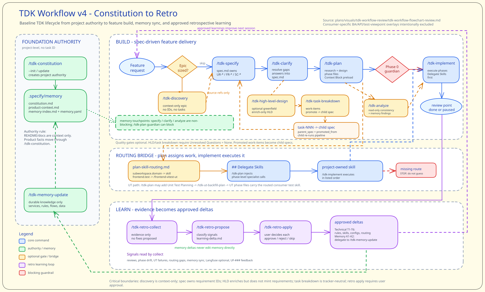

# TDK - TiHon Development Kit

**TDK (TiHon Development Kit)** is a specification-driven coding workflow toolkit for Claude Code with generated Codex harness support. It generates specs, child spec seed breakdowns, plans, and code from natural language — shipped as a set of marketplace plugins + a TypeScript CLI.

Core philosophy: **SDD (Specification-Driven Development)** — every feature starts from a formal spec, broad epics can produce child spec seeds, each child flows through structured plans, and implementation is verified against the spec before shipping.

## Workflow Overview

TDK works as a closed development loop:

- **Build**: turn intent into specs, plans, implementation phases, tests, and status.
- **Learn**: collect evidence after implementation, propose reviewable deltas, and apply only approved learnings.
- **Compound**: approved learnings improve the next TDK session instead of staying as one-off feedback.



## What It Does

TDK structures the full development loop:

1. **Start** — classify greenfield or brownfield repo shape and recommend the safe workflow path (`/tdk-greenfield-start`, `/tdk-brownfield-start`)
2. **Advise** — optionally produce project-level architecture options, decisions, or recovery reports without layout/config writes (`/tdk-architecture-advisor`)
3. **Propose layout** — optionally produce workspace layout proposal markdown and JSON without runtime config writes (`/tdk-workspace-layout-propose`; `/tdk-boundary-map` is a compatibility route)
4. **Guide dependencies** — optionally turn approved layout into workspace dependency policy and non-applied snippets (`/tdk-workspace-dependency-policy`; `/tdk-module-boundary-policy` is a compatibility route)
5. **Scaffold safely** — optionally turn approved layout into a dry-run golden-path skeleton recipe (`/tdk-golden-path-scaffold`)
6. **Discover** — optionally create epic-only context before spec (`/tdk-discovery`)
7. **Align epic PRD** — optionally turn discovery into product alignment, blocking questions, and child spec slice seeds (`/tdk-epic-prd`)
8. **Design epic** — optionally turn epic PRD into parent HLD context before child seed breakdown (`/tdk-epic-hld`)
9. **Break down epic** — optionally turn epic PRD + HLD into child spec seed Markdown (`/tdk-task-breakdown`)
10. **Specify** — generate child or feature specs from natural language and optional discovery/epic PRD refs (`/tdk:specify`)
11. **Clarify** — resolve unresolved questions before planning (`/tdk-clarify`)
12. **Plan** — break specs into phased implementation plans (`/tdk:plan`)
13. **Implement** — execute plans with guided phase tracking (`/tdk-implement`)
14. **Verify** — plan and route unit-test work through consumer test skills (`/tdk-ut-backfill-plan`)
15. **Track** — status dashboards, checklists, progress sync (`/tdk-status`)

Additional workflows: constitution-owned `product-context.md`, workspace layout proposal and dry-run workspace config previews, config management, sub-workspace docs generation, scout (codebase analysis), memory management, API test generation.

Authority boundaries: discovery is context-only and does not mint requirement IDs; epic PRD is product alignment and slice-map context only; epic HLD guides parent decomposition and does not mint requirement IDs; task breakdown creates child spec seeds; child `spec.md` owns `UR-*`/`FR-*`/`SC-*`.

## Quick Start

### Prerequisites

- [Bun](https://bun.sh) runtime
- [Claude Code](https://claude.ai/code) CLI

### Install into a Consumer Project

```bash
# From the consumer project root after TDK .specify/ is present:
bash .specify/setup.sh
```

This bootstraps prerequisites, installs TypeScript dependencies, runs setup checks, and registers TDK plugin metadata from the consumer project's `.specify/` directory.

### Setup CLI — Harness Installation

The setup CLI is a standalone package for managing harness install, convert, and convert-flat commands. From a TDK source checkout, run it from `packages/tdk-setup/` and pass the consumer project root explicitly:

```bash
cd packages/tdk-setup
CONSUMER_ROOT=/path/to/consumer-project

# Install one plugin
bun src/index.ts install "$CONSUMER_ROOT" --harness claude --plugins tdk-core --dry-run
bun src/index.ts install "$CONSUMER_ROOT" --harness claude --plugins tdk-core --yes

# Install multiple plugins
bun src/index.ts install "$CONSUMER_ROOT" --harness claude --plugins tdk-core,tdk-memory --dry-run
bun src/index.ts install "$CONSUMER_ROOT" --harness claude --plugins tdk-core,tdk-memory --yes

# Install every plugin listed in .specify/plugins/manifest.json
bun src/index.ts install "$CONSUMER_ROOT" --harness claude --all-plugins --dry-run
bun src/index.ts install "$CONSUMER_ROOT" --harness claude --all-plugins --yes

# Install preconverted Codex artifacts
bun src/index.ts install "$CONSUMER_ROOT" --harness codex --plugins tdk-core --dry-run
bun src/index.ts install "$CONSUMER_ROOT" --harness codex --plugins tdk-core --yes
bun src/index.ts install "$CONSUMER_ROOT" --harness codex --all-plugins --dry-run

# Select plugins interactively
bun src/index.ts install "$CONSUMER_ROOT" --harness claude

# Maintainers: regenerate generated Codex packages under .specify/codex-plugins/
bun src/index.ts convert --dry-run
bun src/index.ts convert
bun src/index.ts convert --check

# Migrate an existing flat .claude/ tree to Codex artifacts
bun src/index.ts convert-flat "$CONSUMER_ROOT" --dry-run
bun src/index.ts convert-flat "$CONSUMER_ROOT" --yes
```

The `packages/tdk-setup/` package is a separate dev tool (not shipped to consumers). The workflow scripts (config, scout, ut, sub-workspace) and generated Codex packages under `.specify/codex-plugins/` are shipped to consumer projects.

`convert` is source-tree/maintainer-only. It emits generated Codex packages to `.specify/codex-plugins/<plugin>/` following the official OpenAI layout (only `.codex-plugin/plugin.json` inside `.codex-plugin/`; `skills/`, `hooks/`, `lib/` at the package root) from plugin source trees; `--check` re-emits in memory and fails if the committed packages drift from source.

`install --harness codex` reads the generated packages from `.specify/codex-plugins/` and verifies them against `.specify/codex-plugins/manifest.json`, writes skills to `.agents/skills/` and hooks/lib to `.codex/`, generates `.codex/agents/*.toml` and `.codex/config.toml` at install time from plugin source agents, merges `.codex/hooks.json`, and writes Codex ownership state to `.specify/state/harness-install/codex.json`.

Underscore-prefixed shared skill directories such as `_shared` are copied as reference assets, but their `SKILL.md` entrypoint is not installed as a loadable Codex skill.

`convert-flat` leaves the source `.claude/` tree untouched, reports unknown entries as skipped, and writes Codex ownership state to `.specify/state/harness-install/codex.json`. Use `--force` to overwrite conflicts on unowned or user-edited `.codex/` targets.

Omit `--plugins` and `--all-plugins` to select plugins interactively with Space and Enter.

Existing unmanaged `.claude/` files require explicit interactive overwrite approval; `--yes` does not approve those overwrites.

Claude hook runtime entries are merged into `.claude/settings.json`. Hook scripts are installed under plugin-scoped paths like `.claude/hooks/tdk-core/`; plugin `hooks/hooks.json` files stay source declarations and are not installed as `.claude/hooks/hooks.json`.

Claude and Codex harness installs are separate runs. A combined Claude+Codex install is unsupported.

See [tdk-setup README](packages/tdk-setup/README.md) for the full setup CLI reference.

### CLI Usage (Development)

```bash
cd .specify/scripts/ts

# Run integrated CLI
bun src/index.ts --help

# Run individual commands
bun src/commands/detect-config.ts
bun src/commands/manifest/compute.ts --root ../..
```

## Architecture

```
.specify/
├── plugins/              # Marketplace plugins (installed by setup.sh)
│   ├── tdk-core/            # Core workflow (25 skills + 1 agent)
│   ├── tdk-utils/           # Utilities: scout, research, dependency policy, problem solving (16 skills + 5 agents)
│   ├── tdk-memory/          # Domain memory management (5 skills + 1 agent)
│   ├── tdk-test-api/        # API test generation (3 skills)
│   ├── tdk-retro/           # Retrospective learning loop (4 skills)
│   └── tdk-scaffold/        # Skill/agent and golden-path scaffolding (3 skills)
├── codex-plugins/        # Generated Codex packages (6 packages; skills/hooks/lib at package root)
├── templates/            # 60 templates (spec, plan, task, discovery, epic PRD, HLD, test, memory, output, design, docs)
├── docs/                 # 26 user guides (scenario guides + setup guides + reference)
├── configurations/       # Hook configs, sub-workspace configs
└── scripts/
    ├── ts/               # TypeScript CLI (@tdk/tdk) — primary
    │   ├── src/
    │   │   ├── index.ts         # Unified CLI entry
    │   │   ├── commands/        # Integrated command groups + standalone scripts
    │   │   ├── lib/             # Library modules (parsers, generators)
    │   │   └── utils/           # Zod schemas, shared utilities
    │   └── tests/               # Bun test suite (114 .test.ts files)
    └── bash/             # Legacy shell scripts (maintenance-only)
```

## Plugins

| Plugin | Skills | Purpose |
|--------|--------|---------|
| **tdk-core** | 25 skills + 1 agent | Greenfield/brownfield start, architecture advisor, workspace layout proposal, boundary-map compatibility, workflow config apply, constitution, discovery, epic PRD, specify, clarify, HLD, task breakdown, plan, implement, config, `/tdk-sub-workspace-docs`, ut-backfill |
| **tdk-utils** | 16 skills + 5 agents | Scout, research, workspace dependency policy, module-boundary compatibility, brainstorming, docs-seeker, context-engineering, problem-solving |
| **tdk-memory** | 5 skills + 1 agent | Domain memory: init, update, checksum, changelog, query, and tdk-memory-agent |
| **tdk-test-api** | 3 | Test plan, testcase generation, Playwright code gen |
| **tdk-retro** | 4 | Retrospective feedback collection, learning proposal, and approved-delta application |
| **tdk-scaffold** | 3 | `/tdk-sub-workspace-automation-recommend`, skill/agent scaffolding from approved automation recommendations, and guarded golden-path skeleton recipes |

## CLI Commands

Integrated commands (via `bun src/index.ts`; no installed `tdk` binary yet):

**Workflow commands** (run from `.specify/scripts/ts/`):

| Command | Description |
|---------|-------------|
| `bun src/index.ts config detect` | Detect `.specify.json` configuration |
| `bun src/index.ts config index` | Index configuration files |
| `bun src/index.ts config diff` | Compare docs between workspace and sub-workspace |
| `bun src/index.ts config topology apply --dry-run` | Preview `.specify/.specify.json` changes and emit `planHash`; apply with `--yes --expect-hash <planHash>` |
| `bun src/index.ts ut backfill auto` | Automated unit test backfill |
| `bun src/index.ts ut backfill plan` | Plan unit test coverage |
| `bun src/index.ts ut backfill impl` | Implement unit tests from plan |
| `bun src/index.ts scout` | Codebase analysis (repomix + tier-1 extraction) |
| `bun src/index.ts sub-workspace docs` | Generate arc42-lite sub-workspace documentation for `/tdk-sub-workspace-docs` |

**Setup CLI commands** (run from `packages/tdk-setup/`):

| Command | Description |
|---------|-------------|
| `bun src/index.ts install <consumer-root>` | Install selected TDK plugin artifacts into `.claude/` or preconverted `.codex/` + `.agents/skills/` targets with dry-run, saved install settings, prefix rewrite, ownership, collision, and drift safety |
| `bun src/index.ts convert` | Maintainer-only command that emits generated Codex packages under `.specify/codex-plugins/<plugin>/` and checks converter freshness |
| `bun src/index.ts convert-flat` | Convert an existing flat `.claude/` tree into additive `.codex/` and `.agents/skills/` artifacts with dry-run, conflict reporting, and `.specify/state/harness-install/codex.json` ownership manifest |

Standalone scripts (via `bun src/commands/<path>.ts`): manifest, feature, setup, changelog, util, test-api.

## Tech Stack

- **Runtime:** Bun
- **Language:** TypeScript (strict mode, `noUncheckedIndexedAccess`)
- **CLI:** Commander.js
- **Validation:** Zod schemas for config/data, Commander for CLI args
- **Testing:** Bun test runner (TDD-first)
- **Config format:** `.specify.json`

## Documentation

- [TDK Skills Guide](.specify/docs/en/guides/tdk-skills-guide.md) — skill directory, cheat sheet, and usage reference
- [tdk-setup README](packages/tdk-setup/README.md) — harness setup CLI reference
- [Scenario Guides](.specify/docs/en/guides/scenarios/) — 11 workflow scenarios
- [Setup Guide](.specify/docs/en/guides/setup/installation.md) — installation and configuration
- [UT Backfill Usage](.specify/docs/en/guides/tdk-ut-backfill-skills-usage.md) — unit test workflow
- [Document Flow](.specify/docs/en/guides/document-flow.md) — spec → plan → task lifecycle
