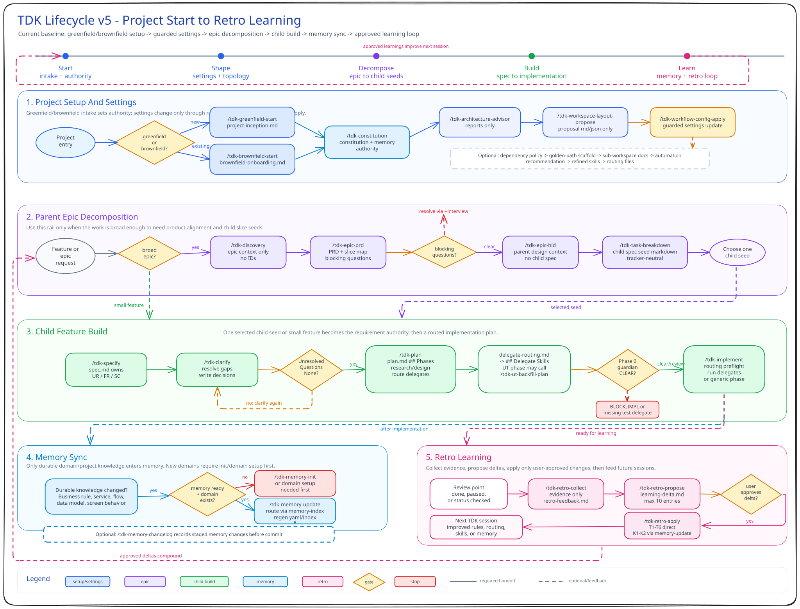

# TDK - TiHon Development Kit

**TDK (TiHon Development Kit)** is a specification-driven development toolkit for AI coding agents.
It moves a consumer project from intent to specs, plans, implementation, review, and durable project
memory.

Core idea: write the work down first. Broad work becomes discovery, epic PRD, high-level design, and
child spec seeds. Small clear work starts at a feature spec.

Targets **Claude Code**, with generated **Codex** harness artifacts. Cursor, Copilot, and Antigravity
are coming soon.



## Install

Run from a TDK source checkout against the consumer project:

```bash
CONSUMER_ROOT=/path/to/consumer-project

# 1. Copy the .specify/ payload (plugins, templates, scripts, schemas, docs, setup script)
bash distribute.sh "$CONSUMER_ROOT" --dry-run
bash distribute.sh "$CONSUMER_ROOT" --yes

# 2. Bootstrap: prerequisites, TypeScript deps, plugin metadata registration
(cd "$CONSUMER_ROOT" && bash .specify/setup.sh)

# 3. Install the Claude Code harness
cd packages/tdk-setup
bun src/index.ts install "$CONSUMER_ROOT" --harness claude --all-plugins --dry-run
bun src/index.ts install "$CONSUMER_ROOT" --harness claude --all-plugins --yes
```

Codex is a separate install run; a combined Claude+Codex install is unsupported. It also needs
materialized Codex packages and a consumer-local manifest first, because the default payload omits
`.specify/codex-plugins/**`. Full sequence: [tdk-setup README](packages/tdk-setup/README.md).

Commands not visible, or setup failing? [Setup Guide](.specify/docs/en/guides/setup/setup-guide.md).

## Usage

`/tdk-*` commands run in the agent chat, not in a terminal. Use the terminal only for shell
snippets such as `bash`, `bun`, `git`, or test runners.

### Greenfield project and sub-workspaces

```text
/tdk-greenfield-start "Project brief..." --full
/tdk-constitution --init .specify/configurations/inception/project-inception.md
/tdk-architecture-advisor .specify/configurations/inception/project-inception.md
/tdk-workspace-layout-propose .specify/configurations/architecture/architecture-decision.md
/tdk-workflow-config-apply
/tdk-workspace-dependency-policy .specify/configurations/workspace-layout/workspace-layout-proposal.json
/tdk-sub-workspace-docs --all
```

`/tdk-workflow-config-apply` previews changes first. Approve only when the diff matches the intended
workspace layout.

### Broad epic to child specs

Use when the work is vague or likely to split into multiple features:

```text
/tdk-discovery epic-001 "Broad epic brief"
/tdk-epic-prd epic-001 --interview
/tdk-epic-hld epic-001
/tdk-task-breakdown epic-001
```

Then promote one generated child seed into a spec and deliver it with the small-spec flow below.
For selective harness installs, make sure the parent epic commands are included, plus the child
feature commands to continue past task breakdown.

### Small feature or fix

Use when the work is already clear enough to skip the epic flow:

```text
/tdk-specify feat-001 "Small feature or fix description"
/tdk-clarify feat-001
/tdk-plan feat-001
/tdk-implement feat-001
```

Run `/tdk-clarify` until unresolved questions are gone or explicitly deferred. `spec.md` is the
requirement authority.

### Review, status, and tests

```text
/tdk-status feat-001
/tdk-plan feat-001 --validate       # interview the plan for missing assumptions
/tdk-plan feat-001 --red-team       # adversarial plan review
/tdk-plan feat-001 --tdd            # fold tests-first phases into the plan
/tdk-plan feat-001 --ut-backfill --sub-workspace backend
```

`--ut-backfill` plans unit-test coverage for existing code and routes test implementation through
the configured consumer test skill.

### Memory and retrospectives

```text
/tdk-memory-update "Accepted business rule, architecture decision, or domain fact"
/tdk-retro-collect
/tdk-retro-propose
/tdk-retro-apply
```

Memory stores accepted durable domain knowledge. Retrospectives only propose changes.

## Implementation Modes

| Form | Behavior |
|---|---|
| `/tdk-implement <task-id>` | Serial: ready phases in plan-table order |
| `/tdk-implement <task-id> --phase NN` | One phase, serially, after its dependencies |
| `/tdk-implement <task-id> --parallel` | Claude Code only: dynamic waves, max four workers |

`--phase` and `--parallel` are mutually exclusive. The default serial path keeps the existing
routing, recovery, review, test, and status behavior, and stays the escape hatch for any phase
parallel mode refuses.

Parallel essentials:

- **Ownership comes from `## Related Code Files`.** `Read` grants read access; `Modify`, `Create`,
  and `Delete` grant exact write ownership. Read/read overlap is fine; write/write and either
  direction of read/write overlap, including ancestor/descendant paths, cannot share a wave.
- **Plans classify phases.** `parallel_safe: auto` only when the complete access set is known;
  otherwise `parallel_safe: never` with a factual reason. Legacy phases without the metadata are
  serial barriers, executed through the serial path.
- **Admission is strict.** Clean Git worktree, Git-backed project, and case-sensitive POSIX paths
  (WSL with exact case). Native Windows, DrvFS, case-insensitive or unknown roots, and an
  unsupported nested mount under an access path are rejected. Concurrency canaries must prove
  concurrent spawn and join. There is no silent serial fallback.
- **Waves are all-or-nothing.** Dispatch is synchronous, so there is no worker timeout or polling
  loop. Status writes are crash-atomic through a recovery journal. Any worker, gate, audit, or
  malformed-result failure leaves admitted siblings `in_progress`; explicit recovery reconciles the
  journal and requires a clean rerun.
- **One mutation reservation.** Mutating `/tdk-implement` and `/tdk-plan` flows share a single
  repo-wide mutation reservation, cleared by state, never by TTL, PID, or mtime.
- **Codex STOPs on `--parallel`.** Rerun without the flag to use the default serial path; harness
  identity is fixed at conversion time, not guessed at runtime.

Full contract:
[parallel phase orchestration](.specify/plugins/tdk-core/skills/tdk-implement/references/parallel-phase-orchestration.md).

## Plugins

| Plugin | Purpose |
|---|---|
| **tdk-core** | Child feature delivery: specify, clarify, plan, analyze, implement, status, test-planning modes; owns the shared hook/runtime gateway |
| **tdk-inception** | Project foundation: greenfield/brownfield start, constitution, architecture, workspace layout/config, dependency policy, sub-workspace docs |
| **tdk-epic** | Parent epic discovery, epic PRD, HLD, task breakdown |
| **tdk-utils** | Scout, research, docs-seeker, context engineering, brainstorming, problem-solving |
| **tdk-memory** | Domain memory init, update, query, changelog, checksum, memory agent |
| **tdk-test-api** | API test planning, testcase generation, Playwright TypeScript codegen |
| **tdk-retro** | Retrospective collection, learning proposal, approved learning application |
| **tdk-scaffold** | Sub-workspace automation recommendations, skill/agent scaffolding, delegate routing, guarded golden-path recipes |

Every install includes the coupled base `tdk-core`, `tdk-inception`, `tdk-memory`, and `tdk-utils`.
Selection adds optional workflows to that base; there is no runtime-independent core-only install.
`--plugins tdk-core` is accepted as base-only compatibility syntax.

## Tech Stack

Bun runtime, TypeScript in strict mode with `noUncheckedIndexedAccess`, Commander.js CLI, Zod
validation, Bun test runner, `.specify.json` config, setup CLI in `packages/tdk-setup/`.

## Documentation

| Topic | Start here |
|---|---|
| Install or troubleshoot setup | [Setup Guide](.specify/docs/en/guides/setup/setup-guide.md) |
| Harness install and Codex conversion | [tdk-setup README](packages/tdk-setup/README.md) |
| Greenfield project and sub-workspaces | [Greenfield Full Start](.specify/docs/en/guides/scenarios/10-greenfield-full-start-architecture-topology.md) |
| Broad epic to child specs | [Epic Start Guide](.specify/docs/en/guides/scenarios/00-epic-start-guide.md) |
| Small child feature delivery | [Child Feature Implementation](.specify/docs/en/guides/scenarios/01-child-feature-implementation.md) |
| Command and artifact relationships | [Workflow Map](.specify/docs/en/guides/workflow-map.md) |
| Command catalog and tips | [Skills Guide](.specify/docs/en/guides/skills-guide.md) |
| All guides and scenarios | [Docs Index](.specify/docs/README.md) · [Scenario Catalog](.specify/docs/en/guides/scenarios/scenario-catalog.md) |
| Shipping a payload (maintainers) | [Maintainer Distribution Notes](docs/maintainer-distribution.md) |
